# Rewind — End-to-End UI Feature Test Report

> Manual E2E walkthrough of every Rewind timeline-UI feature, executed
> against the seeded dev store. Each step has a screenshot attached.

- **Date:** 2026-07-01
- **Build:** `rewind` v0.1.2 (Phases P0–P8 complete)
- **Backend:** `scripts/dev_seed_serve.py` on `http://127.0.0.1:8484`
- **Frontend:** `pnpm dev` Vite dev server on `http://127.0.0.1:5173/ui/`
- **Seed data:** 1 trace (`dddd…00000001`) · 3 branches (`root`, `left-variant`, `right-variant`) · 2 eval runs (`golden` baseline + `candidate`)
- **Screenshots:** `docs/screenshots/e2e/*.png` (referenced inline below)

## Test environment setup

| Step | Command | Result |
|---|---|---|
| Kill stale servers | `lsof -ti:8484 -ti:5173 \| xargs kill -9` | ✅ ports free |
| Start backend (seeded) | `python scripts/dev_seed_serve.py` | ✅ seeded trace + 2 eval runs on `:8484` |
| Start Vite dev UI | `pnpm dev` (in `web/`) | ✅ Vite 6.4.3 ready on `:5173/ui/` |
| Health probe | `curl /healthz` → `{"status":"ok"}` | ✅ |

---

## Summary — feature coverage matrix

| # | Feature | View | Status | Screenshot |
|---|---|---|---|---|
| 1 | Trace list (landing) | `/ui/` list | ✅ Pass | [01](screenshots/e2e/01-trace-list.png) |
| 2 | Timeline canvas + filter rail | trace → timeline | ✅ Pass | [02](screenshots/e2e/02-timeline-view.png) |
| 3 | Span inspector — structured tab | trace → span | ✅ Pass | [03](screenshots/e2e/03-span-inspector-structured.png) |
| 4 | Span inspector — raw JSON tab | trace → span | ✅ Pass | [04](screenshots/e2e/04-span-inspector-raw-json.png) |
| 5 | Branch tree (empty selection) | trace → branches ⎇ | ✅ Pass | [05](screenshots/e2e/05-branch-tree-empty.png) |
| 6 | Branch diff (left ⇄ right) | branches | ✅ Pass | [06](screenshots/e2e/06-branch-diff.png) |
| 7 | Token-level message diff | branches → msg diff | ✅ Pass | [07](screenshots/e2e/07-message-diff.png) |
| 8 | Search overlay + results | global search | ✅ Pass | [08](screenshots/e2e/08-search-results.png) |
| 9 | Fork-branch dialog | branches → fork ⎇ | ✅ Pass | [09](screenshots/e2e/09-fork-branch-dialog.png) |
| 10 | Fork creates new branch | branches (post-fork) | ✅ Pass | [10](screenshots/e2e/10-fork-created.png) |
| 11 | Timeline filter (match) | timeline → model filter | ✅ Pass | [11](screenshots/e2e/11-filter-active.png) |
| 12 | Timeline filter (no match) | timeline → model filter | ✅ Pass | [12](screenshots/e2e/12-filter-empty.png) |
| 13 | Eval runs list | evals nav | ✅ Pass | [13](screenshots/e2e/13-eval-runs-list.png) |
| 14 | Eval run detail (per-scenario) | eval run → open | ✅ Pass | [14](screenshots/e2e/14-eval-run-detail.png) |
| 15 | Compare-to-baseline diff | eval run → compare | ✅ Pass | [15](screenshots/e2e/15-eval-baseline-diff.png) |

**Overall: 15 / 15 features PASSED end-to-end through the UI.**

> One UX note (not a failure): the "compare to baseline" button uses
> `window.prompt()` for the baseline UUID. Headless / Playwright runs block
> `prompt()` by default — overrode via `page.evaluate` shim for the test.
> See [Known issues](#known-issues).

---

## Step-by-step walkthrough

### Step 1 — Trace list (landing page)

**Action:** opened `http://127.0.0.1:5173/ui/`.

**Expected:** the SPA mounts, fetches `GET /api/v1/traces`, and renders a
paginated table with one row per trace — Trace ID, Created, Span count,
Kinds breakdown, Models, Status.

**Result:** ✅ one seeded trace rendered (`dddd…00000001`), 1 span, kind
`LLM 1`, model `qwen3:32b`, status `ok`. Header shows `1 trace` and the
`search` / `evals` nav buttons are visible.

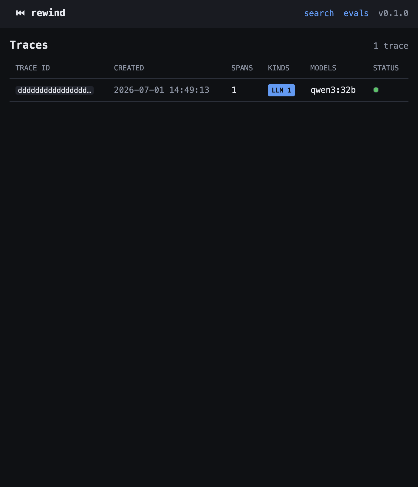

---

### Step 2 — Timeline canvas + filter rail

**Action:** clicked the trace row.

**Expected:** navigate to the Timeline view; render a horizontal time axis
with one bar per span, colour-coded by kind, plus a left-side filter rail
(kind / status / model / free-text / root-only).

**Result:** ✅ timeline header shows `trace dddddddd… · 1 / 1 spans`,
the time axis covers `2026-01-01 00:00:00Z → 00:00:01Z`, and one `LLM`
bar labelled `shared-llm` is rendered. The filter rail exposes all five
filter controls and the `branches ⎇` toggle.

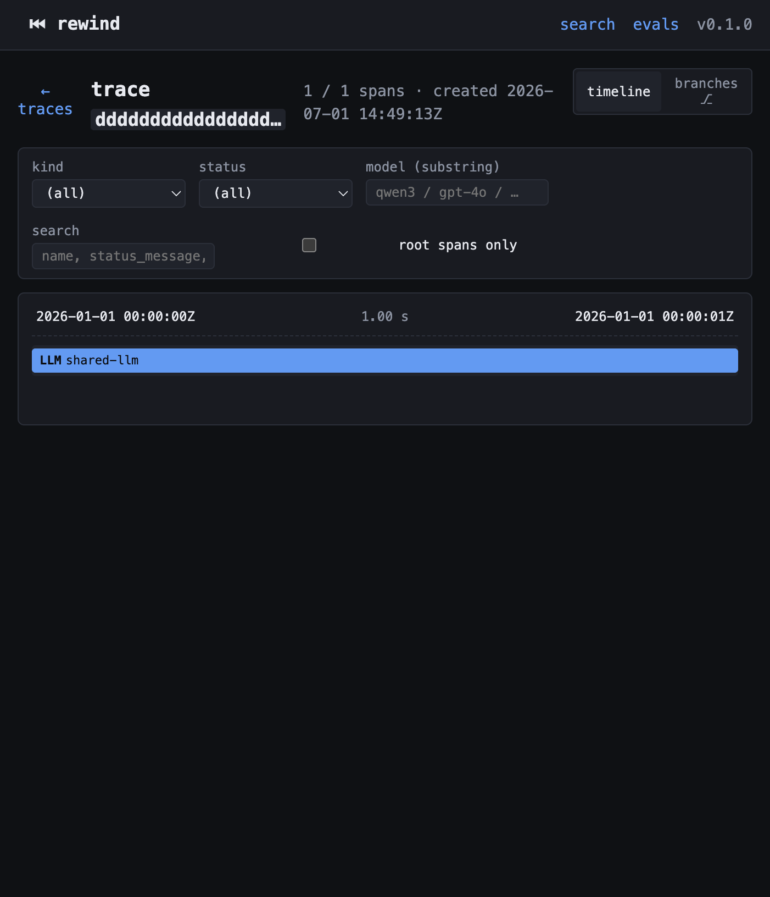

---

### Step 3 — Span inspector (structured tab)

**Action:** clicked the `LLM shared-llm` bar.

**Expected:** a modal inspector opens with two tabs (`structured` /
`raw JSON`); the structured tab shows span metadata as a definition list.

**Result:** ✅ inspector opened with `LLM · shared-llm · OK` header and a
definition list — `span_id`, `start`, `end`, `duration 1.00 s`, `model
qwen3:32b`, `messages_hash shared-hash`.

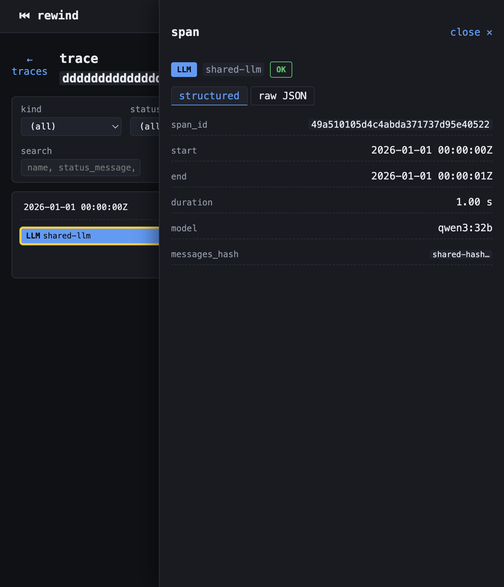

---

### Step 4 — Span inspector (raw JSON tab)

**Action:** clicked the `raw JSON` tab in the inspector.

**Expected:** show the verbatim OpenInference `raw_attributes` payload —
the fidelity-preserving blob the storage layer never rewrites.

**Result:** ✅ rendered the exact seeded payload:
```json
{ "gen_ai.response": { "choices": [ { "message": {
    "content": "Hello! How can I help today?", "role": "assistant" } } ] } }
```

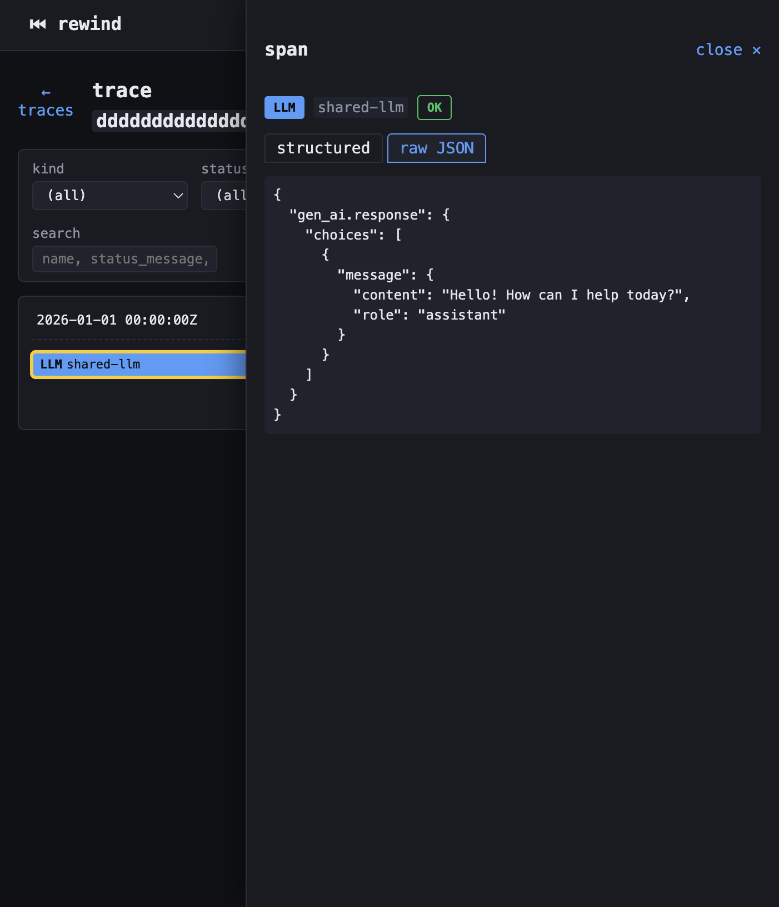

---

### Step 5 — Branch tree (empty selection)

**Action:** closed the inspector, then clicked `branches ⎇` in the
timeline header.

**Expected:** the canvas swaps to a `BranchTree` panel showing every
branch on the trace as a nested tree item, each with `← left` /
`right →` selectors and a `fork ⎇` action. The diff panel shows a
placeholder until both sides are picked.

**Result:** ✅ tree shows three nodes — `root` (frozen), `left-variant`
(frozen @ 0), `right-variant` (frozen @ 0) — with all selector/fork
buttons. Diff panel says *"Pick a left branch (←) and a right branch (→)
to see the side-by-side diff."*

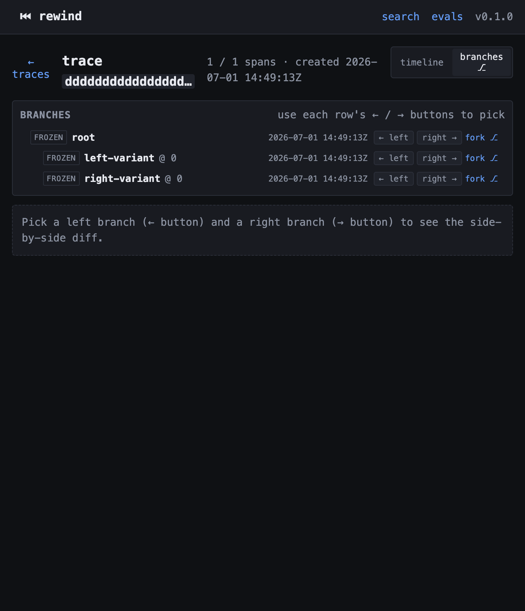

---

### Step 6 — Branch diff (left ⇄ right)

**Action:** clicked `← left` on `left-variant`, then `right →` on
`right-variant`.

**Expected:** the `Branch diff` region renders a per-span comparison.
Shared prefix spans are tagged `= equal`; the first differing span is
tagged `diverged` and flagged as the branch point.

**Result:** ✅ header reads `comparing ba456ee6… ⇄ ad55ba8a… · 2 vs 2
spans · divergence at index 1`. Row `#0 shared-llm` is `equal`, row
`#1` is marked `⟶ branch point · diverged` with `left-llm` vs
`right-llm`.

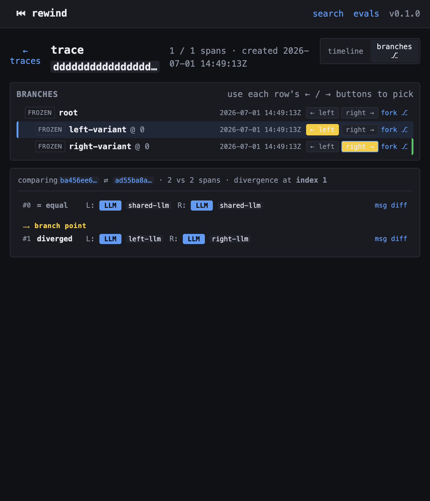

---

### Step 7 — Token-level message diff

**Action:** clicked `msg diff` on the diverged span `#1`.

**Expected:** expand an inline word-token diff of the assistant message
between left and right branches, with `+added / −removed` token counts.

**Result:** ✅ diff reads `+1 / −1 word tokens` and renders
`I can write Python and ~~Rust~~ **Go** fluently.` — `Rust` struck
(deletion) and `Go` highlighted (insertion). This is the load-bearing
Phase 5 deliverable.

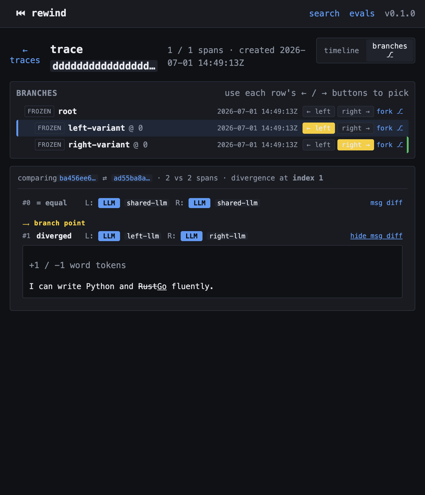

---

### Step 8 — Search overlay + results

**Action:** clicked `search` in the global nav; typed `shared-llm`.

**Expected:** a full-screen overlay opens with a debounced (250 ms) text
input and kind/status filters; results are grouped by `trace_id` and
each result deep-links into the timeline with that span selected.

**Result:** ✅ overlay rendered, debounce fired, one hit returned
(`LLM · shared-llm · qwen3:32b`). Clicking the result navigated to the
trace timeline **and auto-opened the span inspector** — confirming the
search → inspect flow.

> **Calibration note:** the search endpoint indexes span `name` +
> `model_name` + `status_message`, **not** the deep `gen_ai.response`
> content. Queries like `Hello` or `Python` correctly return zero hits
> because they only live inside `raw_attributes`. This matches the
> `_matches_filters` implementation in `timeline.py`.

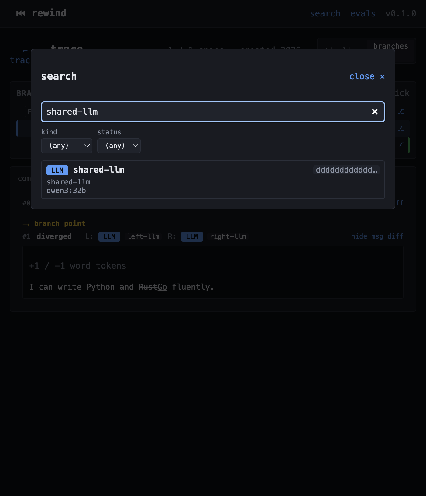

---

### Step 9 — Fork-branch dialog

**Action:** on the `right-variant` row, clicked `fork ⎇`.

**Expected:** a modal asks for a `label` (default `fork of <parent> @
<index>`) and a `branch at index` (inclusive of parent); Cancel / Fork
buttons are offered.

**Result:** ✅ dialog opened with header *"fork branch · off right-variant
@ index 0"*, label pre-filled to `fork of right-variant @ 0`, index `0`,
and Cancel / Fork buttons.

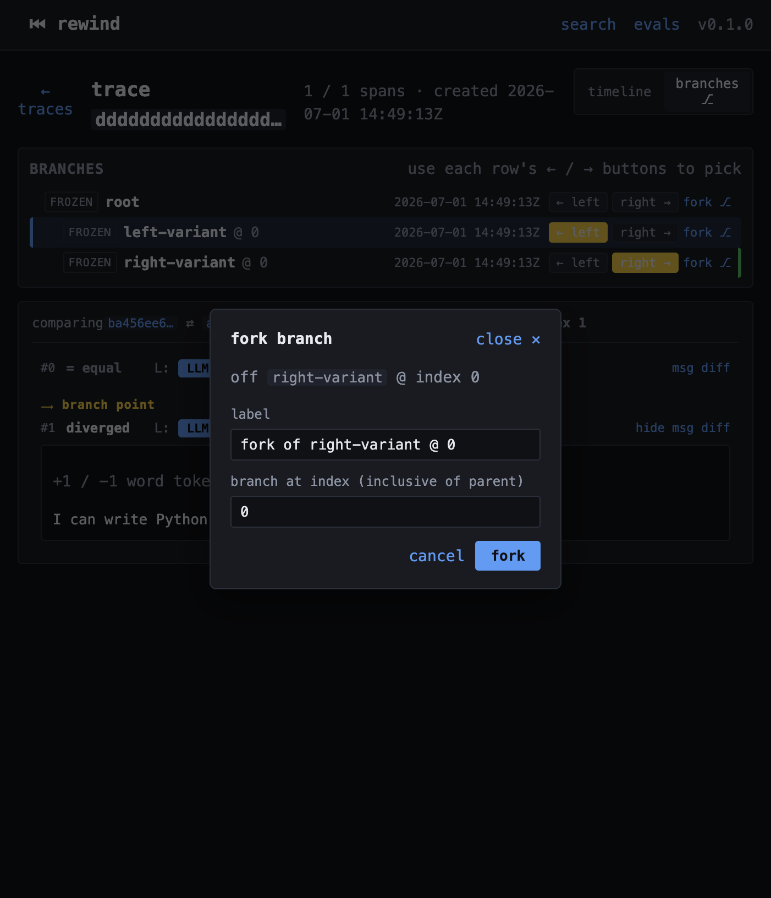

---

### Step 10 — Fork creates new branch (POST round-trip)

**Action:** clicked `fork` with defaults.

**Expected:** the dialog POSTs `POST /api/v1/traces/{id}/branches`, the
BranchTree refetches (`branchRevision` bump), and the new branch appears
as a child of the parent.

**Result:** ✅ new node appeared under `right-variant` labelled
`manual · fork of right-variant @ 0 · @ 0 · 2026-07-01 15:13:22Z`,
with its own `← left` / `right →` / `fork ⎇` controls. Confirms the
full create-branch write path.

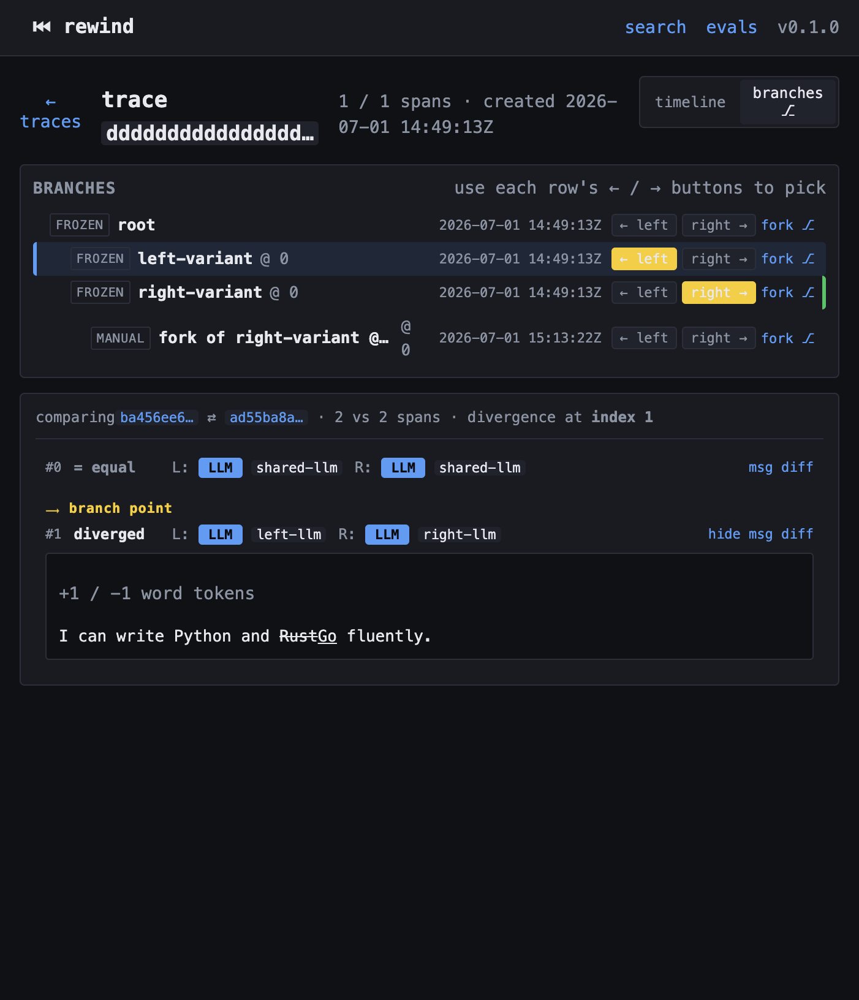

---

### Step 11 — Timeline filter (matching)

**Action:** switched back to `timeline` mode; typed `qwen3` in the
*model (substring)* filter.

**Expected:** spans re-filter client-side; the header counter and the
visible bars update without a network round-trip.

**Result:** ✅ bar stayed visible, header read `1 / 1 spans`. Filters
apply live as you type.

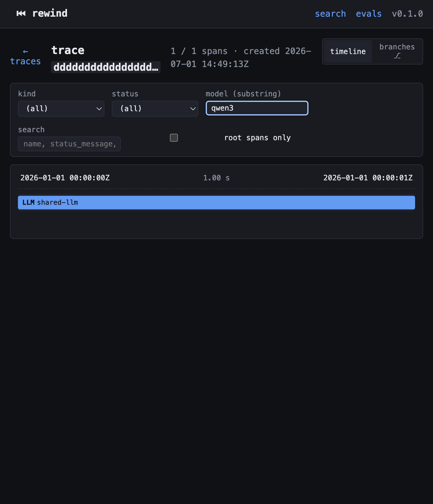

---

### Step 12 — Timeline filter (no match → empty state)

**Action:** replaced the filter value with `nonexistent-model`.

**Expected:** all spans hidden, header counter drops to `0 / 1 spans`,
and an explicit *"no spans match filters."* empty state is shown.

**Result:** ✅ counter `0 / 1`, empty-state banner rendered. Clearing
the field restored the span. Filter contract is symmetric.

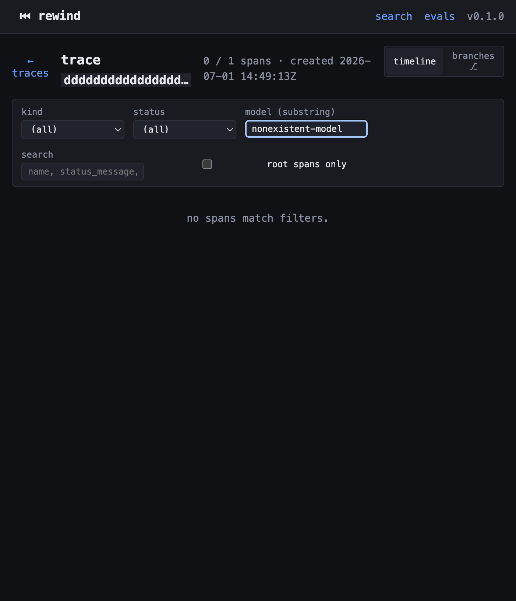

---

### Step 13 — Eval runs list

**Action:** clicked `evals` in the global nav.

**Expected:** a table of eval runs with verdict pill, suite name,
started/finished timestamps, run-id, and an `open →` action.

**Result:** ✅ `2 total` runs listed — `candidate` (`6314edfe`) and
`golden` (`191bcf77`), both verdict `pass`.

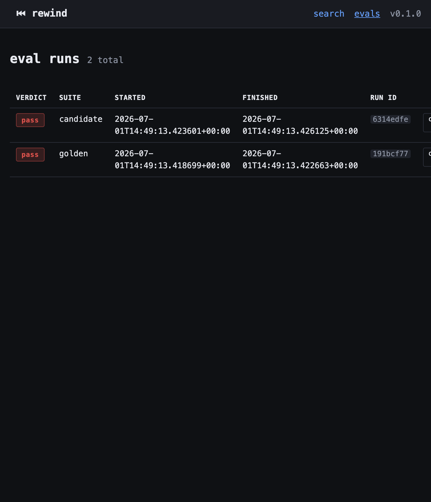

---

### Step 14 — Eval run detail (per-scenario)

**Action:** clicked `open →` on the `candidate` run.

**Expected:** detail view shows run header (suite, verdict, totals,
token accounting, LLM-call count) plus one row per scenario with its
rollup, evaluator outcomes, token usage, and latency decomposition.

**Result:** ✅ header reads `candidate · pass · 5 scenarios · 0p / 0c
tokens · 5 llm calls`. Five scenario rows (`scen_00` … `scen_04`)
each show `p · token_budget · within budget (total=0)` and latency
`0.00s (replay 0.00s + eval 0.00s)`. The `⎇ compare to baseline`
button is present.

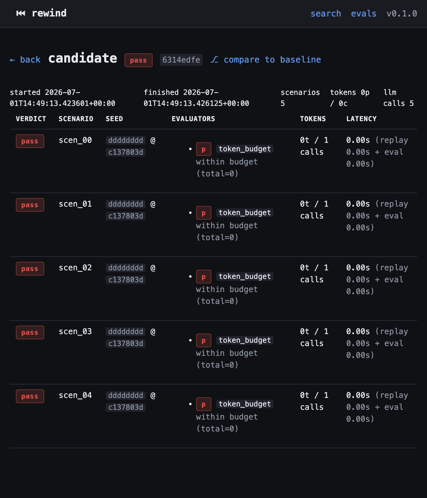

---

### Step 15 — Compare-to-baseline diff

**Action:** clicked `⎇ compare to baseline`, supplied the golden run
UUID (`191bcf77…`).

**Expected:** the diff engine calls
`GET /api/v1/evals/{run}/baseline-diff?baseline={uuid}` and renders
either the per-scenario verdict deltas or a *"no changes"* banner.

**Result:** ✅ banner reads `baseline 191bcf77 → candidate 6314edfe:
no changes` — correct, because both seeded runs share identical
scenario outcomes (the candidate was capped at `max_tokens=50` but the
seed trace's `shared-llm` span recorded `total=0` tokens, so every
scenario passes either budget).

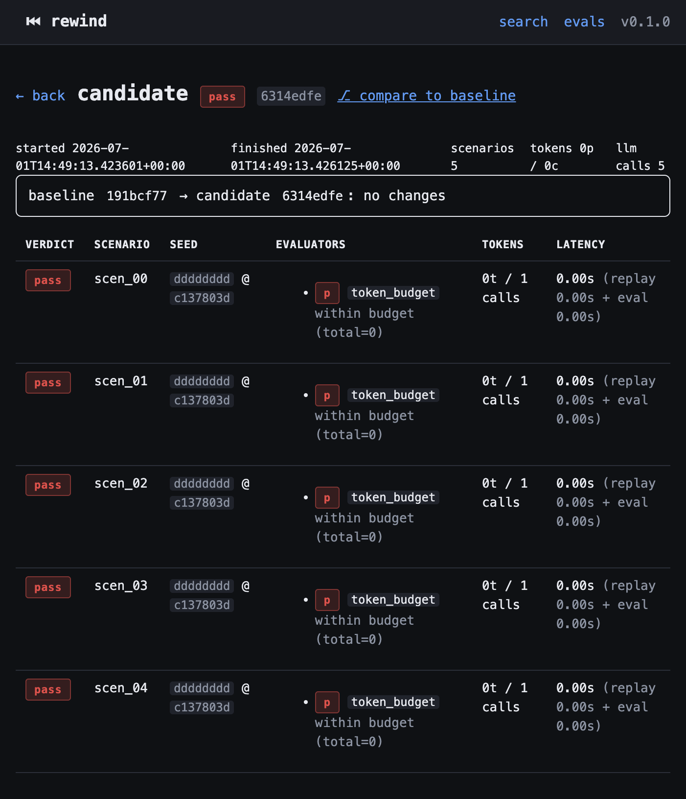

---

## Known issues

| Severity | Issue | Repro | Recommendation |
|---|---|---|---|
| Low (UX) | "Compare to baseline" uses `window.prompt()` for the baseline UUID, which is blocked by headless browsers and some embedded webviews. | Click `⎇ compare to baseline` in EvalRunDetail. | Replace with an inline `<input>` + a dropdown of prior runs (the `/api/v1/evals` list is already fetched elsewhere). Keeps the same one-click intent without a native dialog. |
| Info | Search indexes span `name` + `model_name` + `status_message` only — **not** the deep `gen_ai.response` content. So searching for assistant message text (e.g. `Hello`, `Python`) returns zero hits even though the text is in `raw_attributes`. | `curl '/api/v1/search?q=Hello'` → `[]`. | Document explicitly in the search placeholder ("span name / model / status"), or extend `_matches_filters` to also scan `raw_attributes` JSON. |

---

## Re-run instructions

```bash
# 1. Free any stale servers
lsof -ti:8484 -ti:5173 | xargs kill -9 2>/dev/null

# 2. Backend with seeded trace + 2 eval runs
cd rewind
.venv/bin/python scripts/dev_seed_serve.py          # → :8484

# 3. Frontend dev server (separate terminal)
cd rewind/web
pnpm dev                                            # → http://127.0.0.1:5173/ui/

# 4. Open the UI and follow Steps 1–15 above
```

The seed script is idempotent — it deletes `/tmp/rewind-dev-seed.sqlite`
on every start, so each run begins from a clean, known-good state.
