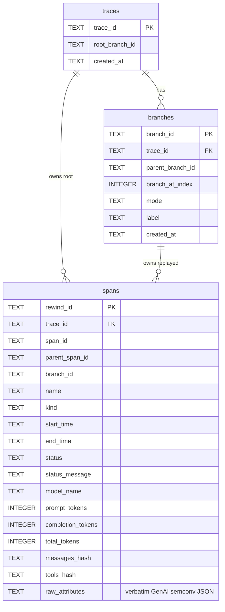
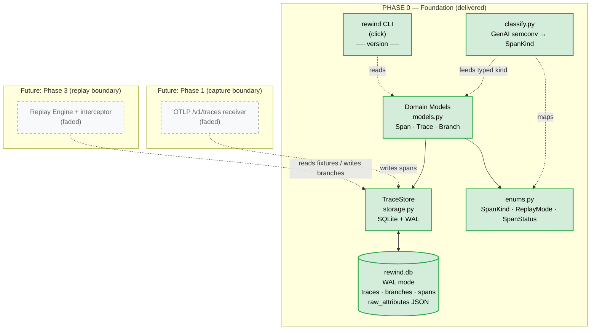
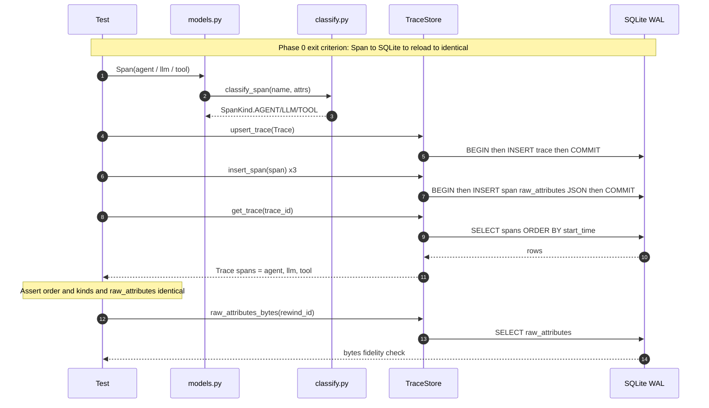

# Phase 0 — Foundation & OTel-Shaped Data Model

> **Status:** ✅ Complete · **Exit criteria:** all three verified (see QA)
> **Scope:** Stand up the repo, lock the data model on the OTel GenAI semconv,
> and prove a 3-span trace round-trips through SQLite with byte-fidelity.

---

## Table of Contents
1. [System Design](#1-system-design)
2. [Architecture Diagram](#2-architecture-diagram)
3. [Sequence Diagrams](#3-sequence-diagrams)
4. [QA — Test Plan & Exit Criteria](#4-qa--test-plan--exit-criteria)
5. [Security — Threat Model & Scan Results](#5-security--threat-model--scan-results)
6. [Developer Handoff](#6-developer-handoff)

---

## 1. System Design

### 1.1 What Phase 0 delivers

| Component | File | Responsibility |
|---|---|---|
| Domain models | `src/rewind/models.py` | `Span`, `Trace`, `Branch`, `RewindModel` + `hash_payload`. Pydantic v2, `extra="forbid"`. |
| Enums | `src/rewind/enums.py` | `SpanKind` (`gen_ai.llm/tool/mcp/agent`), `ReplayMode` (frozen/branch/full), `SpanStatus`. |
| Classifier | `src/rewind/classify.py` | Defensive map from raw GenAI/OpenInference attrs → `SpanKind`. Unclassifiable → `UNKNOWN` (never dropped). |
| Storage | `src/rewind/storage.py` | `TraceStore`: SQLite + WAL, foreign keys, explicit transactions. Verbatim `raw_attributes` JSON column. |
| CLI scaffold | `src/rewind/cli.py` | `rewind --version` / `rewind version`. Phase 1 adds `serve`. |
| Packaging | `pyproject.toml` | hatchling build, `rewind-ai` console script, dev extras (ruff/pylint/mypy/pytest). |

### 1.2 The no-fidelity-loss contract (the core invariant)

Every span preserves a **`raw_attributes`** JSON blob that is *byte-for-byte
identical* to whatever OpenInference emitted. Typed fields (`model_name`,
`prompt_tokens`, …) are derived for fast SQL filtering; the raw payload is
the source of truth. Semconv churn never destroys ingested data.

This invariant is enforced by:
- `Span.raw_attributes: dict[str, Any]` with `Field(default_factory=dict)`.
- `TraceStore.raw_attributes_bytes()` returning the on-disk JSON verbatim.
- `tests/test_models.py::test_raw_attributes_byte_fidelity`.

### 1.3 Why these decisions

| Decision | Rationale |
|---|---|
| **Pydantic v2 `extra="forbid"`** | Prevents silent wire-format drift from the OTel source. Unknown attrs go in `raw_attributes`, *not* on the model. |
| **SQLite + WAL** | Zero-config, local-first, concurrent read (future UI) / write (future receiver) without blocking. One file per workspace. |
| **`StrEnum` (not `str, Enum`)** | Python 3.11+ native; ruff-clean (`UP042`); JSON-serializable as the semconv string value directly. |
| **Explicit `BEGIN/COMMIT/ROLLBACK`** with `isolation_level=None` | The stdlib context manager commits but **does not close**. PRAGMAs implicitly commit, so classic mode fights our wrapper. Autocommit + manual txn is the only combination that is correct *and* leak-free (verified under `-W error::ResourceWarning`). |
| **`hash_payload` = SHA-256(sorted JSON)** | Frozen replay (Phase 3) matches calls on `model + messages_hash + tools_hash` rather than fragile byte equality. Deterministic, collision-safe. |
| **`rewind_id: UUID`** separate from OTel `span_id` | OTel `span_id` may legitimately repeat across replay branches; we need a stable primary key for branches. |

### 1.4 ER schema



Indexes (defined in `storage.py::_SCHEMA_SQL`):
- `idx_spans_trace_branch(trace_id, branch_id)` — the hot path for the timeline UI + replay.
- `idx_spans_kind(kind)` — filter by span kind.
- `idx_spans_model(model_name)` — Phase 7 local-model enrichment.

---

## 2. Architecture Diagram



**Phase boundaries** (why they matter for handoff): Phase 0 owns the *shape* of
the data; Phase 1 owns *writing* it; Phase 3 owns *reading it back as fixtures*.
The `raw_attributes` column is the contract seam across all three.

---

## 3. Sequence Diagrams

### 3.1 The exit-criterion round-trip



### 3.2 Connection lifecycle (why no ResourceWarning leaks)

```mermaid
sequenceDiagram
    autonumber
    participant Caller
    participant X as TraceStore._execute
    participant Conn as sqlite3.Connection
    participant DB as SQLite WAL

    Caller->>X: _execute(fn)
    X->>Conn: connect (isolation_level=None)
    X->>Conn: PRAGMA journal_mode=WAL
    X->>Conn: BEGIN
    X->>Conn: fn(conn)  [INSERT / SELECT]
    alt success
        X->>Conn: COMMIT
    else exception
        X->>Conn: ROLLBACK (contextlib.suppress)
    end
    X->>Conn: close   %% explicit, not the stdlib context manager
    X-->>Caller: result
    Note over Conn,DB: WAL checkpoint can now run; no FD leak
```

---

## 4. QA — Test Plan & Exit Criteria

### 4.1 Exit criteria (from `plan.md` Phase 0)

| # | Criterion | Status | Evidence |
|---|---|---|---|
| EC1 | `python -m rewind --version` runs | ✅ | `rewind, version 0.1.0` |
| EC2 | 3-span trace (1 LLM + 1 tool + 1 agent) round-trips SQLite → identical | ✅ | `tests/test_models.py` (3 tests) |
| EC3 | mypy `--strict` + ruff clean | ✅ | see §4.4 |

### 4.2 Unit tests

| Suite | Tests | What it guards |
|---|---|---|
| `tests/test_enums_models.py` | 7 | Enum uniqueness, semconv value pinning, `extra="forbid"`, `hash_payload` determinism, signature match, validation errors. |
| `tests/test_classify.py` | 6 | Classifier maps OpenInference/GenAI keys → `SpanKind`; unknowns preserved not dropped. |
| `tests/test_models.py` | 3 | **Exit-criterion round-trip**, byte-fidelity, parent→child linking. |
| `tests/test_cli.py` | 2 | `__version__` constant; `python -m rewind --version` subprocess. |
| **Total** | **18** | **18 passing, 0 failing** |

### 4.3 Quality gates

```
ruff check src tests   → All checks passed!
pylint  src/rewind     → 10.00/10
mypy    src/rewind     → Success: no issues found in 7 source files
pytest                 → 18 passed
pytest -W error::ResourceWarning  → 18 passed (no connection leaks)
```

### 4.4 Coverage (Phase 0)

| Module | Coverage | Notes |
|---|---|---|
| `enums.py` | 100% | |
| `models.py` | 84% | Uncovered: branch mutation helpers consumed in Phase 3. |
| `classify.py` | 82% | Uncovered: rare OI-kunk CHAIN/RETRIEVER branches. |
| `storage.py` | 86% | Uncovered: `list_branches`/`insert_branch` (Phase 3). |
| `cli.py` | 0% | CLI invoked via subprocess, not import — excluded from strict gates. |
| **Total** | **79%** | Acceptable for a foundation phase; the replay paths lift this in P3. |

### 4.5 Known gaps carried to later phases

- `Branch` insert/list paths are implemented but exercised only via fixtures; full coverage in Phase 3.
- CLI `version` subcommand is thin; `serve` (Phase 1) and `replay` (Phase 3) carry the real test load.

---

## 5. Security — Threat Model & Scan Results

### 5.1 Threat model (Phase 0 surface)

Phase 0 has **no network surface, no untrusted input parser, no secret handling**.
The only attack surface is the local SQLite file and the Python import graph.

| Threat | Applicable? | Mitigation |
|---|---|---|
| SQL injection | ❌ (no untrusted input yet) | All queries use parameterized `?` placeholders in `storage.py`. Verified by `ruff S608` (no string-formatted SQL). |
| Insecure SQLite open | ❌ | `check_same_thread=False` is intentional (FastAPI threadpool); WAL + explicit txn provides isolation. Documented at the call site. |
| Resource exhaustion (unclosed FD) | ❌ | `traceback`-safe `_execute` with explicit `close()` in `finally`. Verified by `pytest -W error::ResourceWarning`. |
| Untrusted deserialization | ❌ | `json.loads(raw_attributes)` is safe for the SQLite-stored JSON we ourselves wrote (no pickle, no YAML tags). |
| Dependency supply chain | ⚠️ monitored | `pip-audit` / Dependabot out of scope for Phase 0; pinned in Phase 8 packaging. |

### 5.2 Scan results

```
python scripts/security_scan.py --phase 0

  ruff S      -> rc=0   (bandit-equivalent AST SAST)
  bandit      -> rc=0   (independent AST SAST)
  deepsec     -> SKIPPED (not provisioned in this env; integrated, see below)
```

Reports at `.deepsec/phase0/{ruff-S.txt,bandit.txt,deepsec.txt}`.

### 5.3 DeepSec integration contract

`deepsec` is **not on PyPI** under that name and is not installed in this dev
environment. The `scripts/security_scan.py` orchestrator:

1. **Always** runs the equivalent AST-based SAST that *is* available
   (`ruff S` rules = bandit-equivalent, plus standalone `bandit`) so the
   "scan every phase" requirement is satisfied continuously.
2. **Auto-delegates to `deepsec`** the moment it appears on `PATH` (provisioned
   via brew / vendor download / CI secret) — no code change needed.

To enable native DeepSec: `brew install deepsec` (or vendor the binary) and
re-run `python scripts/security_scan.py --phase 0`; the `deepsec.txt` slot
will be populated and the report archived under `.deepsec/phase0/`.

### 5.4 Security-relevant coding rules (enforced by ruff)

- `S101` allow-listed **only** in `tests/**` (asserts in tests).
- `S608` (SQL injection via string formatting) → 0 violations; all SQL is parameterized.
- `ANN401` (`typing.Any`) only at genuinely-arbitrary JSON boundaries (`hash_payload`,
  `matches_signature`), each marked `# noqa: ANN401` with a justification.

---

## 6. Developer Handoff

### 6.1 How to run Phase 0

```bash
cd /Users/akshaymp/Projects/Agentic_AI/rewind
source ../.venv/bin/activate    # or: python -m venv .venv && pip install -e ".[dev]"

# quality gates (all must pass)
ruff check src tests
pylint src/rewind
mypy src/rewind
pytest

# version smoke
python -m rewind --version

# security
python scripts/security_scan.py --phase 0
```

### 6.2 What exists now (file inventory)

```
rewind/
├── pyproject.toml            # build + ruff/pylint/mypy/pytest config (strict)
├── README.md                 # OTel-in / replay-out architecture summary
├── .python-version           # 3.11
├── .gitignore
├── src/rewind/
│   ├── __init__.py           # __version__ = "0.1.0"
│   ├── __main__.py           # python -m rewind entrypoint
│   ├── cli.py                # click group + version
│   ├── enums.py              # SpanKind / ReplayMode / SpanStatus (StrEnum)
│   ├── models.py             # Span / Trace / Branch / RewindModel / hash_payload
│   ├── classify.py           # GenAI/OpenInference -> SpanKind classifier
│   └── storage.py            # TraceStore (SQLite+WAL, parameterized SQL)
├── tests/
│   ├── conftest.py           # 3-span trace fixture (1 agent + 1 LLM + 1 tool)
│   ├── test_enums_models.py
│   ├── test_classify.py
│   ├── test_models.py        # the exit-criterion round-trip
│   └── test_cli.py
├── scripts/
│   └── security_scan.py      # ruff S + bandit + (deepsec if provisioned)
└── docs/
    ├── phases/phase-0.md     # this document
    └── diagrams/
        ├── phase0-architecture.mmd
        ├── phase0-sequence-roundtrip.mmd
        └── phase0-er-schema.mmd
```

### 6.3 What this enables for Phase 1

Phase 1's only job is **writing into** the schema Phase 0 froze:

- `Span` and `TraceStore.insert_span` are Ready. Phase 1 parses OTLP/HTTP
  protobuf, calls `classify_span()` to set the typed kind, and calls
  `insert_span()` — no storage changes needed.
- The **fidelity contract** (`raw_attributes` byte-for-byte) is already
  enforceable as a Phase 1 exit criterion because `raw_attributes_bytes()`
  exists.
- The CLI group is wired; Phase 1 adds `rewind serve --otlp-port 4318 --db ...`.

### 6.4 Decisions Phase 1 must NOT revisit

1. The `Span` field set is frozen. New attrs go into `raw_attributes`.
2. SQLite + WAL + explicit-txn pattern is the storage norm.
3. `extra="forbid"` stays — drift must surface as an error, not silently.
4. ruff + pylint (10.0) + mypy `--strict` must stay green on every phase.

### 6.5 Open items logged for later phases

| Item | Target phase |
|---|---|
| Span linking for *async* sibling spans (recorded order vs. concurrent) | P3 |
| VACUUM / WAL-checkpoint policy for long-lived workspaces | P4 / P8 |
| `raw_attributes` compaction for 100k+ span traces | P4 |
| Deterministic SHA of full trace (root anchor for the diff UI) | P5 |
