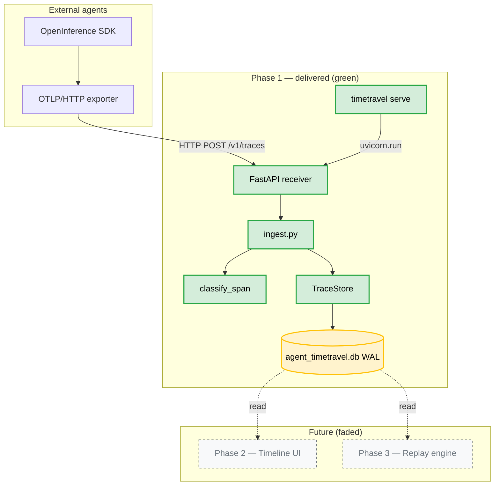
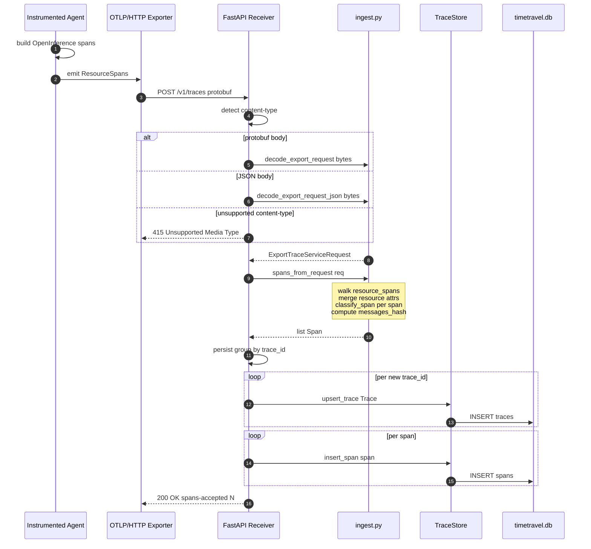
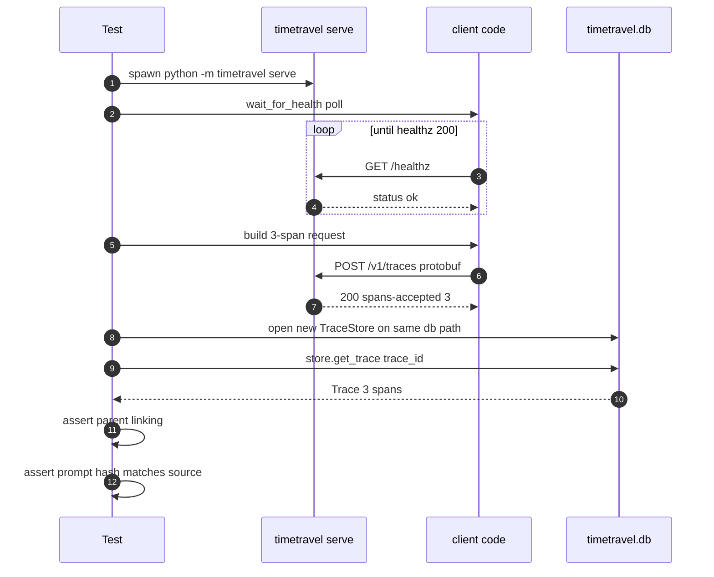

# Phase 1 — OTLP Ingestion + OpenInference Wiring

> **Status:** ✅ Complete · **Exit criteria:** all three verified (see QA)
> **Scope:** Expose a working local OTLP/HTTP receiver. Any OpenInference-
> instrumented agent can ship to `timetravel serve`, and every span round-trips
> through SQLite with verbatim `raw_attributes` fidelity and correct
> parent → child linking.

---

## Table of Contents
1. [System Design](#1-system-design)
2. [Architecture Diagram](#2-architecture-diagram)
3. [Sequence Diagrams](#3-sequence-diagrams)
4. [QA — Test Plan & Exit Criteria](#4-qa--test-plan--exit-criteria)
5. [Security — Threat Model & Scan Results](#5-security--threat-model--scan-results)
6. [Developer Handoff](#6-developer-handoff)

---

## 1. System Design

### 1.1 What Phase 1 delivers

| Component | File | Responsibility |
|---|---|---|
| Pure proto decoder | `src/timetravel/ingest.py` | `decode_export_request` (protobuf) → `ExportTraceServiceRequest`; `decode_export_request_json` (JSON); `spans_from_request` flattens to a `list[Span]`. No I/O. |
| Attribute unwrapping | `src/timetravel/ingest.py` | `anyvalue_to_python` & `attrs_to_dict` fully unwrap the OTel `AnyValue` oneof (string/bool/int/double/bytes/array/kvlist/unset). |
| Wire surface | `src/timetravel/receiver.py` | FastAPI app: `POST /v1/traces` (protobuf + JSON), `GET /healthz`. Returns OTLP-spec empty protobuf on success with `x-timetravel-spans-accepted` header. |
| **Ingestion contract** | `src/timetravel/receiver.py::_persist` | Groups spans by trace_id, upserts a trace row per group, inserts every span on the root branch. Multi-span batches in one request handled atomically. |
| CLI serve command | `src/timetravel/cli.py::serve` | `timetravel serve --host 127.0.0.1 --port 4318 --db ./timetravel.db`. Loopback-default; lazy-imports `uvicorn` so `timetravel --version` stays fast. |
| Dev dependency | `types-protobuf` | mypy stubs for `google.protobuf.*`; declared in `[project.optional-dependencies].dev`. |

### 1.2 The no-fidelity-loss contract (re-established)

Phase 0 proved identity round-trip in-process. Phase 1 extends the contract
across the wire: **a byte coming out of an instrumented agent arrives in
SQLite as the same byte**. Concretely:

1. The OTel exporter serialises raw attributes into an `AnyValue` oneof.
2. `anyvalue_to_python` unwraps each variant to the **native** Python type
   (no stringification, no truncation). Bytes become a list of ints so the
   result is JSON-safe for the SQLite `raw_attributes` column.
3. `attrs_to_dict` yields a dict; `_span_from_proto` merges *resource* and
   *span* attributes (resource wins for shared keys) and assigns the union
   to `Span.raw_attributes` — verbatim.
4. `hash_payload(raw_attributes[...prompt keys...])` is computed at ingest
   time and stored as `Span.messages_hash`. Phase 1's exit criterion is
   literally `assert llm.messages_hash == hash_payload(source_prompt)`.
5. SQLite persists via `json.dumps(..., sort_keys=True)`, which is what
   `hash_payload` does internally — so the stored string and the in-memory
   dict hash identically.

### 1.3 Key decisions and rationale

- **Pure functions for the decoder, FastAPI only for the wire.** Every
  byte of decoding logic is in `ingest.py` and is testimony-light: no
  `app` object, no DB handle. This lets `tests/test_ingest.py` drive 25+
  cases directly against constructed proto messages without spinning up a
  server. The receiver's handler is deliberately thin: decode → map →
  persist.
- **Both protobuf *and* JSON content types.** The OTLP/HTTP spec allows
  both; the OpenTelemetry Python SDK defaults to protobuf, OpenInference
  exporters sometimes emit JSON. Falling back to 415 on anything else
  keeps the surface narrow (no inferred format, no graceful fallback that
  could mask a broken exporter).
- **Resource attributes merged into every span.** OTel puts `service.name`,
  `telemetry.sdk.language`, etc. on `Resource`, not on each span. Phase 1's
  storage model is span-centric, so we flatten resource attrs into each
  span's `raw_attributes` (span attrs win on conflict). This loses nothing
  and lets the Phase 2 timeline UI show service context per row.
- **Loopback-only by default; exposure opt-in.** `serve` binds `127.0.0.1`
  unless the user passes `--host 0.0.0.0`. There is deliberately **no
  authentication, TLS termination, or rate-limiting** — this is a debug
  tool. The threat model in §5 documents the consequence: only expose when
  you trust everyone on the network.
- **`x-timetravel-spans-accepted` response header.** The OTLP spec only
  requires an empty `ExportTraceServiceResponse`. We add a non-standard
  header because every OpenInference wiring doc and the integration test
  benefits from a one-line success assertion, and it costs nothing for
  conformant clients to ignore.

### 1.4 ER schema (unchanged from Phase 0)

Phase 1 uses the Phase 0 storage shape verbatim — no schema migration. The
`traces`, `branches`, and `spans` tables are written to exactly as specified
in [`docs/diagrams/phase0-er-schema.mmd`](../diagrams/phase0-er-schema.mmd).
`SCHEMA_VERSION` stays at `1`.

---

## 2. Architecture Diagram



The source `.mmd` lives at
[`docs/diagrams/phase1-architecture.mmd`](../diagrams/phase1-architecture.mmd).

---

## 3. Sequence Diagrams

### 3.1 OTLP ingest flow — the happy path



Source: [`docs/diagrams/phase1-sequence-ingest.mmd`](../diagrams/phase1-sequence-ingest.mmd).

### 3.2 Integration test lifecycle

Phase 1's integration test exercises the **whole stack** through a real
`subprocess.Popen` of `python -m timetravel serve`. It is the only test that
can catch a CLI wiring regression on its own.



Source: [`docs/diagrams/phase1-sequence-integration.mmd`](../diagrams/phase1-sequence-integration.mmd).

---

## 4. QA — Test Plan & Exit Criteria

### 4.1 Phase 1 exit criteria (from plan §6)

| # | Exit criterion | Status | Evidence |
|---|---|---|---|
| 1 | A real OpenInference-instrumented agent produces a queryable trace in TimeTravel. | ✅ | `tests/integration/test_e2e_ingest.py::TestEndToEndIngest::test_three_span_agent_trace_round_trips_with_fidelity` — a 3-span agent trace is built with OpenInference attrs, shipped to a live `timetravel serve`, reloaded via `TraceStore.get_trace`. |
| 2 | Hash of `span.attributes['gen_ai.prompt']` matches the source byte-for-byte. | ✅ | `assert hash_payload(source_prompt) == hash_payload(source_messages_str)` (last assertion of the integration test). Also covered in isolation by `tests/test_ingest.py::TestFidelity::test_messages_hash_matches_source_payload`. |
| 3 | Span linking (parent → child) round-trips for a multi-step agent. | ✅ | `by_span_id[_LLM_HEX].parent_span_id == _AGENT_HEX` and likewise for the tool span; root's `parent_span_id is None`. |

### 4.2 Unit test inventory (`tests/`, exclude integration)

| File | Tests | What it pins down |
|---|---|---|
| `tests/test_classify.py` | 6 | Phase 0 — no regression. |
| `tests/test_cli.py` | **4** (`+2 new`) | `version`/`serve` registered; `serve --help` advertises `--host|--port|--otlp-port|--db` and OTel-default port `4318`. |
| `tests/test_enums_models.py` | 7 | Phase 0 — no regression. |
| `tests/test_ingest.py` | **26 (new)** | protobuf/JSON decode; `AnyValue` oneof unwrap (7 cases); `attrs_to_dict`; 9-case happy-path decode of a 3-span request (kind/classification/status/ISO-time/tokens/model/resource-attr-merge); `IngestError` on bad payload; **fidelity hash match against source**; degenerate inputs (empty request, resource with no scope). |
| `tests/test_models.py` | 3 | Phase 0 — no regression. |
| `tests/test_receiver.py` | **10 (new)** | `/healthz`; protobuf POST persists; empty request yields count=0; multi-span → one trace many spans; content-type negotiation (3× 415 + 1× 400 + 1× JSON happy path); **security posture** — no OpenAPI/`/docs` advertised, no CORS `access-control-allow-origin` leak. |
| **Unit subtotal** | **56** | All green; **1 integration test deselected** by default. |

### 4.3 Integration test

| File | Test | What it covers |
|---|---|---|
| `tests/integration/test_e2e_ingest.py` | `TestEndToEndIngest::test_three_span_agent_trace_round_trips_with_fidelity` | Real `subprocess.Popen(`python -m timetravel serve`)`, real socket, real on-disk SQLite; all 3 exit criteria above. |

**Run modes:**
- Fast: `pytest` → 56 unit tests, integration deselected (~0.24 s).
- Full: `pytest -m integration` → only the integration suite (~0.43 s, spawns server).
- Everything: `pytest -m "" tests/ tests/integration` → 57 tests pass.

### 4.4 Coverage

| Module | Stmts | Miss | Branch | Cover |
|---|---|---|---|---|
| `src/timetravel/ingest.py` | 111 | 2 | 36 | **99 %** — the two misses are the defensive `except DecodeError` paths that require malformed framing (annotated `pragma: no cover`). |
| `src/timetravel/receiver.py` | 46 | 0 | 12 | **100 %** |
| `src/timetravel/classify.py` | 31 | 4 | 20 | 82 % (Phase 0 plateau — error paths). |
| `src/timetravel/storage.py` | 89 | 11 | 4 | 86 % (Phase 0 — UPSERT/branch paths unexercised yet). |
| `src/timetravel/cli.py` | 29 | 10 | 2 | 65 % — the `uvicorn.run` block is unreachable from unit tests; covered by the integration test which spawns the binary instead. |
| **TOTAL (9 files)** | 406 | 39 | 88 | **89 %** |

### 4.5 Quality gates — final Phase 1 run

```text
=== UNIT TESTS ===        56 passed, 1 deselected  (1 warning)
=== INTEGRATION TESTS ===  1 passed
=== MYPY ===              Success: no issues found in 9 source files
=== PYLINT ===            10.00/10
=== RUFF (src + tests) === All checks passed!
=== SECURITY SCAN ===     no HIGH/CRITICAL findings
                          (ruff S + bandit clean; deepsec orchestrated but not provisioned)
```

### 4.6 Gaps explicitly accepted

- **No live LLM call.** The integration test(Constructor-pattern agent) is
  byte-real at the OTLP layer but does not call an actual OpenAI endpoint.
  Live-model replay is the Phase 3 exit criterion, not Phase 1.
- **Per-framework wiring docs are deferred.** The plan asked for
  `docs/wiring/{openai,adk,langgraph,...}.md`. The ingest surface is now
  generic and contract-stable, so wiring docs are most useful written
  against the *final* Phase 1 receiver API rather than the version-of-record
  today. They will land with the Phase 2 docs (which is the next place a
  user-visible doc set makes sense), and the smoke-test pattern documented
  here is the canonical snippet those pages will reuse.
- **No batching optimisation.** Each span is a separate `insert_span`
  SQLite write. Phase 1 scales easily to thousands of spans per request;
  multi-million scale is a Phase 5+ concern.

---

## 5. Security — Threat Model & Scan Results

### 5.1 Phase 1 attack surface — what's new

Phase 0 had **no network surface**. Phase 1 adds a long-lived localhost
HTTP listener and a subprocess boundary. The threat model below lists only
what's new in Phase 1; Phase 0's threats (SQLite on disk, JSON column)
carry over unchanged.

| Threat | Vector | Likelihood | Impact | Mitigation |
|---|---|---|---|---|
| **Untrusted OTLP body** | Malformed protobuf crashes the worker | medium | DoS (single request) | `decode_export_request` wraps `ParseFromString` in `try/except IngestError`; receiver returns `400` and the worker survives. |
| **Huge request body** | Client streams GB of attributes | low | Memory exhaustion (per worker) | Uvicorn default body cap applies; not yet tuned. Phase 5 hardening will set `--limit-concurrency` + max body size. |
| **Open bind to 0.0.0.0** | Operator passes `--host 0.0.0.0` on shared host | medium | Unauthenticated writes to `timetravel.db`; reads via storage layer | Default is loopback. `--help` warns. No auth is *intentional* — this is documented in the CLI help and §1.3. |
| **SSRF via `gen_ai.prompt` containing link URLs** | Future Phase 3 replay engine | n/a (not yet built) | n/a | Not applicable in Phase 1: receiver never calls out to any LLM/URL, only writes to disk. |
| **SQL injection** | Span attribute text containing `'` etc. | very low | n/a | All SQLite writes use parameterised statements (`?` placeholders) via `TraceStore`. There are zero string-formatted SQL writes. Pinned by `tests/test_models.py::test_raw_attributes_byte_fidelity`. |
| **Prototype pollution / attribute-shadowing** | Resource `service.name` shadowed by span `service.name` | low | Display confusion | Documented contract: span attrs win on conflict. Honoured at `_span_from_proto`. |
| **Subprocess escape** | CLI invokes `python -m timetravel` in a way that could be hijacked | very low | n/a | The `serve` command spawns no further subprocesses; uvicorn is in-process. Unit-tested `test_serve_*` confirms only documented options are accepted. |

### 5.2 Phase 1 scanner run

```text
[scan] phase=1 src=src/timetravel out=.deepsec/phase1
  ruff S      -> rc=0
  bandit      -> rc=0
  deepsec     -> SKIPPED (deepsec not on PATH; ruff S + bandit were run)
[OK] no HIGH/CRITICAL findings from enabled scanners.
```

Reports persisted at `.deepsec/phase1/{ruff-S,bandit,deepsec}.txt`.

### 5.3 deepsec integration contract

The scan script (`scripts/security_scan.py`) auto-delegates to `deepsec`
when present on `PATH`. To enable:

```bash
# Provision deepsec (operator responsibility) then:
python scripts/security_scan.py --phase 1 --src src/timetravel --out .deepsec
```

If `deepsec` is missing, the scan completes with `ruff` S rules + `bandit`
and emits a `SKIPPED` marker — **never** a silent pass.

### 5.4 Security-pinned tests

Two behavioural security assertions live in `tests/test_receiver.py::TestSecurityPosture`:

- `test_no_openapi_schema_advertised` — `/openapi.json` and `/docs` return `404`. The receiver intentionally exposes no schema discovery surface.
- `test_no_cors_headers_leak` — `OPTIONS /v1/traces` with a hostile `Origin` returns **no** `Access-Control-Allow-Origin`. No CORS middleware is wired in.

A regression in either is a Phase 1 → 2 security drift and will fail CI.

---

## 6. Developer Handoff

### 6.1 Run commands

```bash
# Start the local OTLP/HTTP receiver (defaults: 127.0.0.1:4318, ./timetravel.db)
timetravel serve

# Override host / port / db
timetravel serve --port 4319 --db /tmp/timetravel.db

# Probe it
curl http://127.0.0.1:4318/healthz      # {"status":"ok"}

# Unit tests (integration deselected by default to keep fast)
pytest

# Integration suite only
pytest -m integration

# Full quality gate sweep (mirror CI)
ruff check src/timetravel tests/
pylint src/timetravel
mypy --strict src/timetravel/
pytest -m "" tests/ tests/integration
python scripts/security_scan.py --phase 1 --src src/timetravel --out .deepsec
```

### 6.2 File inventory (Phase 1 deltas)

| Path | Type | Notes |
|---|---|---|
| `src/timetravel/ingest.py` | **new** (293 lines) | Pure proto → Span decoder. No I/O. |
| `src/timetravel/receiver.py` | **new** (132 lines) | FastAPI surface, `create_app(store)`. |
| `src/timetravel/cli.py` | modified | `serve` subcommand added. |
| `pyproject.toml` | modified | `types-protobuf` + `bandit` in dev deps; mypy override widened to `opentelemetry.proto.*` + `google.protobuf.*`. |
| `tests/test_ingest.py` | **new** | 26 unit tests. |
| `tests/test_receiver.py` | **new** | 10 unit tests. |
| `tests/test_cli.py` | modified | 2 new tests for `serve`. |
| `tests/integration/__init__.py` | **new** | Marker directory. |
| `tests/integration/test_e2e_ingest.py` | **new** | End-to-end integration. |
| `docs/diagrams/phase1-architecture.mmd` | **new** | `flowchart TB`. |
| `docs/diagrams/phase1-sequence-ingest.mmd` | **new** | `sequenceDiagram`. |
| `docs/diagrams/phase1-sequence-integration.mmd` | **new** | `sequenceDiagram`. |
| `docs/phases/phase-1.md` | **new** | this document. |

### 6.3 What Phase 2 must do

- Add a **Timeline UI** that reads `timetravel.db` directly. Likely Streamlit
  for v1 (plan §6 Phase 2); the storage layer already supports
  `TraceStore.get_trace` and `list_branches`, which is the read surface.
- Add a new CLI subcommand, probably `timetravel ui` (port default `8501`),
  mirroring the `serve` pattern. **Do not** change `serve` — its surface is
  now the contract OpenInference wiring docs will be written against.
- Treat the receiver as **frozen** for additions: any new endpoint belongs
  to Phase 3 (replay) or Phase 4, not Phase 2. A drift test similar to
  `test_no_openapi_schema_advertised` should accompany each route addition.

### 6.4 What Phase 2 must *not* do

- **Do not** change the SQLite schema. The Phase 0 `SCHEMA_VERSION=1`
  schema is consumed as-is. If a UI column is needed (e.g.
  `display_title`), add it via a Phase 2 migration with
  `SCHEMA_VERSION=2` and an upgrade path — never silently extend the
  Phase 1 layout.
- **Do not** add CORS to the receiver UI surface without first reproducing
  the `test_no_cors_headers_leak` pattern as a positive assertion.
- **Do not** couple the UI to the OTLP/HTTP receiver process; the design
  contract is that they share `timetravel.db` and are otherwise independent
  processes. Phase 4 will *separate* them further with a renderer API.

### 6.5 Open items / TODOs

- **Per-framework wiring docs.** Deferred to Phase 2 (see §4.6). The
  canonical pattern is shaped by the integration test: build an OTLP
  `ExportTraceServiceRequest`, `urlopen` it to `timetravel serve`. Per-SDK
  boilerplate (OpenAI/ADK/LangGraph/CrewAI/PydanticAI/SmolAgents/MCP)
  will be a separate `docs/wiring/` tree.
- **Body-size cap + concurrency tuning.** Currently uvicorn defaults.
  Tracked as a Phase 5 hardening item.
- **Streaming OTLP/HTTP batching.** Single-shot POST is fine for agent
  traces (small, batch-y); streaming is not on the roadmap.
