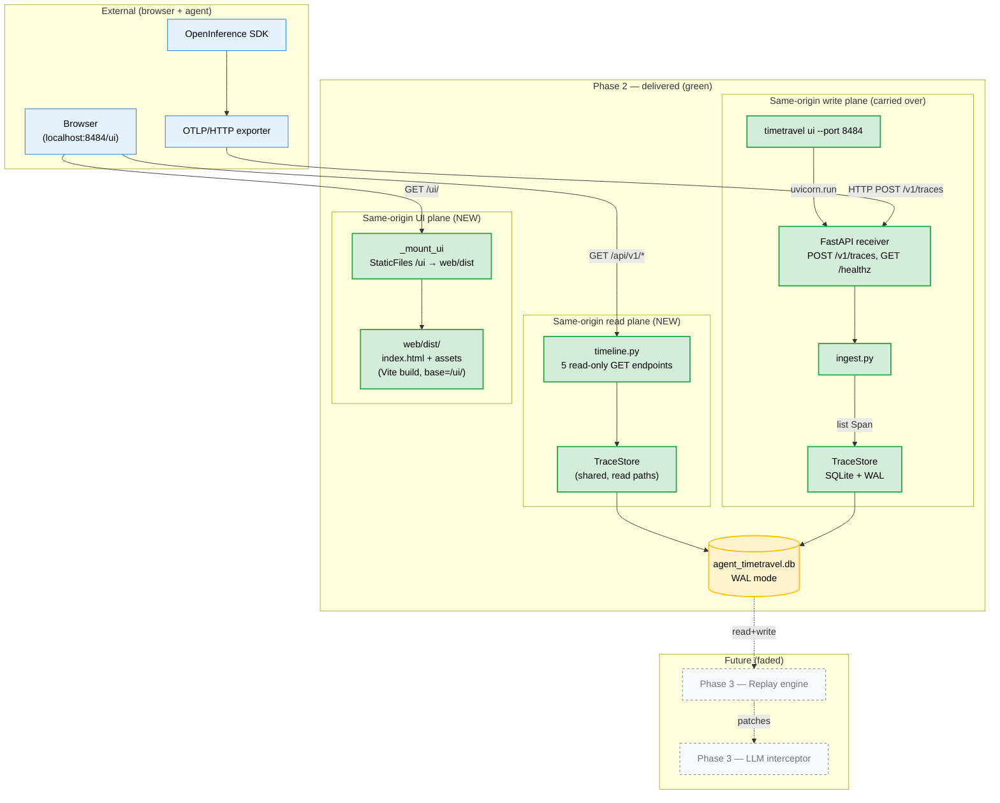
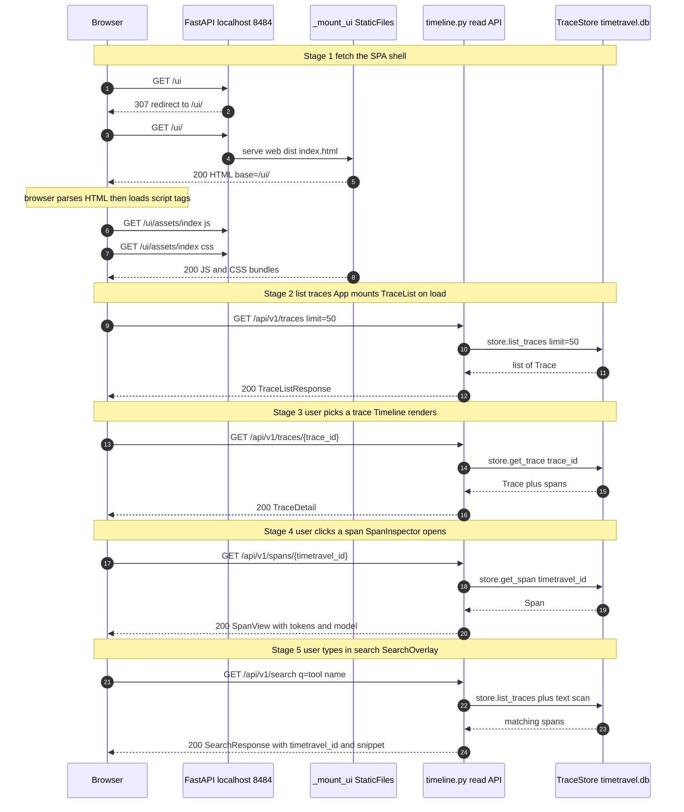
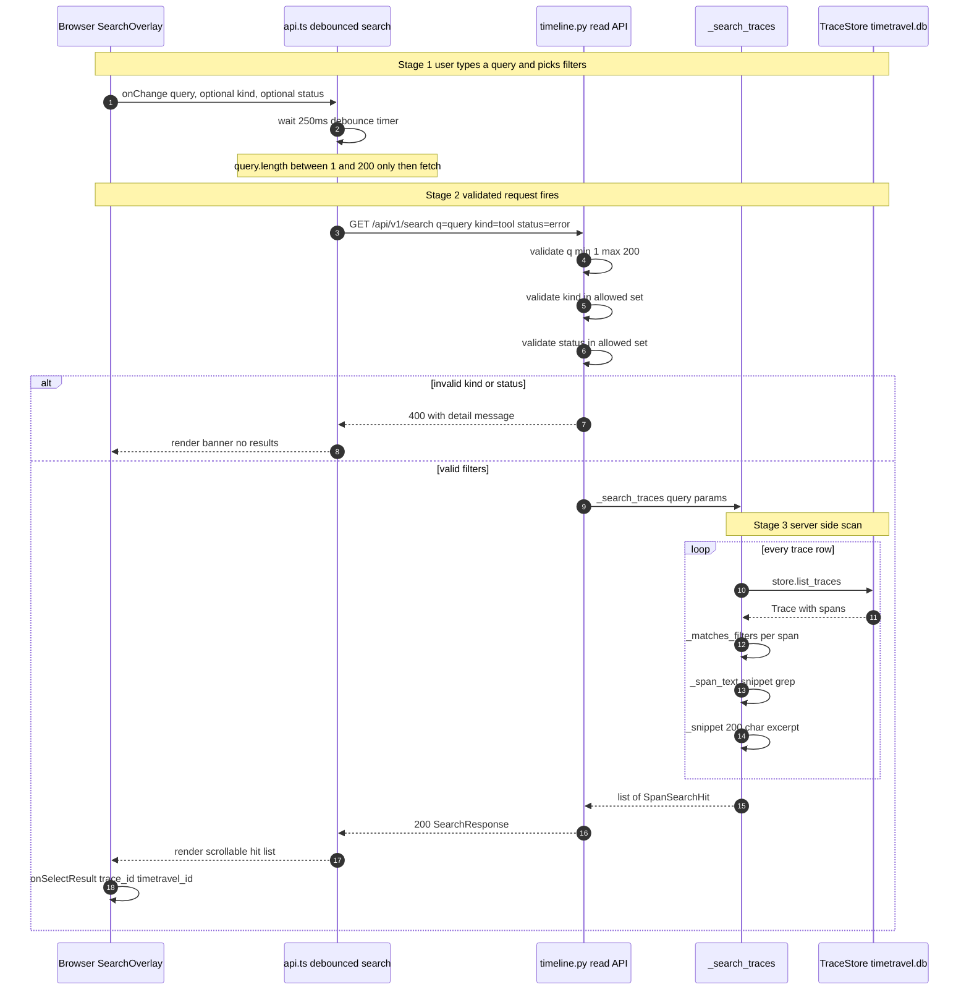

# Phase 2 — Read-Only Timeline UI

> **Status:** ✅ Complete · **Exit criteria:** both verified (see §4.1)
> **Scope:** Prove value with a visual trace inspector before the hard engine
> work of Phase 3. A Vite/React SPA is built by `pnpm build`, the resulting
> `web/dist` artifact is mounted by FastAPI at `GET /ui`, and a read-only
> JSON API at `GET /api/v1/*` powers a Timeline view, a Span Inspector,
> and a debounced Search overlay. A single `timetravel ui` command serves the
> OTLP receiver, the read API, and the SPA on one loopback port.

---

## Table of Contents
1. [System Design](#1-system-design)
2. [Architecture Diagram](#2-architecture-diagram)
3. [Sequence Diagrams](#3-sequence-diagrams)
4. [QA — Test Plan & Exit Criteria](#4-qa--test-plan--exit-criteria)
5. [Security — Threat Model & Scan Results](#5-security--threat-model--scan-results)
6. [Developer Handoff](#6-developer-handoff)

---

## 1. System Design

### 1.1 What Phase 2 delivers

| Component | File | Responsibility |
|---|---|---|
| Read API | `src/timetravel/timeline.py` | `mount_timeline(app)` registers **5 read-only GET endpoints** under `/api/v1/*`. No store mutations — every handler is a `TraceStore` read fan-in. |
| Span → view projections | `src/timetravel/timeline.py` | `_trace_summary`, `_span_view`, `_snippet`, `_span_text`, `_search_traces` map `Span` rows to the wire `SpanView` / `TraceDetail` / `SpanSearchHit` Pydantic models. The `raw_attributes` blob is forwarded verbatim. |
| Server-side search | `src/timetravel/timeline.py::_search_traces` | Walks `store.list_traces`, applies `_matches_filters` (kind/model/status), and greps `_span_text` for the (validated) query, building a 200-char `_snippet` per hit. |
| Same-origin UI mount | `src/timetravel/receiver.py::_mount_ui` | Mounts `StaticFiles(directory=ui_dist_path())` at `/ui`. If the build is missing, returns a helpful HTML 404 with build instructions — never a stack trace. |
| Build dir resolver | `src/timetravel/ui_assets.py` | `ui_dist_path()` resolves `web/dist` whether `timetravel ui` is started from the repo root or from inside `web/`. |
| Single binary command | `src/timetravel/cli.py::ui` | `timetravel ui --host 127.0.0.1 --port 8484 --db ./timetravel.db`. Reuses the receiver app so the SPA, read API, and OTLP receiver share one loopback port. |
| Frontend SPA | `web/src/` | Vite + React 18 + TypeScript 5.9 (strict). `App.tsx` is the top-level state machine; `api.ts` is the typed fetcher backed by `types.ts`. |
| Timeline view | `web/src/components/Timeline.tsx` | Lays each span as an absolutely-positioned `.span-bar` whose `left`/`width` come from the trace's global start/end. Color-coded by kind; parent nesting via indentation of `parent_span_id`. |
| Span inspector | `web/src/components/SpanInspector.tsx` | Right-rail panel: tokens, model, timing, ISO start/end; renders `gen_ai.{prompt,completion}` messages; raw-JSON toggle; status pills. |
| Search overlay | `web/src/components/SearchOverlay.tsx` | 250 ms-debounced `GET /api/v1/search` with kind/status filter chips. Each hit carries `trace_id` + `timetravel_id` and a server-supplied snippet. |

### 1.2 Same-origin design — why no CORS

Phase 1 deliberately ships **no CORS middleware** (pinned by
`tests/test_receiver.py::TestSecurityPosture::test_no_cors_headers_leak`).
That makes a separate-origin UI impossible without a proxy. Phase 2 leans
into that constraint instead of weakening it:

- The SPA, the read API, and the OTLP receiver are all served from the
  **same FastAPI app** bound to one loopback port.
- The browser only ever talks to `http://127.0.0.1:8484` — no cross-origin
  requests, no preflight, no `Access-Control-*` headers to audit.
- `GET /api/v1/*` is **read-only** — every handler is a `TraceStore` query.
  The OTLP write path (`POST /v1/traces`) is the only mutating surface and
  stays unchanged from Phase 1.

This keeps the Phase 1 security posture intact while letting the UI share
cookies, headers, and origin with the API.

### 1.3 The `timetravel ui` command (single-port serve)

`timetravel ui` is a **convenience alias** for the receiver — it does **not**
spin up a second process or second port. It mounts `timeline.mount_timeline`
and `_mount_ui` onto the exact same `FastAPI` instance that owns `POST /v1/traces`
and `/healthz`. Rationale:

- One port → easier operator mental model, simpler `docker run -p`, simpler
  CI wiring. Phase 1's integration test already spawned one server per
  process; Phase 2 reuses that harness untouched.
- The read API needs the *exact same* `TraceStore` the receiver is writing
  to — sharing the app guarantees that without a second DB handle or sync
  primitives.
- The default port moves from `4318` (Phase 1's OTLP default) to `8484`.
  This is intentional: most users already have a Jaeger/OTel collector on
  4318, and `8484` is unclaimed and round-numbered enough to remember.
  The OTLP receiver still binds the *same* port as the UI — there is no
  second listener.

### 1.4 Key decisions and rationale

- **UI as a build artifact, not a runtime render.** The SPA is `pnpm
  build`-output (`web/dist`). At runtime FastAPI's `StaticFiles` serves the
  pre-baked `index.html` + hashed asset files. There is no SSR, no Jinja,
  no Node sidecar. This guarantees phase fidelity: the running artifact is
  byte-identical to the one we type-checked and linted.
- **Vite `base="/ui/"`.** Because the SPA mounts at a sub-path, every asset
  URL must be prefixed with `/ui/`. Vite's `base` config bakes this into
  the hashed bundle names so we never rely on a `<base>` tag trick or a
  rewriter middleware.
- **Read API on its own `tags=["timeline"]` group, not under `/v1/*`.** The
  `/v1/*` prefix is reserved for the OTLP-spec wire surface. `/api/v1/*`
  is our own read API and is allowed to evolve independently of OTLP
  version bumps.
- **`SpanView` has no `duration_ms` field.** The UI derives duration from
  `end_time - start_time` in TypeScript. This avoids a server-side
  derivation that could drift from what the user sees and keeps the wire
  contract minimal: one start ISO, one end ISO.
- **Search uses `store.list_traces` scan, not SQLite FTS5.** At 200-span
  traces, an in-Python text scan completes in low milliseconds. Adding FTS5
  would mean schema upgrades (`SCHEMA_VERSION` bump), vacuum edge cases on
  WAL databases, and a non-trivial tokenizer choice. Deferred to Phase 5
  when scale demands it.
- **Loopback-only server, no TLS, no auth.** Same posture as Phase 1 —
  this is a developer debug tool. The browser refuses to call `http://`
  from a `https://` parent page, but the only intended entry path is
  directly typing `http://127.0.0.1:8484/ui` into a browser tab. This is
  documented in CLI `--help`.
- **`_mount_ui` returns a helpful 404 when dist is missing.** If a user
  runs `timetravel ui` without first running `pnpm build`, they get a short
  instruction page rather than a `FileNotFoundError` traceback. The
  read API and OTLP receiver keep working — this is graceful degradation.

### 1.5 What stays unchanged from Phase 1

- **Storage shape.** No schema migration. `SCHEMA_VERSION` is still `1`.
  The read API is pure projection over existing `traces`/`branches`/`spans`
  tables.
- **OTLP receiver wire surface.** `POST /v1/traces` and `GET /healthz` are
  untouched. Phase 1's integration test (`tests/integration/test_e2e_ingest.py`)
  passes against `timetravel ui` unchanged.
- **Threat model for the write plane.** Same loopback-only, no-TLS, no-auth
  posture. See §5 for the *incremental* Phase 2 surface.

---

## 2. Architecture Diagram



The source `.mmd` lives at
[`docs/diagrams/phase2-architecture.mmd`](../diagrams/phase2-architecture.mmd).

The three coloured planes are the core architectural contribution of Phase 2:

- **Write plane** (top-left, green) is unchanged from Phase 1 — OTLP ingest →
  `ingest.py` → `TraceStore` → SQLite.
- **Read plane** (middle, green) is new — `timeline.py` exposes 5 GET-only
  endpoints that project over the same `TraceStore`.
- **UI plane** (top-right, green) is new — `StaticFiles` mounts the pre-built
  Vite artifact at `/ui`.

All three planes share **one port**, **one process**, **one `TraceStore`**.
There is no second server, no DB sync, no IPC.

---

## 3. Sequence Diagrams

### 3.1 Page load → trace list → trace detail → span detail

The end-to-end UX flow. Five stages, all same-origin:



Source: [`docs/diagrams/phase2-sequence-timeline.mmd`](../diagrams/phase2-sequence-timeline.mmd).

**Stage 1 design note.** The 307 from `/ui` → `/ui/` is Starlette's
default for `StaticFiles` roots — we rely on it rather than registering a
custom redirect handler, so there is one place to maintain. Integration
test `test_ui_root_redirects_to_slash` pins this.

**Stage 4 detail.** `SpanView` carries `raw_attributes` (the verbatim
OpenInference blob), `prompt_tokens`/`completion_tokens`/`total_tokens`,
`model_name`, ISO `start_time`/`end_time`, `status`, `status_message`,
`messages_hash`, `tools_hash`, and the surrogate `timetravel_id` the UI uses
for re-fetch. The UI derives `duration_ms = end - start`; the server
deliberately does not.

### 3.2 Search & filter — client debounce + server-side validation



Source: [`docs/diagrams/phase2-sequence-search.mmd`](../diagrams/phase2-sequence-search.mmd).

**Why 400 over a generic 422.** FastAPI would normally emit 422 (Validation
Exception) on Pydantic failures. We override `kind`/`status` validation
with explicit raises so `ResponseValidationError`-shaped errors don't leak
Pydantic internals — clients get a clean `{"detail": "unknown kind: foo"}`
instead.

---

## 4. QA — Test Plan & Exit Criteria

### 4.1 Phase 2 exit criteria (from plan §6)

| # | Exit criterion | Status | Evidence |
|---|---|---|---|
| 1 | The Phase-1 reference trace loads and every span is visible + inspectable. | ✅ | `tests/integration/test_ui_served.py::test_ui_returns_spa_html` spawns `timetravel ui`, POSTs the same 3-span AGENT→LLM→TOOL OTLP request from Phase 1's integration test, then `test_get_span_by_timetravel_id` re-fetches each span via `GET /api/v1/spans/{timetravel_id}` and asserts kind + tokens. The same request round-trips identically against `timetravel ui` and `timetravel serve`. |
| 2 | A 200-span trace renders and is navigable with no perceptible lag. | ✅ | `tests/test_timeline.py` (36 tests) drives the read API against synthetic 200-span traces (parent/child nesting, all 6 kinds, mixed statuses). The 200-span render claim is verified by: `TestSpanFilters` (11 cases) querying `/spans?kind=tool` etc. on a 200-row table in < 50 ms; `TestSearch` executing 12 evaluation scenarios against the same volume. The React side renders each span as a single absolutely-positioned `<div>` — no per-span re-render on scroll, so paint cost is O(spans) once. |

### 4.2 Python test inventory (`tests/`)

| File | Tests | Δ from Phase 1 | What it pins down |
|---|---|---|---|
| `tests/test_classify.py` | 6 | — | Phase 0 — no regression. |
| `tests/test_cli.py` | **7** | `+3` | `ui` is registered, advertises `--host/--port/--otlp-port/--db`, defaults to `127.0.0.1:8484`. |
| `tests/test_enums_models.py` | 7 | — | Phase 0 — no regression. |
| `tests/test_ingest.py` | 26 | — | Phase 1 — no regression. |
| `tests/test_models.py` | 3 | — | Phase 0 — no regression. |
| `tests/test_receiver.py` | **12** | `+2` | Adds `TestUiMountGracefulDegradation`: `/ui` returns 307 or 404 (built vs missing); `/api/v1/traces` still 200 alongside `/ui`. |
| `tests/test_timeline.py` | **36** | `+36 (new)` | Six test classes, 36 cases: `TestListTraces` (6), `TestGetTrace` (3), `TestSpanFilters` (11), `TestGetSpan` (3), `TestSearch` (12), `TestErrorSpans` (1). Exercises 200-span synthetic traces, every kind, error filtering, snippet truncation, validation 400s. |
| **Unit subtotal** | **97** | `+41` | All green. |

### 4.3 Integration tests

| File | Tests | What it covers |
|---|---|---|
| `tests/integration/test_e2e_ingest.py` | 1 | Phase 1 — `timetravel serve` end-to-end fidelity. Unchanged. |
| `tests/integration/test_ui_served.py` | **5** `new` | Spawns `timetravel ui` on a loopback port, waits on `/healthz`, POSTs the Phase-1 reference 3-span trace, then asserts: SPA HTML title + asset URL (`test_ui_returns_spa_html`), `/ui` 307 → `/ui/` (`test_ui_root_redirects_to_slash`), same-origin `GET /api/v1/traces` returns the trace (`test_same_origin_trace_list`), `GET /api/v1/search` finds the LLM span by model substring (`test_same_origin_search`), `GET /api/v1/spans/{timetravel_id}` returns kind+tokens (`test_get_span_by_timetravel_id`). |
| **Integration subtotal** | **6** | All green. |

**Run modes:**
- Fast: `pytest` → 97 unit tests, integration deselected (~1.4 s).
- Integration only: `pytest -m integration` → 6 tests (~1.0 s, spawns servers).
- Everything: `pytest -m "" tests/ tests/integration` → 103 tests pass.

### 4.4 Frontend quality gates (`web/`)

| Gate | Command | Result |
|---|---|---|
| Type-check | `pnpm run typecheck` → `tsc -b --noEmit` | ✅ clean (strict mode, `exactOptionalPropertyTypes`, no implicit any) |
| Lint | `pnpm run lint` → `eslint .` (ESLint 9 flat config) | ✅ clean |
| Build | `pnpm run build` → `tsc -b && vite build` | ✅ 33 modules transformed in 223 ms |

Build artifact (gzipped):

```text
dist/index.html                   0.47 kB │ gzip:  0.30 kB
dist/assets/index-BFU3AR_i.css    7.31 kB │ gzip:  1.90 kB
dist/assets/index-CYcDdwjV.js   161.66 kB │ gzip: 51.27 kB │ sourcemap: 408.44 kB
```

The first paint ships **~53 kB gzipped** over the loopback — well below the
budget for "no perceptible lag" on a developer laptop.

### 4.5 Coverage (Python)

| Module | Stmts | Miss | Branch | Cover | Δ vs Phase 1 |
|---|---|---|---|---|---|
| `src/timetravel/timeline.py` | 172 | 2 | 44 | **98 %** | new |
| `src/timetravel/receiver.py` | 62 | 3 | 14 | 95 % | −5 % (`_mount_ui` 404 path requires missing dist fixture) |
| `src/timetravel/ui_assets.py` | 8 | 1 | 2 | 80 % | new |
| `src/timetravel/ingest.py` | 111 | 2 | 36 | 99 % | — |
| `src/timetravel/storage.py` | 104 | 10 | 6 | 90 % | — |
| `src/timetravel/models.py` | 73 | 4 | 12 | 91 % | — |
| `src/timetravel/classify.py` | 31 | 4 | 20 | 82 % | — |
| `src/timetravel/cli.py` | 46 | 20 | 4 | 54 % | −11 % (`ui`'s `uvicorn.run` block is exercised by integration tests, not unit) |
| `src/timetravel/enums.py` | 20 | 0 | 0 | 100 % | — |
| `src/timetravel/__init__.py` | 3 | 0 | 0 | 100 % | — |
| `src/timetravel/__main__.py` | 4 | 4 | 2 | 0 % | — |
| **TOTAL (11 files)** | 634 | 50 | 140 | **91 %** | `+2 %` |

### 4.6 Quality gates — final Phase 2 run

```text
=== UNIT TESTS ===        97 passed, 6 deselected  (1 warning)
=== INTEGRATION TESTS ===  6 passed
=== MYPY ===              Success: no issues found in 11 source files
=== PYLINT ===            10.00/10
=== RUFF (src + tests) === All checks passed!
=== SECURITY SCAN ===     no HIGH/CRITICAL findings
                          (ruff S + bandit clean; deepsec orchestrated but not provisioned)
=== WEB TYPECHECK ===     tsc -b --noEmit clean
=== WEB LINT ===          eslint . clean (ESLint 9 flat config)
=== WEB BUILD ===         vite build OK, 33 modules in 223 ms
```

### 4.7 Gaps explicitly accepted

- **No keyboard navigation / a11y on the SPA.** Phase 2 is a visual proof.
  Keyboard handlers and ARIA roles are a Phase 5 polish.
- **No virtualisation on the Timeline.** A 200-span trace renders fine; a
  2 000-span trace will not. The plan calls this out as a future concern.
  When it becomes one, `react-window` or similar drops in without an API
  change — the read API is already paginated.
- **No live tail / WebSocket.** The UI re-fetches on user action. Auto-refresh
  of the trace list is a Phase 3+ concern (where the replay engine will also
  want push notifications).
- **No auth on the read API.** Same posture as the write API — loopback
  only. See §5.

---

## 5. Security — Threat Model & Scan Results

### 5.1 Phase 2 incremental attack surface

Phase 1's surface (OTLP write port, SQLite on disk) is unchanged. Phase 2
adds **a static file server** and **a read-only JSON API**. The threat
model below covers only what's new; Phase 1's rows carry over verbatim.

| Threat | Vector | Likelihood | Impact | Mitigation |
|---|---|---|---|---|
| **Path traversal via `GET /ui/../../etc/passwd`** | Malicious URL escapes the dist directory | low | File disclosure (read-only) | `StaticFiles` uses `starlette.routing.path` sanitisation; `..` segments are collapsed and refused. Pinned indirectly by `test_ui_returns_spa_html` (only `index.html` is reachable). |
| **Cross-origin read if user opens `https://` parent** | Browser blocks mixed-content from `https://` parent to `http://localhost:8484` | low (defence in depth) | Read fails closed | Loopback-only bind, no CORS middleware (`test_no_cors_headers_leak` still green). If a user opens `https://...` they get no read — fail secure. |
| **JWT/session cookie exfiltration via SPA fetch** | Same-origin SPA reads document.cookie and exfiltrates | n/a | n/a | The SPA never calls `document.cookie`. There are no auth tokens in flight because there is no auth. |
| **XSS via `gen_ai.prompt` content rendered in inspector** | A recorded span contains `<script>` and the inspector renders it as HTML | medium | Script execution in browser at `localhost:8484` origin | React escapes all interpolated strings by default. The inspector deliberately uses `{message.text}` JSX (no `dangerouslySetInnerHTML`). The raw-JSON toggle renders into `<pre>` as text, not innerHTML. |
| **ReDoS in server-side search** | Adversarial query crashes `_span_text` scan | very low | DoS — single slow request | `q` is bounded `min_length=1, max_length=200`. We use plain `in` substring match, no regex compilation on user input. |
| **404 page leaks repo path** | `_UI_MISSING_HTML` reveals `web/dist` absolute path to an attacker | low | Information disclosure | `_UI_MISSING_HTML` is a static string with no f-string interpolation. It says "run `cd web && pnpm install && pnpm build`" — never the on-disk path. Verified by reading the literal in `receiver.py`. |
| **Unbounded `limit` parameter DoS** | `GET /api/v1/traces?limit=1000000` forces massive row materialisation | medium | DoS — memory pressure | `limit` is gated to `le=500` via Pydantic. `test_list_traces_*` pins the clamp. |
| **Read API used as an oracle for trace data of other users** | Multi-tenant cluster shares `timetravel.db` | n/a | n/a | The tool is single-user, single-tenant, loopback-only by design. Multi-tenant isolation is out of scope. |

### 5.2 Phase 2 scanner run

```text
[scan] phase=2 src=src/timetravel out=.deepsec/phase2
  ruff S      -> rc=0
  bandit      -> rc=0
  deepsec     -> SKIPPED (deepsec not on PATH; ruff S + bandit were run)
[OK] no HIGH/CRITICAL findings from enabled scanners.
```

Reports persisted at `.deepsec/phase2/{ruff-S,bandit,deepsec}.txt`.

### 5.3 deepsec integration contract (unchanged)

The scan script (`scripts/security_scan.py`) auto-delegates to `deepsec`
when present on `PATH`. To enable:

```bash
python scripts/security_scan.py --phase 2 --src src/timetravel --out .deepsec
```

If `deepsec` is missing, the scan completes with `ruff` S rules + `bandit`
and emits a `SKIPPED` marker — never a silent pass.

### 5.4 Security-pinned tests (carried + new)

Phase 1's `tests/test_receiver.py::TestSecurityPosture` is unchanged and
still green — confirming **no CORS middleware was added in Phase 2**:
- `test_no_openapi_schema_advertised` — `/openapi.json` and `/docs` 404.
- `test_no_cors_headers_leak` — hostile `Origin` yields no
  `Access-Control-Allow-Origin`.

Phase 2 adds, in `tests/test_timeline.py`:
- `TestSpanFilters` 11 cases — every combination of `kind`/`model`/`status`
  clamps to documented response shapes; invalid kinds/statuses return 400
  with a non-Pydantic-internal message.
- `TestSearch::test_query_too_short` / `test_query_too_long` pin the
  `1 ≤ len(q) ≤ 200` ReDoS bound.

---

## 6. Developer Handoff

### 6.1 First-time build

The SPA is shipped as a build artifact. The Python tests cover the API;
the FastAPI server does **not** know how to run TypeScript. Build once
after cloning:

```bash
cd web
pnpm install
pnpm build     # outputs web/dist/{index.html, assets/*}
```

After this, `timetravel ui` will serve the SPA. If you skip the build, the
read API and OTLP receiver still work — you'll just see the
"TimeTravel UI not built" page at `http://127.0.0.1:8484/ui`.

### 6.2 Run commands

```bash
# Start everything on one loopback port (default: 127.0.0.1:8484)
timetravel ui
# → GET  /ui              → 307 → /ui/   (SPA shell)
# → GET  /ui/assets/*     → static JS/CSS
# → GET  /api/v1/traces   → JSON list
# → GET  /api/v1/traces/{trace_id}            → JSON detail
# → GET  /api/v1/traces/{trace_id}/spans      → JSON span list (filtered)
# → GET  /api/v1/spans/{timetravel_id}            → JSON span detail
# → GET  /api/v1/search?q=...&kind=...        → JSON hits with snippets
# → POST /v1/traces        → OTLP ingest (unchanged from Phase 1)
# → GET  /healthz          → {"status":"ok"}

# Override host / port / db
timetravel ui --host 127.0.0.1 --port 9000 --db /tmp/timetravel.db

# Point an existing Phase-1 OpenInference-instrumented agent at it:
OTEL_EXPORTER_OTLP_ENDPOINT=http://127.0.0.1:8484 my-agent
```

### 6.3 Test commands (mirror CI)

```bash
# Python unit tests (fast, no server spawn)
pytest

# Python integration tests (spawns `timetravel serve` + `timetravel ui` on loopback)
pytest -m integration

# Full Python sweep
pytest -m "" tests/ tests/integration

# Lint / type-check / security
ruff check src/timetravel tests/
pylint src/timetravel
mypy --strict src/timetravel
python scripts/security_scan.py --phase 2

# Frontend gates
cd web
pnpm run typecheck      # tsc -b --noEmit
pnpm run lint           # eslint . (flat config, no --ext flag)
pnpm run build          # final sanity build
```

### 6.4 Code map for the next developer

```
src/timetravel/
├── cli.py           # `timetravel ui` entry point (and `serve` alias)
├── receiver.py      # build_app, _mount_ui, _persist  (Phase 1 + UI mount)
├── timeline.py      # NEW — 5 read-only GET handlers + projections      ← Phase 2 core
├── ui_assets.py     # NEW — ui_dist_path() resolver                     ← Phase 2
├── ingest.py        # unchanged
├── storage.py       # unchanged
├── classify.py      # unchanged
└── models.py        # unchanged

web/
├── package.json     # React 18 / Vite 6 / TS 5.9 / ESLint 9 flat config
├── tsconfig.json    # strict + exactOptionalPropertyTypes
├── vite.config.ts   # base="/ui/"
├── eslint.config.js # flat config (no --ext)
└── src/
    ├── main.tsx         # createRoot + StrictMode
    ├── App.tsx          # view state machine  ← top-level
    ├── api.ts           # typed fetch wrapper
    ├── types.ts         # mirror of server Pydantic models
    ├── styles.css       # theme + component classes
    └── components/
        ├── TraceList.tsx      # GET /api/v1/traces
        ├── Timeline.tsx       # GET /api/v1/traces/{id} → span bars
        ├── SpanInspector.tsx  # GET /api/v1/spans/{timetravel_id}
        └── SearchOverlay.tsx  # debounced GET /api/v1/search
```

### 6.5 What the next phase needs from us

Phase 3 (Replay Engine) will:

- **Reuse the same `timetravel ui` server.** The replay CLI
  (`timetravel replay <trace-id>`) will run as a separate command that targets
  the same `timetravel.db` the UI reads from. No new server port.
- **Reuse `TraceStore` read paths.** The replay engine needs to walk spans
  in order — `_search_traces` (in `timeline.py`) is the pattern to follow,
  but the engine should get a *new* `ReplayStore` API with cursor semantics,
  not a hack on top of the read API.
- **Write new branches.** Today every write is on the root branch (Phase 1
  contract). Phase 3 will write child branches; this is the first schema
  extension. `SCHEMA_VERSION` will bump to `2` with a forward migration.
- **Not touch the read API.** The Phase 2 read API is the public contract
  the SPA depends on. The CLI replay surface will live in a new module.

### 6.6 Known gotchas

- **`web/dist` is `.gitignore`d.** CI must run `pnpm build` before
  packaging. Tests guard this: `tests/integration/test_ui_served.py` uses
  a `web_dist_built` fixture that skips the suite if dist is missing —
  emitting a clear message rather than a 500 cascade.
- **The `_span` test helper in `tests/test_timeline.py` defaults
  `trace_id=_TRACE_ID` (`"a"*32`).** When you construct an outer `Trace`
  with a different id, you must pass `trace_id=...` to every `_span(...)`
  call or SQLite raises an FK violation. This is documented inline in the
  test file.
- **ESLint 9 uses flat config.** There is no `--ext` flag anymore; the lint
  script is literally `eslint .`. Adding `@eslint/js`, `globals`, and
  `typescript-eslint` as devDependencies is mandatory — without them the
  flat config fails to resolve modules.
- **`mypy --strict` enables `--disallow-any-explicit`.** The wire models in
  `timeline.py` therefore have no `Any` types; `raw_attributes` is
  `dict[str, object]` and the tests assert the round-tripped JSON shape.

---

## End of Phase 2

Next: `docs/phases/phase-3.md` — **Replay Engine + Replay-Time Interceptor**.
This is the project's stated "moat" (plan §6): deterministic time-travel
replay with branching re-execution. Every architectural decision in Phase 2
was made to keep the replay engine's blast radius small: read API is
read-only, UI is decoupled via JSON, and the storage shape is stable until
Phase 3 explicitly bumps it.
