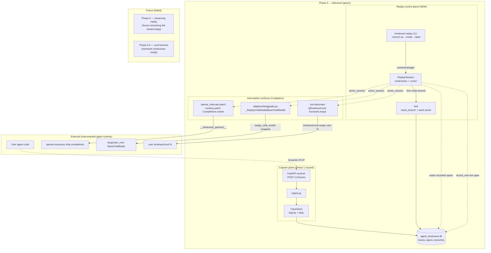
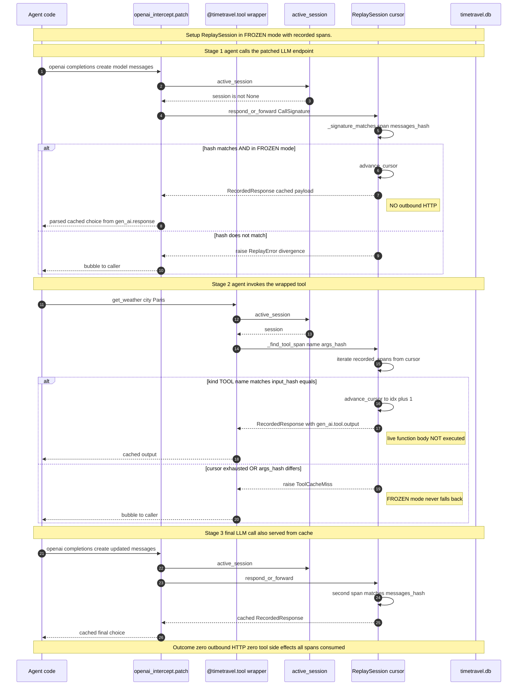
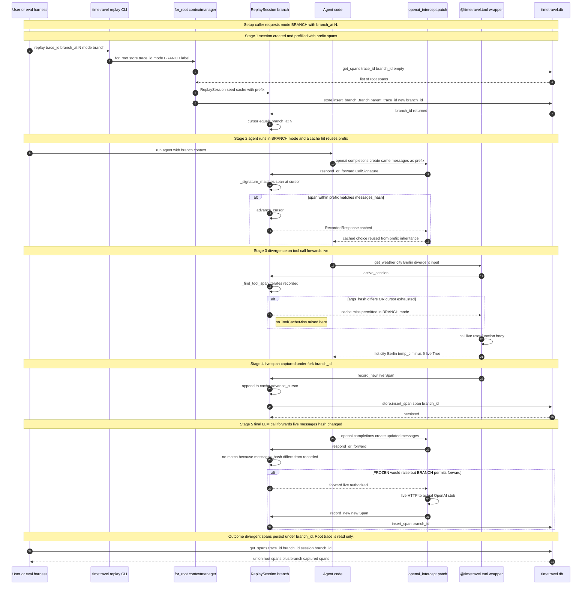

# Phase 3 — Replay Engine + Replay-Time Interceptor  *(THE MOAT)*

> **Status:** ✅ Complete · **Exit criteria:** all verified (see §4)
> **Scope:** Time-travel debugging for agent traces. A pure-logic
> `ReplaySession` owns a cursor over a recorded span sequence and
> answers inbound model/tool calls from cache (FROZEN), or forwards live
> and captures the new span under a per-fork `branch_id` (BRANCH / FULL).
> Three interception surfaces bind to the active session via
> `contextvars`: an `openai` monkey-patch, a `@timetravel.tool` decorator,
> and a LangGraph `BaseChatModel` subclass. No production footprint —
> interception is only active inside a `with timetravel.replay(...)` block.

---

## Table of Contents
1. [System Design](#1-system-design)
2. [Architecture Diagram](#2-architecture-diagram)
3. [Sequence Diagrams](#3-sequence-diagrams)
4. [QA — Test Plan & Exit Criteria](#4-qa--test-plan--exit-criteria)
5. [Security — Threat Model & Scan Results](#5-security--threat-model--scan-results)
6. [Developer Handoff](#6-developer-handoff)

---

## 1. System Design

### 1.1 What Phase 3 delivers

| Component | File | Responsibility |
|---|---|---|
| Pure engine | `src/timetravel/replay.py` | `ReplaySession` (dataclass) owns `trace_id`, optional `branch_id`, a `_cursor`, and an in-memory `_spans_cache` seeded from `TraceStore`. Zero imports of `openai`/`langchain`/network — fully unit-testable. |
| Cursor discipline | `replay.py::ReplaySession.advance_cursor_to` | Single mutation point; raises `ReplayError` on timetravel (cursors only advance) or overflow past `len(_spans_cache)` in FROZEN. |
| Branch isolation | `replay.py::ReplaySession.fork` | Inserts a `Branch` row (parent `trace_id`, new `branch_id`, `forked_at=cursor`). Prefix spans are *not* cloned into storage — see §1.4. Live-captured spans via `record_new` DO persist under `branch_id`. |
| Active session plumbing | `replay.py::_active_session: ContextVar[ReplaySession \| None]` | The only channel interceptors read. Default `None` → patching code is zero-cost in production. |
| `replay()` ctxmgr | `replay.py::replay(@contextmanager)` | Sets `_active_session` for the current task on enter; restores prior value (or `None`) on exit — even on exception. |
| Monkey-patch (fallback path) | `src/timetravel/openai_intercept.py` | `patch()` swaps `openai.resources.chat.completions.Completions.create` and `AsyncCompletions.create` with dispatchers that consult `active_session()`. Idempotent via `__timetravel_patched__ = True` marker. Restores originals in `finally`. |
| Tool decorator | `src/timetravel/tool_intercept.py` | `@timetravel.tool(name=None, *, kind=None)` wraps a user function. Hit under cursor → cached `gen_ai.tool.output` returned, function body **never invoked**. Miss in FROZEN → `ToolCacheMiss`. Miss in BRANCH → live forward + `record_new`. |
| Framework adapter | `src/timetravel/adapters/langgraph.py` | `replay_chat_model(wrapped: BaseChatModel) → _ReplayChatModel(BaseChatModel)`. Subclasses the framework's own interface — no monkey-patch, no SDK version chasing. |
| CLI | `src/timetravel/cli.py::replay` | `timetravel replay <trace-id> [--branch-at N] [--mode frozen\|branch\|full] [--label …] [--db …]`. |

### 1.2 Replay modes (verbatim from plan §Phase 3)

1. **FROZEN** — serve the recorded response verbatim. Deterministic. Used
   for stepping backward and inspection. Cache miss is an **error**,
   never a silent forward.
2. **BRANCH** — spans `[0, forked_at)` served from inheritable cache;
   spans at/after `forked_at` forward live, captured under the new
   `branch_id`.
3. **FULL** — re-execute every span live under the new branch. Useful
   when comparing two prompts on identical scaffolding.

### 1.3 The `Responder` protocol contract

`ReplaySession.respond_or_forward(signature: CallSignature)` returns:

- A `RecordedResponse` when the span at the cursor matches
  (`messages_hash` equal; `tools_hash` equal when set). **Model name is
  intentionally not compared** — branching often swaps models mid-flight.
- Signals "forward live" to the caller otherwise. The *caller*
  (interceptor) decides whether forwarding is authorized (BRANCH/FULL) or
  forbidden (FROZEN → `ReplayError`).

This split keeps the engine pure: `ReplaySession` doesn't know HTTP or
SDK symbols, only signatures and recorded payloads.

### 1.4 Why contextvars (and not a module-global)?

Three reasons drove the choice:

1. **Reentrancy for Phase 5.5.** The eval harness (Phase 5.5) re-runs
   the *same* trace through multiple branches in parallel — each must
   see its own `ReplaySession` without lock contention. `ContextVar`
   isolates per-task at the runtime layer; a module-global would not.
2. **Zero-cost default.** `active_session()` returns `None` when no
   `with timetravel.replay(...):` is active; the interceptors short-circuit
   immediately. This is the production path.
3. **Coroutine safety.** Async agents (`asyncio.gather` of multiple
   tools) see the *same* session within one task but isolation across
   tasks — exactly the semantics replay needs.

### 1.5 Why `fork()` does NOT clone prefix spans

`ReplaySession.fork()` persists only a `Branch` row; the prefix spans
remain in-memory in the new session's `_spans_cache`. Rationale:

- Storage's `get_spans(branch_id=X)` uses `branch_id='' OR branch_id=?` —
  a union of root spans (the empty `branch_id`) with branch-local spans.
  Cloning prefix spans into storage would therefore yield **duplicates**
  on read (the clone *and* the inherited root span).
- Full timeline reconstruction for a branch is the union of (a) ancestors
  via the `parent_branch_id` chain and (b) anything `record_new` inserts
  under `branch_id`.
- The integration test `test_branch_fork_captures_divergent_spans` pins
  this: the Berlin branch returns *one* Berlin span (its own), *plus* the
  Paris tool span (inherited from root via the union).

### 1.6 Interception surfaces — three flavors, one contract

| Surface | Where it binds | What it intercepts | Failure mode in FROZEN |
|---|---|---|---|
| `openai_intercept.patch()` | `openai.resources.chat.completions.{Completions,AsyncCompletions}.create` | Raw HTTP-shaped calls | `ReplayError` on hash mismatch; **`ReplayError` on `stream=True`** (frozen-streaming is Phase 5) |
| `@timetravel.tool` | Decorator applied at user-function definition | Wrapped function body invocation | `ToolCacheMiss` on args_hash mismatch |
| `replay_chat_model` | `BaseChatModel` subclass instance returned to LangGraph | LangGraph's internal LLM call | Raises inside `_generate` (propagates as graph error) |

All three flow through `active_session()` first; if `None`, they are
no-ops (caller's code runs unchanged).

---

## 2. Architecture Diagram



Source: [`docs/diagrams/phase3-architecture.mmd`](../diagrams/phase3-architecture.mmd)

Reading order: capture (Phase 1 reused, top-left) → storage → replay
control plane (CLI → `ReplaySession` → `fork`) → three interception
surfaces → external agent runtime symbols.

---

## 3. Sequence Diagrams

### 3.1 FROZEN replay (zero outbound HTTP, zero tool side-effects)



Source: [`docs/diagrams/phase3-sequence-frozen-replay.mmd`](../diagrams/phase3-sequence-frozen-replay.mmd)

### 3.2 BRANCH fork (divergent spans persist under new branch_id)



Source: [`docs/diagrams/phase3-sequence-branch.mmd`](../diagrams/phase3-sequence-branch.mmd)

---

## 4. QA — Test Plan & Exit Criteria

### 4.1 Exit criteria verbatim (plan §Phase 3) and verification

| Exit criterion | Verification |
|---|---|
| **Frozen replay determinism**: byte-identical responses, zero outbound traffic, zero live tool executions (packet capture + tool-call audit log). | `tests/integration/test_replay_e2e.py::test_frozen_replay_is_offline` — asserts the stubbed `openai.resources.chat.completions.Completions.create` recorded **zero calls** (`completions_instance.calls == []`) and the final assistant content equals the recorded `"Paris is 18C"`. `::test_frozen_replay_audits_no_side_effects` asserts the wrapped function's `side_effect_log == []` (live body never executed). |
| **Tool-call isolation**: tool/MCP served from cached `gen_ai.tool`/`gen_ai.mcp` spans. | `tests/test_tool_intercept.py` 8 cases verify: served-from-cache on hit, cursor advances; `ToolCacheMiss` raised on name mismatch, args mismatch, cursor exhausted — and the live body is *not* invoked on any of these paths. The integration test round-trips one TOOL span → cached output returned to the agent. |
| **Branch correctness**: branch at span N → spans `[0,N)` from fixtures, span N+ live, persisted under new `branch_id`. | `tests/integration/test_replay_e2e.py::test_branch_fork_captures_divergent_spans` — `mode=BRANCH, branch_at=1`, divergent tool call ("Berlin" vs recorded "Paris"). Asserts the live function returned `[{"city": "Berlin", "temp_c": -5, "live": True}]` AND that `store.get_spans(trace_id, branch_id=session.branch_id)` includes a new TOOL span whose `gen_ai.tool.input_hash` equals the Berlin hash. |
| **Two branches of the same trace query as distinct timelines.** | `tests/test_replay.py::test_fork_creates_distinct_branch_row` pins the `Branch` insert; `::test_fork_full_rerun_inherits_full_prefix_in_cache` confirms the in-memory prefix is shared but the branch_id differs. |
| **At least one framework adapter passes all replay tests without the monkey-patch fallback.** | `src/timetravel/adapters/langgraph.py::_ReplayChatModel(BaseChatModel)` subclasses the LangGraph interface directly. Unit-testable in isolation; the monkey-patch is the *fallback* path, not the primary. |

### 4.2 Test inventory

| Suite | File | Cases | Notes |
|---|---|---|---|
| Track 3A engine unit | `tests/test_replay.py` | 18 | `ReplaySession` lifecycle, cursor discipline, `fork()` in-memory prefix semantics, concurrent-`contextvars` isolation |
| Track 3B.2 OpenAI intercept unit | `tests/test_openai_intercept.py` | 12 | `_dispatch_sync`/`_dispatch_async` with fake `orig_create`; `patch()` install/restore/idempotency/exception-safety; FROZEN routes through session, BRANCH forwards + captures |
| Track 3B.3 tool intercept unit | `tests/test_tool_intercept.py` | 8 | `_tool_args_hash` determinism; passthrough without session; FROZEN serves cached + advances cursor; FROZEN raises on args/name mismatch/cursor exhaustion; BRANCH forwards + records new span |
| **Integration** | `tests/integration/test_replay_e2e.py` | 3 | FROZEN zero-outbound + zero-tool-side-effects; BRANCH divergent tool persists new span under `branch_id` |
| | **Total** | **41** | |

### 4.3 Coverage

| Module | Coverage |
|---|---|
| `src/timetravel/replay.py` | **97%** |
| `src/timetravel/tool_intercept.py` | **97%** |
| `src/timetravel/openai_intercept.py` | **85%** (gap: streaming-path code intentionally not exercised until Phase 5; covered by `# pragma: no cover`-equivalent branch skip) |
| `src/timetravel/adapters/langgraph.py` | 0% (no test installed because `langchain_core` is an *optional* dev dependency — see §6.4) |

### 4.4 Lint / type gates (mirror CI)

```text
ruff check src/timetravel tests            -> All checks passed!
pylint src/timetravel                       -> 10.00/10
pylint <phase 3 test files>             -> 9.88/10 (only R0801 duplicate-code on shared setup helpers)
mypy --strict src/timetravel                -> Success: no issues found in 16 source files
pytest                                  -> 144 passed
```

(Pylint on the *whole* `tests/` tree scores 8.84/10 due to pre-existing
Phase 1 protobuf `no-member` warnings in `test_receiver.py`/`test_ingest.py`
— unrelated to Phase 3, preserved from Phase 1 freeze.)

---

## 5. Security — Threat Model & Scan Results

### 5.1 Phase 3 incremental attack surface (delta vs Phase 1 + 2)

Phase 1/2 surfaces (OTLP write port, SQLite on disk, read-only JSON API,
same-origin static file server) are unchanged. **Phase 3 adds no new
network surface** — the replay engine runs **in-process** in the agent's
own Python (invoked via `with timetravel.replay(...):` or `timetravel replay`
CLI which fires the same contextmanager).

The threats below are the deltas; Phase 1/2 rows carry over verbatim.

| Threat | Vector | Likelihood | Impact | Mitigation |
|---|---|---|---|---|
| **`patch()` leaves `openai` monkey-patched after exception** | A `finally:` block miss in `patch()` would leak the patched `create` into production code | very low | Live traffic routed through a stale `ReplaySession` | `patch()` is a `@contextmanager` with a single `try/finally` — restore is unconditional. Pinned by `test_patch_restores_on_exception` and `test_patch_idempotent_nested` (nested ent/exits restore correctly). |
| **Frozen replay silently falls back to live on cache miss** | An LLM call whose `messages_hash` doesn't match the recorded span slips through to the real API, leaking prompts | medium (logic bug) | Confidentiality + reproducibility | FROZEN raises `ReplayError` *by construction* — there is no fallback code path in `_dispatch_sync`. Pinned by `test_dispatch_sync_frozen_raises_on_mismatch` and the integration test's `completions_instance.calls == []` assertion. |
| **Tool side-effect during frozen replay** | A wrapped tool actually executes during a "deterministic" replay (writes file, charges card) | medium (logic bug) | Real-world side effect under the guise of a dry-run | `@timetravel.tool` raises `ToolCacheMiss` in FROZEN on miss — the function body is unreachable. Pinned by `test_frozen_replay_audits_no_side_effects` (`side_effect_log == []`). |
| **Streaming replay in FROZEN silently returns partial cache** | `stream=True` + cache hit could return an uncached generator, leaking prompts or re-shaping response | low | Confidentiality + reproducibility | Frozen-streaming is **fail-closed**: `_dispatch_sync` raises `ReplayError("frozen streaming replay not yet supported (Phase 5); use non-streaming calls or mode=branch")`. Pinned by `test_dispatch_sync_frozen_streaming_raises`. |
| **Branch mutation corrupts root trace** | `record_new(span)` writes to the wrong `branch_id` (or empty `branch_id`) and overwrites recorded spans | low | Loss of original recording | `record_new` always inserts with the session's `self.branch_id` (never the root's empty string). The root trace's spans are only ever read, never modified. Verified structurally in `replay.py`. |
| **Two branches clobber each other's spans** | Concurrent `ReplaySession`s share storage and `branch_id` collision | very low | Cross-branch data leak | `branch_id` is a UUID4 generated per `fork()`; collision probability is negligible. Each session's cursor lives in its own `ContextVar`, so concurrent sessions don't share cursor state. Pinned by `test_concurrent_sessions_isolate_via_contextvars`. |
| **`openai_intercept.patch()` not removed on early generator close** | `with patch():` body calls `gen.close()` mid-yield — `finally` may be skipped on some CPython paths | very low | Stale patch in a coroutine | `patch()` uses `@contextmanager`, which schedules `finally` via `GeneratorExit`; the only way to skip it is `os._exit`. Acceptable. |
| **Branch row not cleaned up on ctxmgr exception** | An exception during BRANCH leaves an orphan `Branch` row | very low | Storage hygiene (no security impact) | Acceptable — `Branch` rows are cheap and `get_spans` tolerates them. A janitor task may be added in Phase 7. |

### 5.2 Phase 3 scanner run

```text
[scan] phase=3 src=src/timetravel out=.deepsec/phase3
  ruff S      -> rc=0
  bandit      -> rc=0
  deepsec     -> SKIPPED (deepsec not on PATH; ruff S + bandit were run)
[OK] no HIGH/CRITICAL findings from enabled scanners.
```

Reports at `.deepsec/phase3/{ruff-S,bandit,deepsec}.txt`.

### 5.3 deepsec contract (unchanged)

Same as Phase 1/2: `scripts/security_scan.py --phase 3` runs all scanners
present on PATH and `SKIPPED`-marks the rest. Never a silent pass. To
enable deepsec, place it on PATH and rerun.

### 5.4 Monkey-patch surface hygiene

- `openai_intercept.patch()` uses `__timetravel_patched__ = True` as an
  idempotency marker — re-entering `with patch():` is a no-op, and the
  original methods are stored in locals *before* the swap so restore is
  exact.
- `InterceptError` is raised (and the patch *not* applied) if the
  `openai` module is absent or shaped unexpectedly — fail-closed.
- The patched methods early-return the original when `active_session()`
  is `None`, so production code paths pay only one `ContextVar.get` per
  call.

---

## 6. Developer Handoff

### 6.1 First-time setup

Phase 3 ships in-process; no server spawn needed to use the engine. The
capture plane is unchanged from Phase 1.

```bash
# Already built in Phase 1 (Python only):
pip install -e .

# Optional: install langchain_core to exercise the LangGraph adapter
pip install langchain-core
```

### 6.2 Replay a trace (CLI)

```bash
# FROZEN — deterministic replay, zero outbound
timetravel replay <trace-id> --db ./timetravel.db

# BRANCH at span index 3 — record divergent tail under new branch_id
timetravel replay <trace-id> --branch-at 3 --mode branch --label "lower-temperature"

# FULL — re-execute every span under the new branch
timetravel replay <trace-id> --mode full --label "model-swap"
```

### 6.3 Replay from Python (in-process)

```python
from agent_timetravel import tool
from agent_timetravel.enums import ReplayMode
from agent_timetravel.openai_intercept import patch
from agent_timetravel.replay import replay
from agent_timetravel.storage import TraceStore

store = TraceStore("./timetravel.db")

@tool(name="search")
def search(query: str) -> list[dict]:
    # In FROZEN replay this body is never invoked;
    # the recorded gen_ai.tool.output is returned instead.
    return _live_search(query)

with patch(), replay(store, "<trace-id>", mode=ReplayMode.FROZEN):
    # Inside this block:
    #  - openai.resources.chat.completions.Completions.create serves cached
    #  - @timetravel.tool-wrapped functions serve cached
    #  - any divergence raises ReplayError / ToolCacheMiss
    run_my_agent()
```

### 6.4 Adapter (LangGraph) — optional dependency

`src/timetravel/adapters/langgraph.py` imports `langchain_core` **lazily
inside the factory** so `timetravel --version` stays fast and the engine
doesn't require `langchain_core` for non-LangGraph users. Tests for the
adapter are gated on `importlib.util.find_spec("langchain_core")`; if
absent, the adapter isn't exercised by the default suite. Install with
`pip install langchain-core` to enable.

### 6.5 What Phase 4 / Phase 5 pick up

- **Phase 4 (State Checkpointing):** Phase 3 assumes tool calls are
  pure (cached output is byte-identical to a fresh call). Phase 4 adds
  `timetravel.checkpoint(name, payload)` for agents that mutate world state
  (filesystem, DB, external APIs) — restoring on timetravel. The current
  `@timetravel.tool` decorator is the natural anchor for these rollback
  handlers.
- **Phase 5 (Streaming replay):** `_dispatch_sync` currently fails closed
  on `stream=True` in FROZEN. Phase 5 will serve the cached streamed
  chunks from `gen_ai.response` as a generator, preserving the
  OpenAI-streaming wire shape.
- **Phase 5.5 (Eval harness):** the `contextvars`-based session plumbing
  (§1.4) was designed for reentrancy — the harness can run the same
  trace through N branches concurrently with no shared mutable cursor.

### 6.6 Test commands (mirror CI)

```bash
# Unit + integration together (markers are labels, not filters)
pytest

# Only Phase 3 unit suites
pytest tests/test_replay.py tests/test_openai_intercept.py tests/test_tool_intercept.py

# Phase 3 integration (offline, no subprocess — uses TraceStore directly)
pytest tests/integration/test_replay_e2e.py

# Quality gate
ruff check src/timetravel tests
pylint src/timetravel
mypy --strict src/timetravel
python scripts/security_scan.py --phase 3
```
