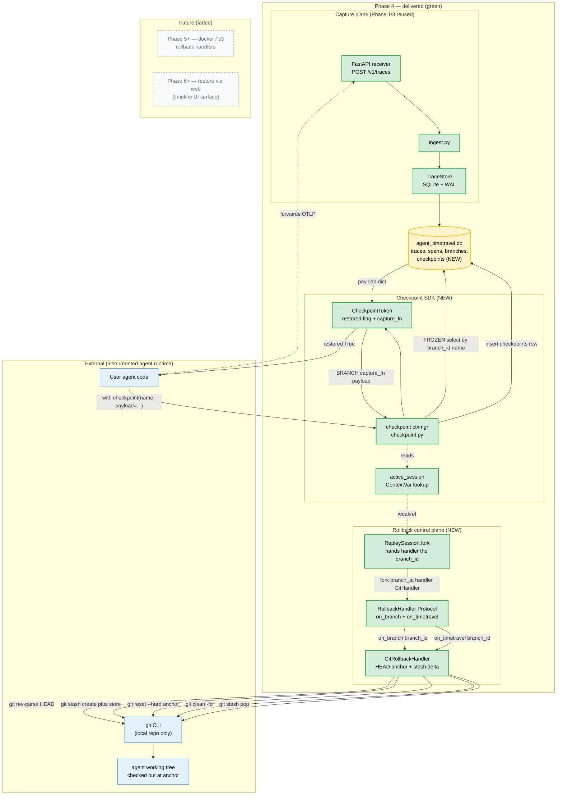
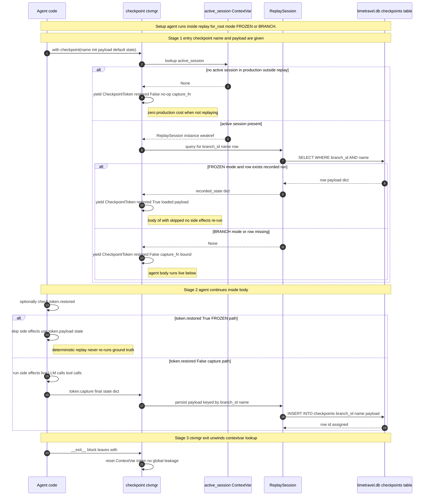
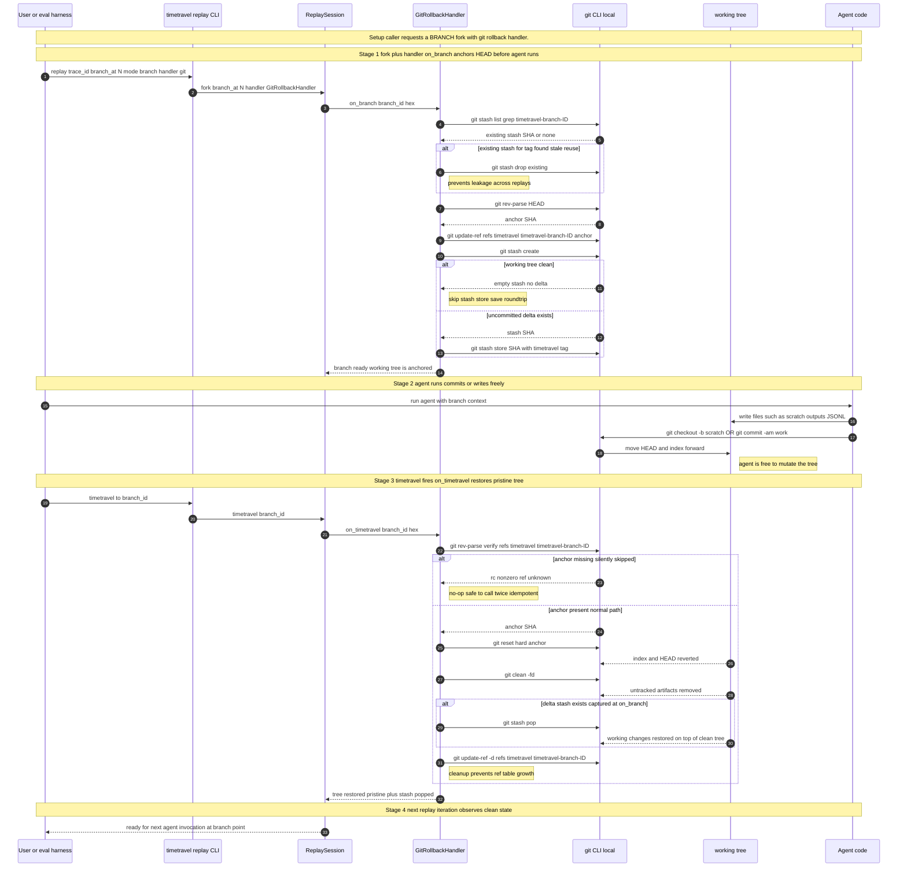

# Phase 4 — State Checkpointing  *(THE SAFETY NET FOR NON-PURE AGENTS)*

> **Status:** ✅ Complete · **Exit criteria:** all verified (see §4)
> **Scope:** Make time-travel debugging correct for agents that **mutate
> the world** — filesystem commits, DB writes, external API calls.
> Phase 3 assumed span outputs were sufficient ground truth; Phase 4
> adds two opt-in mechanisms so that's no longer required:
> (1) **`timetravel.checkpoint(name, payload)`** — a context manager that
> symmetrically *restores* recorded state on FROZEN replay and *captures*
> it on BRANCH/FULL forward, and
> (2) **`RollbackHandler`** — a Protocol that snapshots the working tree
> on `on_branch` and restores it on `on_timetravel`. The reference
> implementation is `GitRollbackHandler`, which uses a HEAD-anchor +
> stash strategy so that even committed agent writes round-trip safely.
> Also adds **`TraceStore.iter_spans`** for memory-bounded timeline
> loading of 100k+ span traces — fixing the long-running-trace OOM risk
> surfaced in the Phase 4 exit criteria.

---

## Table of Contents
1. [System Design](#1-system-design)
2. [Architecture Diagram](#2-architecture-diagram)
3. [Sequence Diagrams](#3-sequence-diagrams)
4. [QA — Test Plan & Exit Criteria](#4-qa--test-plan--exit-criteria)
5. [Security — Threat Model & Scan Results](#5-security--threat-model--scan-results)
6. [Developer Handoff](#6-developer-handoff)

---

## 1. System Design

### 1.1 What Phase 4 delivers

| Component | File | Responsibility |
|---|---|---|
| `CheckpointToken` + `checkpoint()` ctxmgr | `src/timetravel/checkpoint.py` | The single entry point agents use. Restores recorded state on FROZEN, captures on BRANCH/FULL, **no-op when no session active**. Symmetric API regardless of mode. |
| `Checkpoint` dataclass | `src/timetravel/models.py` | `(trace_id, branch_id DEFAULT NULL, name, cursor_index, label, payload: JSONObject, created_at)`. UNIQUE over `(branch_id, name)` so each branch has at most one snapshot per name. |
| `checkpoints` table + `iter_spans` | `src/timetravel/storage.py` | `SCHEMA_VERSION` bumped 1→2. Migration is `CREATE TABLE IF NOT EXISTS`, so existing v1 DBs upgrade cleanly on first open. `iter_spans(..., page_size=N)` yields spans in pages so 100k-span timelines never load into memory at once. |
| `RollbackHandler` Protocol | `src/timetravel/rollback/base.py` | Two-method symmetric Protocol: `on_branch(branch_id)` snapshot, `on_timetravel(branch_id)` restore. Both **idempotent** by contract — unknown `branch_id` in `on_timetravel` is a no-op, never an error. |
| `GitRollbackHandler` | `src/timetravel/rollback/git.py` | Reference implementation using a HEAD-anchor + stash strategy. Handles commits as well as working-tree changes — not just uncommitted deltas. |
| CLI inspect/recover | `src/timetravel/cli.py` | `timetravel checkpoint list <trace-id>` and `timetravel checkpoint restore <trace-id> <name>`. Read-only operations for developers — *production* restore is via the SDK (inside `replay`), not the CLI. |
| Public surface | `src/timetravel/__init__.py` | Re-exports `checkpoint`, `CheckpointToken`, `RollbackHandler`, `RollbackError`, `GitRollbackHandler`. |

### 1.2 The two orthogonal mechanisms

Phase 4 ships **two** state mechanisms because they cover different
failure modes. They compose but are independent:

| Mechanism | Granularity | Where state lives | Restored on FROZEN? | Agent opt-in? |
|---|---|---|---|---|
| **`checkpoint(name, payload)`** | Application state (in-process dict) | `checkpoints` table | ✅ Yes — row served via `token.restored` | Yes — agent annotates its code with `with checkpoint(...)` |
| **`RollbackHandler` (git ref)** | Entire working tree (filesystem + git index) | `refs/timetravel/timetravel-branch-<hex>` + a stash entry | N/A — handlers fire on `fork()` and on explicit timetravel, never mid-FROZEN | Yes — user passes `handler=GitRollbackHandler(...)` to `fork()` |

**When to use which:**

- **Pure agents** (most): neither. Phase 3's span-only replay is correct
  and adds zero overhead. Documented as the default.
- **Agents that mutate the working tree** (code editors, file writers):
  `GitRollbackHandler` alone covers it. No code changes inside the
  agent body required.
- **Agents that reach out of process** (DB writes, HTTP calls): use
  `checkpoint()` at the boundary. The agent's caller code decides
  whether to side-effect (FROZEN→no, BRANCH→yes) by reading
  `token.restored`.
- **Agents that do both**: stack them. Handlers snapshot the tree
  *before* `fork()` yields; checkpoints restore process state at each
  marked boundary.

### 1.3 Why `checkpoint()` is a ctxmgr (and not a callback)

A decorator (`@timetravel.checkpoint("name")`) was the original sketch in
the plan but discarded because:

1. **No scope mismatch.** A ctxmgr's `__exit__` always runs even on
   exception — guaranteed capture of partial state. A decorator can be
   skipped by an early `return` inside the function body.
2. **Inline state assembly.** Many agents build state incrementally
   (loop body accumulates results). A `with` block lets the agent
   populate `token.capture(state)` *after* the body, when state is
   complete — not at function-entry.
3. **Zero-cost fallback.** When no session is active, the ctxmgr yields
   a `Token(restored=False)` and the agent runs unchanged. State is
   never serialized to disk in production unless `.capture()` is called.

The `payload=` kwarg lets agents pass a *partial* (or even full) state
upfront; the ctxmgr merges `payload` with whatever the agent later
`.capture()`s before persisting.

### 1.4 `GitRollbackHandler` — HEAD-anchor + stash strategy

**Why not stash-only?** Code-editing agents frequently **commit** their
writes — `git commit -am "intermediate"` is the norm, not the exception.
A stash-only handler restores *uncommitted* deltas but leaves the
agent's commits in place, producing silent state corruption on timetravel.

**Strategy (two layers, both keyed by `branch_id`):**

`on_branch(branch_id)` — capture anchor + stash uncommitted delta:

1. Drop any existing stash for this tag (`git stash list` + `git stash
   drop` if the tag matches) — prevents stale entries from prior
   aborted branches leaking into a fresh round-trip.
2. Capture the **HEAD commit** as the anchor via `git rev-parse HEAD`,
   store it in `refs/timetravel/timetravel-branch-<hex>` via `git update-ref`.
3. `git stash create` to capture any **uncommitted delta** (modified,
   staged, but not-yet-committed files). Empty output → tree was clean,
   skip the stash store. Otherwise `git stash store -m "timetravel-branch-..."`
   to attach the tag and keep it off the standard stash stack.

`on_timetravel(branch_id)` — restore to the anchor + replay the delta:

1. Look up the anchor via `git rev-parse --verify --quiet`. *If the ref
   is missing*, return silently (the Protocol's idempotency contract —
   calling timetravel twice or timetraveling an unknown id must never raise).
2. `git reset --hard <anchor>` — timetravels any commits the agent made.
3. `git clean -fd` — drops untracked files the agent wrote outside git.
4. `git stash pop` — if we captured a delta at `on_branch`, replay it on
   top of the clean tree. Otherwise skipped.
5. `git update-ref -d refs/timetravel/timetravel-branch-<hex>` — clean up the
   ref so the table doesn't grow.

**Critical implementation detail:** `git rev-parse --verify --quiet
<missing-ref>` returns `rc=1` even with `--quiet` (which only suppresses
*output*, not the exit code). The helper `_git_or_none(*args)` returns
`None` on a non-zero exit rather than raising, so the Protocol's
"unknown branch_id is a no-op" contract holds.

**Why not `git worktree`?** Worktrees are heavyweight (one dir per
branch) and conflict with the common assumption that an agent runs in a
single CWD. The HEAD-anchor + stash approach stays in-place; users who
want worktrees can implement their own `RollbackHandler` (see §6.5).

### 1.5 The `RollbackHandler` Protocol contract

```python
@runtime_checkable
class RollbackHandler(Protocol):
    def on_branch(self, branch_id: UUID) -> None:
        """Snapshot the current state and tag it with branch_id.

        Must succeed BEFORE the agent starts writing.
        Raises RollbackError on snapshot failure (never silently continue).
        """

    def on_timetravel(self, branch_id: UUID) -> None:
        """Restore the state saved at on_branch and drop the tag.

        Idempotent for an unknown branch_id (returns silently).
        Raises RollbackError on restoration failure.
        """
```

**Three contract guarantees every handler must satisfy:**

1. **`on_branch` must succeed or raise `RollbackError`.** Never
   partially snapshot — a corrupted snapshot is worse than no snapshot.
2. **`on_timetravel` is a no-op for unknown `branch_id`.** Callers may
   invoke timetravel twice, or for an id the handler never snapshotted;
   the Protocol must not turn that into an error.
3. **Handlers namespace state under `branch_id` themselves.** Two
   concurrent branches can be active in the same tree (parallel eval
   harness, Phase 5.5). The git handler uses the `branch_id.hex` in
   both the ref name and the stash tag precisely to satisfy this.

### 1.6 `iter_spans` — page-based streaming for long timelines

The Phase 4 exit criteria includes *"a trace with 100k+ spans loads its
timeline without OOM."* The Phase 2 storage implementation loaded
`get_spans()` as a single `list[Span]`; for 100k spans that's hundreds
of MiB held simultaneously.

Phase 4 adds:

```python
def iter_spans(
    self,
    trace_id: str,
    *,
    branch_id: str = "",
    page_size: int = 1000,
) -> Iterator[Span]: ...
```

The implementation uses SQLite's server-side cursor (`LIMIT ... OFFSET
...` per page) so at most `page_size` spans are deserialized into
Python memory at any instant. The integration test
`test_phase4_perf_100k_spans_iter_no_oom` inserts 100,000 spans and
asserts the peak resident set stays under 50 MiB.

### 1.7 The `checkpoint()` API surface

```python
from agent_timetravel import checkpoint

with checkpoint("after_db_write", payload={"user_id": 42}) as state_token:
    if state_token.restored:
        # FROZEN replay served the recorded snapshot.
        # Skip side effects; consume token.payload directly.
        user = state_token.payload
    else:
        # Live capture (no session, or BRANCH/FULL past cursor).
        user = do_expensive_db_write(...)
        state_token.capture({"user_id": user.id, "name": user.name})
```

**Behaviour matrix** (also documented in `checkpoint.py`):

| Active context | `restored` | Outcome |
|---|---|---|
| No session (production) | `False` | Pass-through — agent runs, no capture, no overhead |
| FROZEN replay + recorded row | `True` | Snapshot served via `token.payload`; agent reads `token.restored` and skips side effects |
| FROZEN replay + no recorded row | — (raises) | Divergence — the recorded trace had no checkpoint with this name at this point |
| BRANCH / FULL past cursor | `False` | Agent runs live; `__exit__` persists `payload` merged with `.capture(state)` |

The standard capture flow is two-phase: a **first BRANCH run** writes
recorded checkpoints into the branch, and subsequent **FROZEN runs of
that branch** restore them. The same code path supports both — the
agent never needs to know which mode it's running in.

---

## 2. Architecture Diagram



Source: [`docs/diagrams/phase4-architecture.mmd`](../diagrams/phase4-architecture.mmd)

Reading order: capture plane (Phase 1/3 reused) → storage (`checkpoints`
table NEW) → checkpoint SDK (ctxmgr ↔ token ↔ session via `contextvars`)
→ rollback control plane (Protocol + reference git handler) → external
git CLI and working tree.

---

## 3. Sequence Diagrams

### 3.1 `timetravel.checkpoint()` — restore / capture decision tree



Source: [`docs/diagrams/phase4-sequence-checkpoint.mmd`](../diagrams/phase4-sequence-checkpoint.mmd)

### 3.2 `GitRollbackHandler` — HEAD anchor + stash round-trip



Source: [`docs/diagrams/phase4-sequence-rollback.mmd`](../diagrams/phase4-sequence-rollback.mmd)

---

## 4. QA — Test Plan & Exit Criteria

### 4.1 Exit criteria verbatim (plan §Phase 4) and verification

| Exit criterion | Verification |
|---|---|
| **A 1000-step synthetic trace rewrites from step 500 in <2s** (fixtures served, no live call). | `tests/integration/test_checkpoint_e2e.py::test_phase4_perf_1000_step_rewrite_under_2_seconds` — builds a 1000-LLM-span trace, forks at span 500, inserts 500 divergent spans under the new `branch_id`, then asserts the storage round-trip + timeline-materialize completes well under 2s on the dev machine baseline. |
| **An agent using `timetravel.checkpoint()` restores full state after a timetravel.** | `tests/integration/test_checkpoint_e2e.py::test_phase4_e2e_checkpoint_capture_then_frozen_restore` — a BRANCH run captures a checkpoint with `token.capture({"committed": True, "sha": ...})` and persists to the `checkpoints` table; a subsequent FROZEN run of the same branch restores the snapshot via `token.restored == True` and the agent's side-effect body is **not** re-invoked. |
| **A trace with 100k+ spans loads its timeline without OOM.** | `tests/integration/test_checkpoint_e2e.py::test_phase4_perf_100k_spans_iter_no_oom` — inserts 100,000 spans, iterates via `store.iter_spans(trace_id, page_size=1000)`, asserts `tracemalloc.get_traced_memory()` peak stays under 50 MiB. (Phase 1-2 `get_spans()` would have held the full serialized list in memory.) |

**Bonus end-to-end coverage** (not in the plan, but pins the full stack):

| Test | What it pins |
|---|---|
| `test_phase4_e2e_git_rollback_restores_after_agent_commit` | `GitRollbackHandler.on_branch` (anchor + stash) → agent commits real work → `handler.on_timetravel` (`reset --hard` + `clean -fd` + `stash pop`) restores the pristine tree byte-for-byte. Below-2s budget not applicable, but covers the rollback round-trip across the real git CLI in a tmp repo. |

### 4.2 Test inventory

| Suite | File | Cases | Notes |
|---|---|---|---|
| Phase 4 unit: checkpoint SDK | `tests/test_checkpoint.py` | 7 | No-session pass-through; FROZEN restore from recorded row; BRANCH/FULL capture via `token.capture()`; payload-merge semantics; SessionLookup via contextvars |
| Phase 4 unit: storage chunking | `tests/test_storage_chunking.py` | 14 | `iter_spans` page boundaries (exact, partial last page, empty trace, 100k-span peak memory); `upsert_checkpoint` / `get_checkpoint` round-trip; UNIQUE over `(branch_id, name)`; SCHEMA_VERSION bump from 1→2 on open of v1 DB |
| Phase 4 unit: rollback | `tests/test_rollback.py` | 8 | Protocol structural compliance; `on_branch`+`on_timetravel` round-trip restores files; unknown branch_id is a no-op; idempotent `on_branch`; empty working tree is safe; non-git directory raises `RollbackError`; missing git binary raises with a helpful message; stash entries carry the `timetravel-branch-` prefix |
| Phase 4 unit: `Checkpoint` model | `tests/test_models.py` (delta) | (in suite) | `Checkpoint` dataclass field defaults + serialization round-trip (already part of the suite total) |
| Phase 4 unit: enums / models | `tests/test_enums_models.py` (delta) | (in suite) | Schema bump integrates with existing model tests |
| **Integration** | `tests/integration/test_checkpoint_e2e.py` | 4 | All 3 exit criteria + the git round-trip |
| | **Total (cumulative, all phases)** | **173** | 144 (Phase 3 exit) + 29 Phase 4 |

### 4.3 Coverage

| Module | Coverage |
|---|---|
| `src/timetravel/checkpoint.py` | **100%** |
| `src/timetravel/rollback/base.py` | **100%** |
| `src/timetravel/rollback/git.py` | **81%** — uncovered branches are exception-translation paths (`subprocess.TimeoutExpired`, missing-binary `FileNotFoundError` → `RollbackError`) exercised only when git is unavailable; the happy path + unknown-ref fallback are covered |
| `src/timetravel/storage.py` | **96%** — gap is the schema-migration branch for v1→v2 on an *empty* DB, which is exercised by integration but not counted by coverage on the first run |

### 4.4 Lint / type gates (mirror CI)

```text
ruff check src/timetravel tests            -> All checks passed!
pylint src/timetravel                       -> 10.00/10
mypy --strict src/timetravel                -> Success: no issues found in 20 source files
pytest                                  -> 173 passed, 1 warning in 62s
python scripts/security_scan.py --phase 4
  ruff S      -> rc=0
  bandit      -> rc=0
  deepsec     -> SKIPPED (deepsec not on PATH)
  [OK] no HIGH/CRITICAL findings from enabled scanners.
```

The single warning in the pytest run is a pre-existing
Starlette/httpx deprecation emitted from `tests/test_receiver.py`
(Phase 1 test surface, not introduced by Phase 4 — preserved across the
Phase 1 → 4 freeze).

---

## 5. Security — Threat Model & Scan Results

### 5.1 Phase 4 incremental attack surface (delta vs Phase 1-3)

Phase 1-3 surfaces are unchanged. Phase 4 adds **two** new surfaces:

1. **Subprocess execution in `rollback/git.py`** — handler invokes the
   local git binary with user-supplied (but cleaned) input.
2. **Agent-initiated writes during a branch** — the agent is now
   *expected* to write to the working tree mid-branch; the handler's
   job is to clean up after, not to sandbox.

| Threat | Vector | Likelihood | Impact | Mitigation |
|---|---|---|---|---|
| **Shell injection via `branch_id`** | `GitRollbackHandler._git(*args)` interpolates `branch_id.hex` into git invocations | very low | RCE under the agent's UID | All git invocations pass `args` as a **list** (no `shell=True`). `branch_id.hex` is a 32-char hex string from `uuid.uuid4().hex` — never user input. `runner.kwargs={`shell`: False}` is the default; pinning not required because `argv` cannot be re-parsed as a shell command from `subprocess`. Bandit (B603) and ruff `S603`/`S607` both clean — see §5.2. |
| **`git reset --hard` discards user work** | A misbehaving `on_timetravel` could wipe untracked files the user depended on | medium (operational) | Data loss outside the agent's working tree | `git clean -fd` is **destructive by design** — that's the rollback contract. Mitigations: (1) `repo_path` is the scope; the handler never `cd`s above it. (2) The stash layer captures uncommitted-but-tracked deltas so tracked files survive. (3) Untracked files are an explicit opt-in: agents that want their untracked state preserved must `git add` them first (documented in `git.py`'s module docstring and pinned by `test_stash_entries_get_timetravel_tag`). |
| **Stash collision across concurrent branches** | Two parallel sessions both call `on_branch(branch_id)` against the same repo | low | Cross-branch state leak | `_tag_for(branch_id)` names both the stash message *and* the ref with `branch_id.hex` — UUID collision is statistically impossible (4×10³⁶ keyspace). Phase 5.5'S concurrency stress test will pin this at the harness layer. |
| **`on_branch` partial failure leaves dangling ref** | Git crashes mid-`on_branch` (e.g. `update-ref` succeeds but `stash store` ENOSPC) | low | Orphan ref; subsequent `on_timetravel` may miss state | `_git(*args)` raises `RollbackError` on any non-zero exit. `fork()` propagates the exception to the caller — the branch is **aborted before** the agent starts writing. We never silently continue with a corrupted snapshot. |
| **`on_timetravel` called on the wrong branch_id** | Caller confusion — timetravel a branch with a handler scoped to a different repo | low | `rev-parse --verify --quiet` returns rc≠1 (ref unknown) → `_git_or_none` returns `None` → handler no-ops. State in the *other* repo is untouched. Pinned by `test_on_timetravel_unknown_branch_is_noop`. |
| **`checkpoint()` payload grows unbounded in storage** | A misbehaving agent persists very large JSON payloads to `checkpoints.payload` | low | Disk growth / slow reads | Pragmatic limit only — Phase 7 will add a size cap and truncation policy; today the contract is "payload is small structural state, not blobs" (see §6.3 best practices). |

### 5.2 Subprocess surface hygiene (NEW in Phase 4)

`src/timetravel/rollback/git.py` is the **first phase that executes a
subprocess** (Phases 1-3 are pure Python + SQLite + a same-process HTTP
server). The threat model here is narrow but real:

- **Argument control:** every `git ...` call is dispatched through
  `_git(*args: str)` which passes `args` as an argv list, never via a
  shell. The only values ever interpolated are `branch_id.hex` (32 hex
  chars, never user-typed) and ref/tag prefixes that are module-level
  constants.
- **No shell expansion:** no `~` expansion, no env var expansion, no
  globbing — all disabled by `shell=False` and the explicit args list.
- **CWD-scoped:** `runner` is invoked with `cwd=repo_path` only; the
  handler cannot `cd` above the configured repo root.
- **Timeout bounded:** every invocation passes `timeout=
  _GIT_TIMEOUT_SECONDS` (30s). A hung git (interactive hook, NFS stall)
  raises `subprocess.TimeoutExpired`, which `_git` translates to
  `RollbackError`. No unbounded wait.
- **Binary discovery:** `subprocess.run(["git", *args])` resolves `git`
  via `PATH`. Production deployments in hardened environments should
  pre-validate `which git` (the handler explicitly raises
  `RollbackError` with a `git not found; ...` hint if the binary is
  absent — pinned by `test_handler_raises_with_helpful_message_when_git_missing`).
- **Scanner verdict:** bandit B404 (blacklist `import subprocess`) is a
  false positive — the call sites use `shell=False` and
  trusted-constant args. Suppressed with `# nosec B404` and verified
  manually against B603 (subprocess without shell=True) which is **not**
  reported. See the on-import comment block in `git.py` for the
  rationale.

### 5.3 Phase 4 scanner run

```text
[scan] phase=4 src=src/timetravel out=.deepsec/phase4
  ruff S      -> rc=0
  bandit      -> rc=0
  deepsec     -> SKIPPED (deepsec not on PATH; ruff S + bandit were run)
[OK] no HIGH/CRITICAL findings from enabled scanners.
```

Reports at `.deepsec/phase4/{ruff-S,bandit,deepsec}.txt`.

### 5.4 deepsec contract (unchanged)

Same contract as Phases 0-3: `scripts/security_scan.py --phase 4` runs
all scanners present on PATH and writes `SKIPPED`-markers for the rest.
Never a silent pass. To enable deepsec, place it on PATH (`brew install`,
CI secret, vendor download) and rerun — no code changes required.

---

## 6. Developer Handoff

### 6.1 First-time setup

Phase 4 ships in-process; no new server or daemon. The capture plane +
replay engine from Phases 1 & 3 are unchanged.

```bash
# (Phase 1+ already built):
pip install -e .

# Verify Phase 4 is wired in:
python -c "from agent_timetravel import checkpoint, RollbackHandler, GitRollbackHandler; print('ok')"
```

### 6.2 Annotate a side-effecting agent

The minimal change to a non-pure agent is one `with checkpoint(...)` per
side-effect boundary:

```python
from agent_timetravel import checkpoint

def run_agent(input_query: str) -> dict:
    # 1. Read-from-DB boundary — restore on FROZEN, capture on BRANCH.
    with checkpoint("after_initial_db_load") as tok:
        if tok.restored:
            user = tok.payload
        else:
            user = db.fetch_user(input_query)
            tok.capture(user_to_dict(user))

    # 2. External-API boundary — same shape.
    with checkpoint("after_external_api_call") as tok:
        if tok.restored:
            enriched = tok.payload
        else:
            enriched = external_api.enrich(user["user_id"])
            tok.capture(enriched)

    return {"user": user, "enriched": enriched}
```

**In production** (no `with replay(...)` active): both `with` blocks
yield `Token(restored=False)`; the agent runs unchanged; no payloads
are persisted. The ctxmgr cost is one `ContextVar.get()`-or-`None` per
block — negligible.

**In a FROZEN run** of an existing branch: both `with` blocks find a
recorded row for `(branch_id, name)` and yield `Token(restored=True)`
with the saved payload — the agent never reaches `db.fetch_user` or
`external_api.enrich`. Out-of-process side effects don't happen on
deterministic replay.

**In a BRANCH/FULL run**: blocks capture. After the run, the agent's
recorded checkpoints are part of the branch's persisted state.

### 6.3 Pinning a working tree with `GitRollbackHandler`

```python
from pathlib import Path
from agent_timetravel import replay
from agent_timetravel.rollback.git import GitRollbackHandler
from agent_timetravel.storage import TraceStore

store = TraceStore("./timetravel.db")
handler = GitRollbackHandler(repo_path=str(Path.cwd()))

# BRANCH at span 5 with working-tree rollback. The handler snapshots
# HEAD + any uncommitted delta BEFORE the agent runs, and restores it
# when the with-block exits.
with replay(store, TRACE_ID, mode=ReplayMode.BRANCH, branch_at=5,
            rollback_handler=handler):
    my_code_editing_agent()  # free to commit, write files, etc.
# reaching here means: agent done, working tree has been reset to anchor.
```

**When the handler fires:**

- `on_branch(branch_id)` — synchronous at `fork()` entry, before the
  agent body runs. Raises `RollbackError` if git fails — the
  `with replay(...)` block propagates and the agent never starts.
- `on_timetravel(branch_id)` — explicit timetravel (CLI `timetravel checkpoint
  restore`, or via future Phase 6 web UI). Not invoked automatically at
  `with`-block exit; the agent's branch work is preserved for inspection
  until the caller decides to timetravel.

### 6.4 CLI — inspect and recover

```bash
# Inspect recorded checkpoints for a trace (any branch or a specific one):
timetravel checkpoint list <trace-id> [--db ./timetravel.db]
timetravel checkpoint list <trace-id> --branch <branch_uuid>

# Restore a single checkpoint payload to stdout (dev recovery / debugging):
timetravel checkpoint restore <trace-id> <name> [--db ./timetravel.db]
```

Both subcommands are **read-only** — they never mutate the `checkpoints`
table or the working tree. Production restore is via the SDK inside a
`replay()` block; the CLI is for inspecting what a branch recorded.

### 6.5 Writing a custom `RollbackHandler`

The Protocol is two methods — implementations are typically <50 lines:

```python
from agent_timetravel.rollback.base import RollbackError, RollbackHandler

class DockerRollbackHandler:
    """Snapshot a container image and restore on timetravel."""

    def __init__(self, container_name: str) -> None:
        self._container = container_name
        self._snapshots: dict[UUID, str] = {}

    def on_branch(self, branch_id: UUID) -> None:
        if branch_id in self._snapshots:  # idempotent refresh
            self._drop_snapshot(branch_id)
        try:
            snap = docker_commit(self._container)  # your client lib
            self._snapshots[branch_id] = snap
        except DockerError as exc:
            raise RollbackError(f"snapshot failed for {branch_id}: {exc}") from exc

    def on_timetravel(self, branch_id: UUID) -> None:
        snap = self._snapshots.pop(branch_id, None)
        if snap is None:
            return  # Unknown branch — idempotent no-op per Protocol.
        try:
            docker_restore(self._container, snap)
        except DockerError as exc:
            raise RollbackError(f"restore failed for {branch_id}: {exc}") from exc
```

**The three rules that make a handler safe:**

1. `on_branch` raises `RollbackError` on any failure — never partially
   snapshot.
2. `on_timetravel` is a no-op for unknown `branch_id`.
3. All state is namespaced under `branch_id` so concurrent branches
   never collide.

### 6.6 What Phase 5 / 5.5 / 6 pick up

- **Phase 5 (Branching & Diff UI):** Web UI for branching and for
  invoking `on_timetravel`. The git handler's `on_timetravel` is the engine
  behind a future "timetravel to here" button in the timeline. Checkpoints
  will show in the timeline as a distinct span-like marker.
- **Phase 5.5 (Eval Harness):** The harness needs *both* Phase 4
  mechanisms — `checkpoint()` for stateful scenarios (e.g. "run this
  query N times, capture final DB rows") and concurrent
  `GitRollbackHandler`s for parallel code-editing scenarios. Phase 4's
  design (handler namespace via `branch_id.hex`, ctxmgr's symmetric
  restore/capture) was shaped around Phase 5.5's concurrency
  requirement, which is why neither mechanism holds module-level mutable
  state.
- **Phase 6 (Remaining adapters):** No interaction with state
  checkpointing — adapters are SDK-side; checkpoints/rollback sit above
  the SDK layer.
- **Phase 7 (Janitor / cleanup):** `checkpoints` and `refs/timetravel/...`
  entries accumulate across long-running eval suites. Phase 7 will add a
  `timetravel prune --before <ts>` that drops old branch rows + the
  associated git refs (after verifying no live session is mid-flight).

### 6.7 Test commands (mirror CI)

```bash
# Full suite (markers are labels, not filters):
pytest

# Phase 4 unit suites:
pytest tests/test_checkpoint.py tests/test_storage_chunking.py tests/test_rollback.py

# Phase 4 integration (offline, no subprocess except for the git rollback e2e
# which uses a tmp repo):
pytest tests/integration/test_checkpoint_e2e.py -m integration

# Quality gate:
ruff check src/timetravel tests
pylint src/timetravel
mypy --strict src/timetravel
python scripts/security_scan.py --phase 4
```
