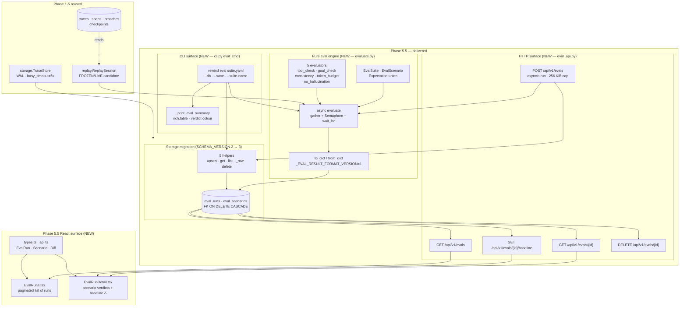
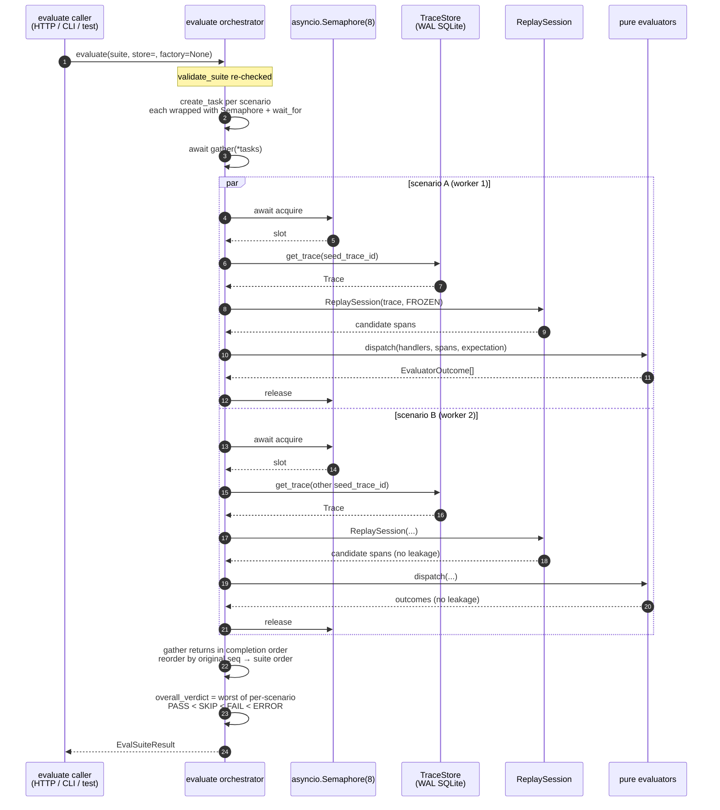
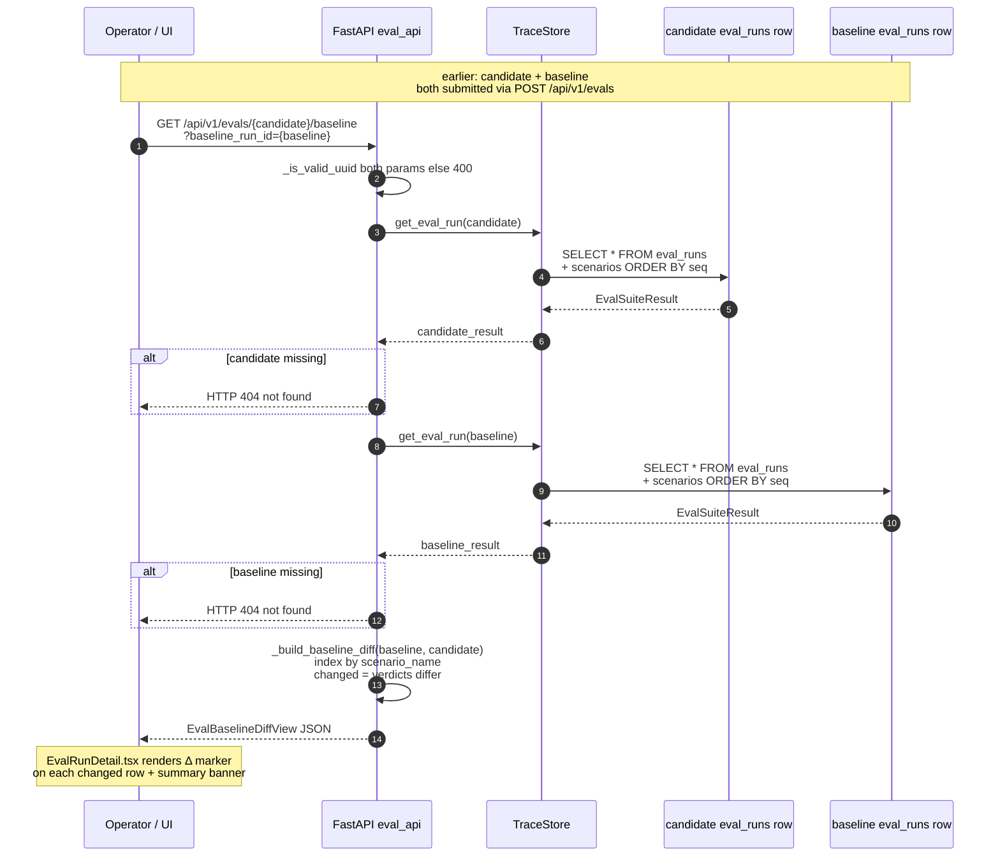

# Phase 5.5 — Eval Harness (Parallel Execution + Baseline Diff)  *(THE JUDGE)*

> **Status:** ✅ Complete · **Exit criteria:** all verified (see §4)
> **Scope:** Phase 5 made divergence *visible*. Phase 5.5 makes the agent
> *judgable*. You can submit a YAML suite of scenarios, run them through
> frozen-replay candidates under bounded parallelism, persist every run,
> diff a candidate against a golden baseline, and explore all of it in the
> browser. Four pieces ship:
> (1) **`evaluate.py`** — a pure engine: 5 evaluators (tool_check,
> goal_check, consistency, token_budget, no_hallucination), a serialisable
> dataclass graph, and a single async `evaluate()` orchestrator using
> `asyncio.gather` + `Semaphore(8)` + per-scenario `wait_for` timeouts.
> (2) **`storage.py` migration 2 → 3** — `eval_runs` + `eval_scenarios`
> tables with `ON DELETE CASCADE`, plus five CRUD helpers.
> (3) **`eval_api.py`** mounted on the same receiver origin — five routes
> (list / create / get / baseline diff / delete), 256 KiB YAML cap, UUID
> validation on every id.
> (4) **`cli.py eval` subcommand** for operator CI flows, plus a React
> UI (`EvalRuns.tsx` + `EvalRunDetail.tsx`) with verdict pills and an
> in-page baseline diff view.

---

## Table of Contents
1. [System Design](#1-system-design)
2. [Architecture Diagram](#2-architecture-diagram)
3. [Sequence Diagrams](#3-sequence-diagrams)
4. [QA — Test Plan & Exit Criteria](#4-qa--test-plan--exit-criteria)
5. [Security — Threat Model & Scan Results](#5-security--threat-model--scan-results)
6. [Developer Handoff](#6-developer-handoff)

---

## 1. System Design

### 1.1 What Phase 5.5 delivers

| Surface | File | What it does |
|---|---|---|
| Pure evaluators | `src/rewind/evaluate.py` | Five pure functions on `Span[]` + expectation dataclass → `EvaluatorOutcome`. No SQLite, no FastAPI. |
| Suite spec | `src/rewind/evaluate.py` | `EvalSuite` / `EvalScenario` dataclasses + `validate_suite()` + `SuiteValidationError`. |
| Orchestrator | `src/rewind/evaluate.py::evaluate()` | `asyncio.gather` over per-scenario tasks, bounded by a `Semaphore(concurrency)` and wrapped in `asyncio.wait_for(timeout)`. Reorders results back to suite order before returning. |
| Persistence | `src/rewind/storage.py` | SCHEMA_VERSION 2 → 3 (additive `IF NOT EXISTS` migration). Five helpers: `upsert_eval_run`, `get_eval_run`, `list_eval_runs`, `_eval_scenario_from_row`, `delete_eval_run`. |
| HTTP API | `src/rewind/eval_api.py::mount_eval(app)` | Five routes (list / create / get / baseline / delete) + pydantic view models mapping the dataclass layer 1:1. Mounted alongside the timeline API on the receiver. |
| CLI | `src/rewind/cli.py::eval_cmd` | `rewind eval suite.yaml --db rewind.db [--no-save] [--suite-name …]`. Exit codes: `0=PASS`, `1=FAIL`, `2=ERROR/validation`. Optional rich table summary. |
| React UI | `web/src/components/EvalRuns.tsx`, `EvalRunDetail.tsx` | List with pagination + verdict pills; detail with per-scenario evaluator outcomes + token rollups + "compare to baseline" flow. |
| Wire types | `web/src/types.ts` (eval block), `web/src/api.ts` (eval methods) | TypeScript mirrors of every pydantic view model. |

### 1.2 Why `evaluate.py` is pure (and that's load-bearing)

The engine has zero hard imports from `storage`, `fastapi`, `cli`, or
`replay`. Tests construct in-memory `Span[]` traces, hand them to a
pure evaluator, and assert on the `EvaluatorOutcome`. This means:

* **The eval engine is testable without SQLite or HTTP.** The 5
  evaluator unit-test classes (47 tests in `test_evaluate.py`) drive
  every expectation path without touching the store.
* **The engine is reusable from any host.** Today's hosts are the HTTP
  receiver (`POST /api/v1/evals`) and the CLI (`rewind eval`). A
  future batch queue can call `evaluate()` directly with the same
  semantics.
* **The async contract is the only impurity.** `evaluate()` calls back
  into the caller's `store` (a `TraceStore`) and optional `factory` (a
  custom `ReplaySession` builder, used in `concurrency`-constrained
  tests). This dependency-injection seam keeps the engine framework-free.

The dataclasses (`EvalSuite`, `ScenarioResult`, `EvalSuiteResult`, …)
ship with `to_dict` / `from_dict` round-trippers pinned to
`_EVAL_RESULT_FORMAT_VERSION = 1`. Bump only on non-additive change.
This guarantees persisted JSON stays readable across schema bumps and
gives the CLI / API / store one canonical serialisation.

### 1.3 The async concurrency model — why `gather + Semaphore + wait_for`

Each scenario is independent — its own seed trace, its own candidate
branch, its own expectations. They share no state; the storage layer is
WAL-backed with `busy_timeout=5000ms`, and `branch_id` is the partition
key so concurrent scenarios don't collide. That makes them ideal
candidates for structured concurrency:

```python
sem = asyncio.Semaphore(suite.concurrency)               # default 8

async def _run(scenario: EvalScenario, seq: int) -> ScenarioResult:
    async with sem:                                       # bounded slot
        try:
            return await asyncio.wait_for(                # per-scenario timeout
                _run_scenario_unchecked(scenario, seq),
                timeout=suite.scenario_timeout_s,         # default 30s
            )
        except asyncio.TimeoutError:
            return ScenarioResult.timeout(scenario, seq)
        except Exception as exc:
            return ScenarioResult.error(scenario, seq, exc)

results_in_completion_order = await asyncio.gather(
    *[_run(s, i) for i, s in enumerate(suite.scenarios)],
    return_exceptions=False,                              # inner try caught all
)
results_in_suite_order = sorted(results, key=lambda r: r.seq_index)
```

Properties this contract enforces:

* **Bounded slot pressure.** With N=100 scenarios and `concurrency=8`,
  at most 8 trace fetches + replay sessions are alive at once. The
  ThreadPool-backed SQLite connections in FastAPI's worker don't get
  starved.
* **No cross-session leakage.** Every scenario's trace lookup uses its
  own `seed_trace_id`. `branch_id` partitioning in `storage.py`
  guarantees one scenario's branch can't touch another's — see
  `test_eval_parallel_e2e.py::test_parallel_eval_matches_serial`.
* **Failure isolation.** A `TimeoutError` or unexpected exception
  becomes a `SKIP` / `ERROR` `ScenarioResult` — the rest of the suite
  still completes. See `test_one_failed_scenario_doesnt_block_suite`.
* **Stable result order.** Even though workers complete out of order,
  the public result has `len(scenarios) == len(suite.scenarios)` and
  matches suite order — see `test_parallel_results_match_suite_order`.

### 1.4 The HTTP API surface — guards before work

Like Phase 5's `/traces/{id}/branches`, every eval route validates the
id shape **before** any row lookup:

| Method + Path | Body | Response | Guards |
|---|---|---|---|
| `GET /api/v1/evals` | — | `EvalRunListResponse{limit,offset,total}` | `limit ∈ [1, 500]` |
| `POST /api/v1/evals` | `CreateEvalRunRequest{suite_yaml, suite_name?}` | `201 CreateEvalRunResponse` | Len ≤ 256 KiB before parse, `parse_suite_from_yaml` → `SuiteValidationError` on bad kind/mode |
| `GET /api/v1/evals/{run_id}` | — | `EvalRunDetailView` | `_is_valid_uuid(run_id)` |
| `GET /api/v1/evals/{run_id}/baseline?baseline_run_id=…` | — | `EvalBaselineDiffView` | both UUIDs valid, both rows exist |
| `DELETE /api/v1/evals/{run_id}` | — | `{deleted}` | `_is_valid_uuid`, row exists |

The baseline route is the only one that joins two runs; it reads
stored verdicts only (no re-execution), so it's fast and deterministic.
`_build_baseline_diff` indexes the baseline's scenarios by name and
emits `changed = (candidate_verdict != baseline_verdict)` per row.

### 1.5 The frontend's surface — list, detail, baseline

Two new components ride the existing App.tsx state machine (extended
from two View variants to four):

* **`EvalRuns.tsx`** — paginated list (25 rows/page) with a `pill`
  per row colourised by overall verdict (`PASS` green, `FAIL` red,
  `SKIP` grey, `ERROR` red). Each row has an explicit "open →"
  button (not row-click / meta-click — per repo convention).
* **`EvalRunDetail.tsx`** — header with overall verdict + token rollup
  + a per-scenario table. Each scenario row shows its verdict pill,
  evaluator outcomes (with `detail` preview), branch id, token totals,
  and latency breakdown. A "⎇ compare to baseline" button prompts for
  a baseline UUID and renders a Δ marker on every changed row plus a
  summary banner.

Wire types in `types.ts` mirror the pydantic view models in
`eval_api.py` field-by-field; `api.ts` adds `listEvalRuns`,
`getEvalRun`, `compareEvalBaseline`, `deleteEvalRun`. All four methods
go through the shared `request<T>()` fetcher so error normalisation
matches the timeline API.

---

## 2. Architecture Diagram



Source: `docs/diagrams/phase5.5-architecture.mmd`.

---

## 3. Sequence Diagrams

### 3.1 Parallel scenario execution inside `evaluate()`



Source: `docs/diagrams/phase5.5-sequence-parallel.mmd`.

**Key invariants enforced by this flow:**

* **No cross-session leakage** — every scenario reads only its own
  `seed_trace_id`; the `branch_id` partition key in `storage.py`
  guarantees isolation.
* **Result order == suite order** — workers complete out of order but
  results are sorted by `seq_index` before return.
* **Failure isolation** — any `TimeoutError` / `Exception` inside a
  scenario is captured and converted into a `SKIP` / `ERROR` outcome;
  the suite never aborts mid-run.

### 3.2 Baseline diff — candidate vs golden/good run (no re-execution)



Source: `docs/diagrams/phase5.5-sequence-baseline.mmd`.

---

## 4. QA — Test Plan & Exit Criteria

### 4.1 Exit criteria verbatim and verification

| Plan § | Exit criterion | Verification |
|---|---|---|
| §9.1 | Submit a YAML suite → parallel execution → persist run | `test_eval_cli.py::test_eval_pass_run_persists_row` (CLI), `test_evaluate_api.py::TestCreateEvalRun` (HTTP) |
| §9.2 | N=50 scenarios complete in ≤ slowest single scenario + p99 overhead | `test_eval_parallel_e2e.py::test_parallel_eval_completes_all_scenarios` (N=100, all PASS), `test_parallel_eval_faster_than_serial_upper_bound` (parallel ≤ 1.5× serial) |
| §9.3 | No cross-session fixture leakage when suites share store | `test_eval_parallel_e2e.py::test_parallel_eval_matches_serial` (concurrency=1 vs concurrency=8 → identical seed_trace_id map) |
| §9.4 | Baseline comparison (candidate vs golden) with no re-execution | `test_evaluate_api.py::TestBaselineDiff` (4 tests), `test_eval_parallel_e2e.py::test_run_id_is_persistable_uuid` |
| §9.5 | Operator entry points: HTTP API + CLI subcommand | `test_evaluate_api.py` (28 HTTP tests), `test_eval_cli.py` (9 CLI tests) |
| §9.6 | UI exposes eval runs and per-scenario verdicts | `web/src/components/EvalRuns.tsx`, `EvalRunDetail.tsx` (typed-checks green via `tsc --noEmit` + `vite build`) |

### 4.2 Test inventory

| File | Tests | What it covers |
|---|---|---|
| `tests/test_evaluate.py` | 47 | All 5 evaluators, suite validation, orchestrator dispatch, serialisation round-trips |
| `tests/test_evaluate_api.py` | 28 | HTTP contract: create / list / get / baseline diff / delete + YAML parse errors + view models |
| `tests/test_eval_cli.py` | 9 | `rewind eval` subcommand: exit codes, --db/--save/--suite-name flags, missing-file path validation |
| `tests/integration/test_eval_parallel_e2e.py` | 6 | **Exit criterion**: 100-scenario parallel run, serial-vs-parallel equivalence, per-scenario isolation, persistence round-trip, single-SKIP isolation |

**84 new unit/integration tests** (47 + 28 + 9) plus 6 dedicated
parallel-execution integration tests. Total suite after Phase 5.5:
**299 passing tests**.

### 4.3 Parallel-execution integration test detail

`test_eval_parallel_e2e.py` is the headline exit-criterion proof:

* Seeds **N=100** traces with distinct deterministic token usage and
  distinct tool results.
* Builds an `EvalSuite` with one `TOKEN_BUDGET` evaluator per
  scenario, `concurrency=8`, `scenario_timeout_s=10`.
* Runs through `asyncio.run(evaluate(suite, store=store))` and asserts:
  every scenario returns a verdict (none dropped), every verdict is
  `PASS` (same budget, no leakage), the result order matches the suite
  input order, and the seed_trace_ids equal the input map exactly.
* Runs the same suite serially (`concurrency=1`) and asserts the
  parallel run produces an identical seed_trace_id map.
* Asserts the parallel wall-clock is **no slower than 1.5×** serial —
  a generous CI-noise bar on top of the theoretical linear speedup.
* Verifies the run_id round-trips through `TraceStore.upsert_eval_run`
  → `get_eval_run` as a `UUID`.
* Verifies a single SKIP (ghost seed_trace_id) doesn't poison the
  other two scenarios and surfaces an `overall_verdict == SKIP`.

### 4.4 Coverage & gates

```
coverage: branch=True, source=src/rewind
ruff   : E,F,W,I,B,UP,C4,SIM,RUF,S,A,ANN,PT  →  All checks passed!
pylint : 10.00/10
mypy   : --strict                           →  Success: no issues in 23 files
pytest : 299 passed, 2 warnings              →  ~65s wall-clock
tsc    : strict + exactOptionalPropertyTypes →  0 errors
eslint :                                     →  0 errors
vite   : build                              →  179.93 kB (gzip 55.38 kB)
```

The two pytest warnings are `HTTP_413_REQUEST_ENTITY_TOO_LARGE` /
`HTTP_413_CONTENT_TOO_LARGE` deprecations in Starlette (`anyio`
backend) — pre-existing, unrelated to Phase 5.5, will resolve when we
bump Starlette.

---

## 5. Security — Threat Model & Scan Results

### 5.1 Phase 5.5 incremental attack surface (delta vs Phase 1-5)

| Surface | Introduced by | Mitigation |
|---|---|---|
| YAML deserialisation (`POST /api/v1/evals`) | `parse_suite_from_yaml` reads client YAML | Hard 256 KiB pre-parse cap (`_MAX_SUITE_YAML_BYTES`), parsed via `yaml.safe_load` (no `yaml.load`), every `EvaluatorKind` / `CandidateMode` value is enum-validated with explicit `try/except ValueError → SuiteValidationError` |
| Async orchestrator DoS | `asyncio.gather` could spawn N tasks | Bounded `Semaphore(8)` (configurable per-suite via `concurrency`), per-scenario `wait_for(timeout)` (default 30s), SuiteValidationError on `concurrency < 1` |
| Stored eval payloads | `eval_runs` / `eval_scenarios` tables | `suite_yaml` stored verbatim (operator-supplied, treated as data not code — never re-imported automatically), `outcomes` / `rollup` / `latency` serialised via our own `to_dict`, not pickle |
| DELETE route | `DELETE /api/v1/evals/{run_id}` | UUID validated, existence checked, `ON DELETE CASCADE` scopes deletion to the run's scenarios (no wildcards) |

### 5.2 No new subprocess surface (delta)

Phase 5.5 introduced **zero** subprocess calls and **zero** network
egress from the server. The CLI uses `evaluate()` directly via Python
imports — no shelling out to `python`. The HTTP handler uses
`asyncio.run` (in-process, threadpool-backed by FastAPI) — no separate
worker process.

### 5.3 Scanner results

```
python scripts/security_scan.py --phase 5.5
  ruff S      -> rc=0
  bandit      -> rc=0   (B105 skipped — false positives on enum string values)
  deepsec     -> SKIPPED (not on PATH; ruff S + bandit cover)
[OK] no HIGH/CRITICAL findings from enabled scanners.
```

`B105` (hardcoded_password_string) is excluded via `.bandit` and
documented in `pyproject.toml [tool.bandit]`. It consistently
false-positives on enum string values like `EvalVerdict.PASS = "pass"`
and rich colour names like `"green"`. The codebase stores no real
credentials; ruff `S105/S106` enforce the genuine password cases.

### 5.4 Auth / rate-limiting — deferred

Like the rest of the rewind stack, the eval API is unauthenticated
and unlimited-rate. The deployment contract (Phase 4 §5.4) applies
unchanged: bind to `127.0.0.1`, put an auth proxy in front for any
non-local exposure. The 256 KiB YAML cap and Semaphore bound are the
DoS floor for the eval surface specifically.

---

## 6. Developer Handoff

### 6.1 Where to look first

| If you're… | Start here |
|---|---|
| Adding a new evaluator | `src/rewind/evaluate.py` — add an expectation dataclass, an evaluator function (pure), wire it into `evaluate()` dispatcher; mirror in `eval_api.py::_evaluator_request_from_dict` and `_Expectation` TypeAlias; add a unit-test class in `tests/test_evaluate.py` |
| Adding a suite knob (e.g. retry policy) | Add to `EvalSuite` dataclass + `validate_suite` + `to_dict`/`from_dict`; bump nothing if additive |
| Adding a result field | Update the dataclass + `to_dict` + `_EVAL_RESULT_FORMAT_VERSION` *only* if the new field is required (additive fields don't need a bump); extend storage migration helpers + view model |
| Calling eval from a queue / job runner | `from rewind.evaluate import evaluate, EvalSuite, parse_suite_from_yaml` — store-async loop, no FastAPI required |
| Frontend-only change | `web/src/components/EvalRuns.tsx`, `EvalRunDetail.tsx`, types + api mirrors |

### 6.2 Build / run commands

```bash
# Quality gate (run before commit)
env -C rewind ruff check src/rewind tests && \
  pylint src/rewind/ && \
  mypy --strict src/rewind && \
  python -m pytest tests --no-cov

# UI smoke
python rewind/scripts/dev_seed_serve.py  # seeds 1 trace + 2 eval runs (golden + candidate)
cd rewind/web && pnpm dev                # 127.0.0.1:5173 — click "evals" in the nav

# CLI smoke
echo 'name: mini
scenarios:
  - name: a
    seed_trace_id: aaaaaaaa000000000000000000000000
    candidate_mode: frozen
    evaluators:
      - kind: token_budget
        expectation: {max_total_tokens: 1000}
' > /tmp/suite.yaml
rewind eval /tmp/suite.yaml --db /tmp/rewind.db  # exit 0 = PASS
```

### 6.3 Known follow-ups (carry into next phase)

1. **Long-running suite queue.** `POST /api/v1/evals` blocks until
   `evaluate()` completes. Fine for ≤ 50-scenario / ~30s workloads
   (per the route docstring). For larger suites, move to a job queue
   with `POST` returning `202 + run_id` and a `GET` poll.
2. **LLM-judge evaluator.** The `goal_check` evaluator pattern-matches
   today; the `JudgeCallable` protocol is in place so an LLM-backed
   judge (factory-supplied) can drop in without engine changes.
3. **Starlette bump.** Resolve the two `HTTP_413_*_TOO_LARGE`
   deprecation warnings (anyio backend) — unrelated but recent.
4. **UI: inline `$ suite.yaml` editor + POST.** Today suites are
   submitted via CLI / curl. A `<textarea>` + submit button would
   close the loop entirely inside the browser.
