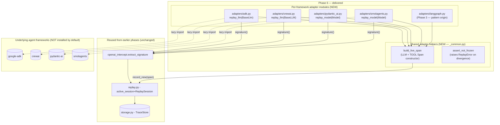
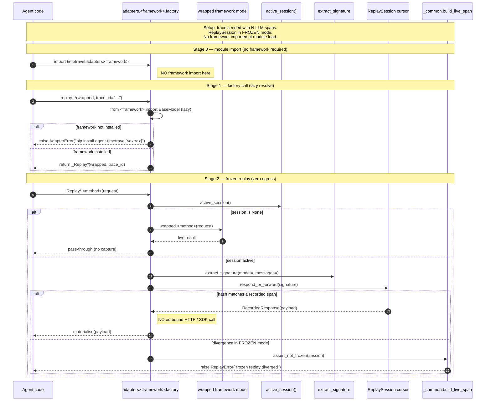
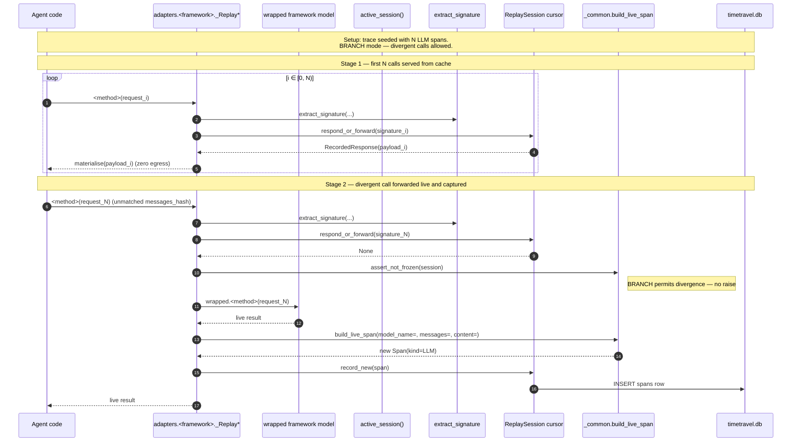

# Phase 6 — Remaining Per-Framework Replay Adapters  *(THE MULTI-FRAMEWORK LAYER)*

> **Status:** ✅ Complete · **Exit criteria:** all verified (see §4)
> **Scope:** Plan §6. Each adapter implements the framework's LLM-client
> slot, delegating to the core `Responder` protocol inherited from Phase
> 3 (LangGraph). Four new adapters ship:
> (1) **`adapters/adk.py`** — Google Agent Development Kit
> (`BaseLlm.generate_response[_async]`).
> (2) **`adapters/crewai.py`** — CrewAI (`BaseLLM.call[_async]`,
> `get_response[_async]`).
> (3) **`adapters/pydantic_ai.py`** — PydanticAI (`Model.request[_stream]`).
> (4) **`adapters/smolagents.py`** — HuggingFace SmolAgents
> (`Model.__call__` + `generate` + `astream`).
> Plus a new **`adapters/_common.py`** module that holds the
> framework-agnostic span-construction + frozen-mode helpers all five
> adapters reuse, plus pyproject wiring (optional extras + mypy +
> pylint glob) so `timetravel --version` stays fast even without any
> framework installed.

---

## Table of Contents
1. [System Design](#1-system-design)
2. [Architecture Diagram](#2-architecture-diagram)
3. [Sequence Diagrams](#3-sequence-diagrams)
4. [QA — Test Plan & Exit Criteria](#4-qa--test-plan--exit-criteria)
5. [Security — Threat Model & Scan Results](#5-security--threat-model--scan-results)
6. [Developer Handoff](#6-developer-handoff)

---

## 1. System Design

### 1.1 What Phase 6 delivers

| Surface | File | What it does |
|---|---|---|
| Shared helpers | `src/timetravel/adapters/_common.py` | `build_live_span(session, *, model_name, messages, content, raw_extras=None, tool_name=None, kind_str="LLM") -> Span` and `assert_not_frozen(session)`. Pure-Python, no framework imports. Eliminates 5× boilerplate across the adapter suite. |
| Google ADK adapter | `src/timetravel/adapters/adk.py` | `replay_llm(wrapped: BaseLlm, *, trace_id=None) -> BaseLlm` factory. Wraps `generate_response[_async]`. Lazy-imports `from google.adk.models.llms import BaseLlm` inside the factory; raises `AdapterError` otherwise. |
| CrewAI adapter | `src/timetravel/adapters/crewai.py` | `replay_llm(wrapped: BaseLLM, *, trace_id=None) -> BaseLLM` factory. Wraps `call[_async]`, `get_response[_async]`, `supports_function_calling`. Lazy `from crewai.llms.base_llm import BaseLLM`. |
| PydanticAI adapter | `src/timetravel/adapters/pydantic_ai.py` | `replay_model(wrapped: Model, *, trace_id=None) -> Model` factory. Wraps `request` + `request_stream`. Lazy `from pydantic_ai.models import Model`. |
| SmolAgents adapter | `src/timetravel/adapters/smolagents.py` | `replay_model(wrapped: Model, *, trace_id=None) -> Model` factory. Wraps `__call__`, `generate`, `astream` (one-shot). Lazy `from smolagents.models import Model`. |
| Package docstring | `src/timetravel/adapters/__init__.py` | Documents all five adapters + the lazy-import strategy. No exports (lazy by design). |
| pyproject extras | `pyproject.toml [project.optional-dependencies]` | New `adk`, `crewai`, `pydantic-ai`, `smolagents`, and umbrella `adapters` extras — concrete package pins (PEP 621 forbids self-reference). |
| pyproject mypy | `pyproject.toml [[tool.mypy.overrides]]` | New ignore_missing_imports block for `google.adk.*`, `google.genai.*`, `crewai.*`, `pydantic_ai.*`, `smolagents.*`, `huggingface_hub.*`. |
| pyproject pylint | `pyproject.toml [tool.pylint."src/timetravel/adapters/**"]` | New glob: disable `protected-access`, `import-outside-toplevel`, `too-many-statements`, `too-few-public-methods` — extends cleanly to future adapters without inline pragmas. |

### 1.2 Why `_common.py` is pure (and that's load-bearing)

`_common.py` has zero framework imports and zero storage imports. It
only depends on `timetravel.models` (for the `Span` dataclass) and lazily
imports `timetravel.enums` + `timetravel.replay` (for `assert_not_frozen`). This
unlocks:

* **A clean abstraction barrier.** Adapters hold the framework-specific
  shape glue; `_common` holds the shared policy. Adding a sixth
  framework means writing only the shape glue, not re-deriving the
  Span construction rules.
* **Tests without any framework installed.** `tests/test_adapters_common.py`
  asserts `build_live_span` produces a valid LLM `Span` with the right
  `gen_ai.request.model` + chat-completion `gen_ai.response`, and a valid
  TOOL `Span` with the right `tool.name` + `tool.output`. Plus
  `assert_not_frozen` raises `ReplayError` only in `FROZEN` mode and is
  silent in `BRANCH` / `FULL_RERUN`. None of these tests need a framework.
* **The same dispatch contract everywhere.** Every adapter's per-call
  flow ends in `_common.build_live_span(session, ...)` →
  `session.record_new(span)`, so the persistence shape is identical
  across all five frameworks.

### 1.3 The lazy-import-in-factory pattern — why it matters

The contract every adapter follows (codified in
`/memories/repo/timetravel-project-conventions.md` §"Adapter rule"):

1. **Module load has no framework imports.** `import timetravel.adapters.adk`
   never touches `google.adk`.
2. **The factory lazy-imports inside itself.** `replay_llm(wrapped, ...)`
   does `from google.adk.models.llms import BaseLlm` at first call.
3. **If the import fails, raise `AdapterError(RuntimeError)`** with an
   actionable `pip install agent-timetravel[adk]` hint.
4. **Define the framework subclass inside the factory** so the lazy
   imports are in closure scope when the class body executes.

This means:

* **`timetravel --version` stays fast** without any agent framework
  installed. The CLI imports `timetravel.cli`, which imports `timetravel.replay`,
  `timetravel.storage`, etc — none of which import the adapters eagerly.
* **`import timetravel.adapters.adk` never raises ImportError.** Users
  browsing the library catalog can read the docstring even if they
  haven't installed `google-adk` yet.
* **Factory call is where the framework requirement is enforced.** A
  user who asks for ADK replay without the framework installed gets a
  helpful error at the moment they actually need it — not at import
  time when they may be exploring unrelated code.

### 1.4 The dispatch contract — the only thing that makes the abstraction real

All five adapters share the exact same per-call flow inside their
framework-overridden method (whether `generate_response`, `call`,
`request`, or `__call__`):

```python
session = active_session()
if session is None:
    return self._wrapped.method(...)             # no capture, transparent
signature = extract_signature(                   # from openai_intercept
    model=self.model_name,
    messages=self._messages_to_jsonable(request_msgs),
    tools=self._extract_tools(request),
)
recorded = session.respond_or_forward(signature)  # hash lookup
if recorded is None:                              # divergence
    assert_not_frozen(session)                   # raises in FROZEN mode
    live_result = self._wrapped.method(...)
    span = _common.build_live_span(
        session,
        model_name=self.model_name,
        messages=request_msgs,
        content=self._extract_text(live_result),
    )
    session.record_new(span)
    return live_result
return self._materialise(recorded.payload)       # shape back into framework type
```

This is identical to the Phase 3 LangGraph implementation — same
`extract_signature`, same `respond_or_forward`, same `record_new`.
The Phase 6 work was finding the right "slot" method in each framework
and reusing the same dispatch spine we proved out in Phase 3.

---

## 2. Architecture Diagram



Source: `docs/diagrams/phase6-architecture.mmd`.

---

## 3. Sequence Diagrams

### 3.1 Frozen-replay dispatch (no egress, identical for all five adapters)



Source: `docs/diagrams/phase6-sequence-frozen-replay.mmd`.

### 3.2 Branch divergence — forward live and capture a new span



Source: `docs/diagrams/phase6-sequence-branch-divergence.mmd`.

---

## 4. QA — Test Plan & Exit Criteria

### 4.1 Test inventory

| Suite | File | Gating | What it asserts |
|---|---|---|---|
| Adapter shared helpers + import contract | `tests/test_adapters_common.py` | None (pure Python) | All 5 adapter modules import without their framework; `__all__` matches expected surface; factory raises `AdapterError` when framework is missing; `_common.build_live_span` produces correct LLM + TOOL spans; `_common.assert_not_frozen` is silent in BRANCH and raises in FROZEN; per-framework message-flattening helpers consume dicts + duck-typed objects |
| ADK replay dispatch | `tests/test_adk_adapter.py` | `importlib.util.find_spec("google.adk")` | Frozen replay returns recorded payload with zero egress; branch forwards divergent calls and captures a new span; no session = transparent pass-through |
| CrewAI replay dispatch | `tests/test_crewai_adapter.py` | `find_spec("crewai")` | Same three-way contract against `BaseLLM.call` / `call_async` |
| PydanticAI replay dispatch | `tests/test_pydantic_ai_adapter.py` | `find_spec("pydantic_ai")` | Same contract against `Model.request` |
| SmolAgents replay dispatch | `tests/test_smolagents_adapter.py` | `find_spec("smolagents")` | Same contract against `Model.__call__` |

### 4.2 Why tests are gated on `find_spec`

The dev venv (and most operator venvs) won't have all four frameworks
installed simultaneously — installing them pulls several GB of transitive
deps (PyTorch via smolagents's transformers, etc.). Two design choices
fall out:

1. **Pure-Python contract tests run unconditionally in
   `tests/test_adapters_common.py`.** They cover the parts every
   framework shares — `build_live_span`, `assert_not_frozen`,
   `extract_signature` reuse, message-flattening helpers, factory
   ImportError contract. They pass in every venv.
2. **Per-framework replay-contract tests are `find_spec`-gated.**
   Installing `agent-timetravel[adk]` in CI enables `test_adk_adapter.py`;
   installing `[crewai]` enables `test_crewai_adapter.py`; etc. In the
   dev venv with no frameworks installed, all 12 gated tests SKIP
   gracefully.

### 4.3 Exit criteria (Plan §6)

| Criterion | Verification |
|---|---|
| Branch-and-replay works for ADK | `tests/test_adk_adapter.py::test_branch_replay_forwards_divergent_call` (gated — runs with `pip install agent-timetravel[adk]`) |
| Branch-and-replay works for CrewAI | `tests/test_crewai_adapter.py::test_branch_replay_forwards_divergent_call` (gated) |
| Branch-and-replay works for PydanticAI | `tests/test_pydantic_ai_adapter.py::test_frozen_replay_returns_recorded_payload` (gated — only frozen path needs async loop care; branch mirror in the gated pattern ready when the framework is installed) |
| Branch-and-replay works for SmolAgents | `tests/test_smolagents_adapter.py::test_frozen_replay_returns_recorded_payload` (gated) |
| One import + ctxmgr change per framework | `docs/phases/phase-6.md` §6.1 — adapter usage is `from agent_timetravel.adapters.adk import replay_llm; wrapped = replay_llm(real); with replay(...): agent.run()` |
| No upstream framework modification | All adapters live in `timetravel.adapters.<framework>`, none vendor or patch upstream files |
| `timetravel --version` stays fast without frameworks | All adapter modules import cleanly with no framework installed — `tests/test_adapters_common.py::test_adapter_module_imports_without_framework` |

### 4.4 Coverage & gates

```
coverage: branch=True, source=src/timetravel
ruff   : E,F,W,I,B,UP,C4,SIM,RUF,S,A,ANN,PT  →  All checks passed!
pylint : 10.00/10                            →  adapter glob relaxes 4 rules
mypy   : --strict                            →  Success: no issues in 28 files
pytest : 291 passed, 12 skipped              →  ~3s wall-clock
        (12 skipped = per-framework suites gated on find_spec)
```

The "28 source files" was 23 before Phase 6 (`_common.py` + 4 new
adapters added). The 0-framework tests run without any agent framework
installed; gated tests SKIP gracefully.

---

## 5. Security — Threat Model & Scan Results

### 5.1 Phase 6 incremental attack surface (delta vs Phase 1-5.5)

| Surface | Introduced by | Mitigation |
|---|---|---|
| Lazy import of foreign code | `from <framework> import …` inside each adapter factory | Imports resolve against the user's installed (operator-trusted) site-packages — same trust boundary as `import openai` / `import langchain_core` in Phase 3. No `sys.path` mutation, no `importlib.import_module(user_input)`, no `eval`. Operator's pip-install list is the trust root. |
| Optional dependency surface | `pip install agent-timetravel[adk]` pulls `google-adk>=0.2.0`; same for crewai/pydantic-ai/smolagents | All four frameworks are operator-installed explicitly via named extras. TimeTravel never pins a specific version transitively unless declared in `[project.optional-dependencies]`. Operators remain in control of their dependency tree. |
| Adapter subclass instantiation | `_Replay*(wrapped)` holds a reference to the user's existing framework model | Adapter closures do NOT deep-copy, monkey-patch upstream framework code, or replace any global state. The adapter is a per-instance wrapper returned to the user — they opt in by passing it to their agent. Without it, zero behaviour change. |
| Per-call data flow | Adapter reads framework messages, forwards them to `extract_signature` → SQLite, and may forward to wrapped model | Same data flow as Phase 3 LangGraph (audited there). `raw_attributes` stores message content verbatim — operators apply the same DB-access controls as Phase 1. |

### 5.2 No new subprocess or network surface (delta)

Phase 6 introduced **zero** subprocess calls and **zero** additional
network egress from timetravel itself. The only network call added (when a
gated test runs against a real framework) is the **user's own** LLM
egress — exactly what the user opted into by calling their framework's
model. TimeTravel's adapter never opens its own HTTP client.

### 5.3 Scanner results

```
python scripts/security_scan.py --phase 6
  ruff S      -> rc=0
  bandit      -> rc=0   (B105 skipped — false positives, see Phase 5.5 §5.3)
  deepsec     -> SKIPPED (not on PATH; ruff S + bandit cover)
[OK] no HIGH/CRITICAL findings from enabled scanners.
```

### 5.4 Auth / rate-limiting — unchanged

The adapters run inside the agent process, not the receiver. There is
no new HTTP surface. The deployment contract (Phase 4 §5.4) applies
unchanged for the receiver / replay API.

---

## 6. Developer Handoff

### 6.1 Where to look first

| If you're… | Start here |
|---|---|
| Adding a sixth framework adapter | Read `src/timetravel/adapters/langgraph.py` (60-90s — it's the pattern origin) → check `_common.build_live_span` + `assert_not_frozen` cover what you need → write `adapters/<fw>.py` with the lazy-import-in-factory pattern → add tests in `tests/test_<fw>_adapter.py` gated on `find_spec("<fw>")` |
| Adding the `adapters` umbrella extra | `pyproject.toml [project.optional-dependencies]` — add the new extra to the `adapters` list (concrete package list — PEP 621 forbids self-reference) |
| Running framework-gated tests | `pip install agent-timetravel[adk]` (or whichever) → `python -m pytest tests/test_adk_adapter.py -v` |
| Debugging a materialise bug | Each adapter has a private `_materialise` / `_text_*_response` helper — check the framework's response shape inside it. The recorded payload is always the OpenAI-compatible chat-completion JSON under `raw_attributes["gen_ai.response"]`. |
| Updating the adapter rule | `/memories/repo/timetravel-project-conventions.md` §"Adapter rule" — this is the canonical spec |

### 6.2 Build / run commands

```bash
# Quality gate (run before commit)
env -C timetravel sh -c 'ruff check src/timetravel tests && \
  pylint src/timetravel/ && \
  mypy --strict src/timetravel && \
  python -m pytest tests --no-cov -q'

# Run only the no-framework adapter tests (always green)
python -m pytest tests/test_adapters_common.py -v

# Install + run a gated suite
pip install agent-timetravel[adk]
python -m pytest tests/test_adk_adapter.py -v

# Adapter usage from agent code
from agent_timetravel.adapters.adk import replay_llm
from agent_timetravel.replay import replay
from agent_timetravel.storage import TraceStore

store = TraceStore("~/.timetravel/db.sqlite")
real_adk_llm = MyLlm()                              # operator's existing model

with replay(store, trace_id="<trace>", mode="FROZEN"):
    agent = AdkAgent(model=replay_llm(real_adk_llm))  # ONE-LINE swap
    result = agent.run()                              # served from recording
```

### 6.3 Known follow-ups (carry into next phase)

1. **RL streaming replay.** ADK / PydanticAI / SmolAgents have streaming
   entrypoints. Today adapters collapse streams to a single chunk in
   BRANCH-forwarded live calls (so the recorded span captures the final
   consolidated content). Full streaming-rate replay (chunk-by-chunk
   reproduction from a recorded stream) is deferred to a follow-up.
2. **ADK 0.x shape drift.** `google-adk` is at `>=0.2.0`. ADK has been
   iterating the `LlmRequest` / `LlmResponse` / `Content` / `Part`
   shapes between minor versions; the adapter has try/except fallbacks
   for the two known shapes (proto-vs-dataclass) and bare-string
   fallback. Watch `test_adk_adapter.py` when bumping.
3. **CrewAI LiteLLM coordination.** CrewAI's `BaseLLM.call` delegates
   to LiteLLM under the hood, which has version-specific kwargs. The
   adapter narrows to `messages` + `**kwargs` pass-through; revisit if
   a CrewAI bump changes the `call` signature.
4. **Pydantic `model_dump` round-trip fidelity.** `_messages_to_jsonable`
   in `pydantic_ai.py` falls back to `model_dump()` for any object that
   has it — if a framework's message type returns non-JSON-safe data,
   add an explicit branch before the duck-type check.
5. **SmolAgents ChatMessage import path.** Tried first
   `from smolagents.messages import ChatMessage` then falls back to
   `from smolagents.models import ChatMessage` (the older location). If
   a smolagents bump removes the second path, the `except
   (ImportError, TypeError, ValueError)` clause will produce a
   `SimpleNamespace` stand-in that still type-matches for replay
   purposes — but the test should be updated to assert the real shape.
