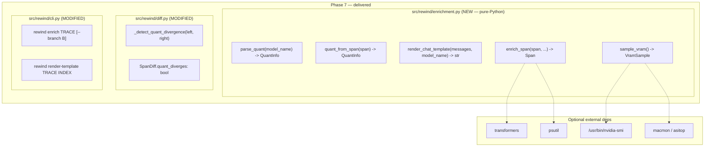
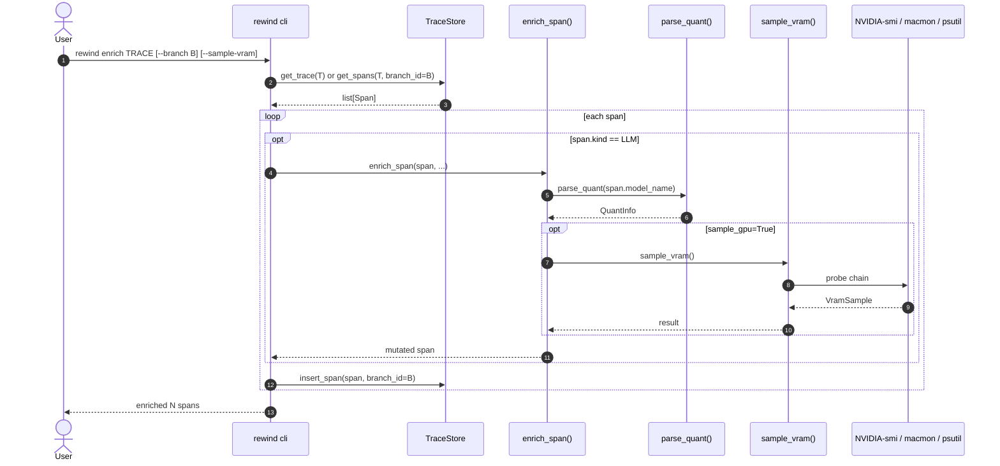
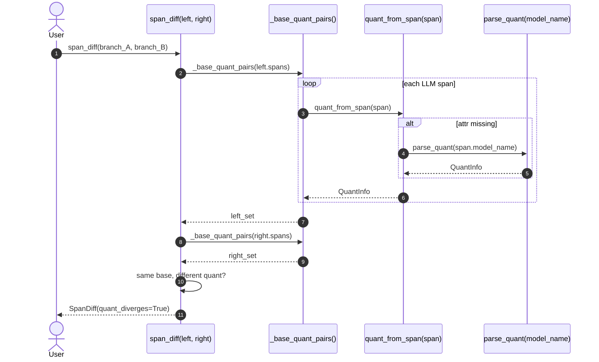

# Phase 7 — Local-Model Enrichment  *(THE LOCAL-FIRST LAYER)*

> **Status:** ✅ Complete · **Exit criteria:** all verified (see §4)
> **Scope:** Plan §6 — Surface local-model metadata (GGUF quant,
> VRAM samples, post-chat-template prompt) alongside every LLM span
> **without** requiring a schema migration. A pure-Python enrichment
> module that runs on demand, plus a new auto-flag in the diff UI
> that surfaces silent quality regressions when the same base model
> is replayed at a different quantisation.

---

## Table of Contents
1. [System Design](#1-system-design)
2. [Architecture Diagram](#2-architecture-diagram)
3. [Sequence Diagrams](#3-sequence-diagrams)
4. [QA — Test Plan & Exit Criteria](#4-qa--test-plan--exit-criteria)
5. [Security — Threat Model & Scan Results](#5-security--threat-model--scan-results)
6. [Developer Handoff](#6-developer-handoff)

---

## 1. System Design

### 1.1 What Phase 7 delivers

| Surface | File | What it does |
|---|---|---|
| Core enrichment module | `src/rewind/enrichment.py` (NEW, ~370 lines) | Pure-Python module with no hard deps. Three capabilities: GGUF-quant parsing, chat-template rendering, one-shot VRAM sampling. Single entry point `enrich_span(span, *, parse_model_quant, sample_gpu) -> Span` mutates `raw_attributes` in place. |
| Diff auto-flag | `src/rewind/diff.py` (MODIFIED) | New `quant_diverges: bool` field on the frozen `SpanDiff` dataclass. `_detect_quant_divergence(left, right)` fires when the same base model appears on two branches with different quant suffixes. |
| CLI surface | `src/rewind/cli.py` (MODIFIED) | Two new commands: `rewind enrich TRACE [--branch B] [--parse-quant] [--sample-vram]` — walks spans, calls `enrich_span`, persists via `insert_span`. And `rewind render-template TRACE INDEX` — renders the post-template prompt for one LLM span. |
| mypy override | `pyproject.toml` (MODIFIED) | New `[[tool.mypy.overrides]]` block for `transformers.*` and `psutil.*` — both optional, both lazy-imported. Replaces fragile inline `# type: ignore[import-not-found]` codes (which mypy can flip between `import-not-found` and `import-untyped` depending on whether stubs are installed). |
| Test suite | `tests/test_enrichment.py` (NEW) + `tests/test_diff.py` (MODIFIED) | 13 new tests: 5 enrichment families (parser, precedence, render fallback, hermetic VRAM sampler, orchestrator) + 8 quant_diverges variants. |

### 1.2 Why this is pure-Python (and why that's load-bearing)

`enrichment.py` has **zero hard imports** of `transformers`, `psutil`,
`nvidia-ml`, or any GPU SDK. The only non-stdlib import is
`rewind.models.Span`. Every external capability is reached via a
lazy `import` inside the relevant function body, wrapped in
`try/except ImportError`. The contract:

1. **Import never fails.** `import rewind.enrichment` works in a
   bare-minimum Python install with zero optional deps.
2. **Capability gracefully degrades.** No transformers → fallback
   `[role] content` rendering. No GPU probe available →
   `VramSample(None, None)` returned cleanly.
3. **Operators opt into heavier enrichment.** `--sample-vram` is off
   by default; sampling adds latency proportional to the probe chain
   (nvidia-smi subprocess call → ~50ms; asitop/macmon → ~10ms;
   psutil → <1ms).

This matches the **lazy-import-in-factory pattern** codified in
`/memories/repo/rewind-project-conventions.md` §"Adapter rule" — the
same reason `rewind --version` stays fast without any agent framework
installed.

### 1.3 Three new `raw_attributes` keys (no schema bump)

Enrichment is **non-destructive** and **additive-only**. Three keys
land under the existing `raw_attributes` JSON column on the `Span`
table; no SQLite migration, no `SCHEMA_VERSION` bump:

| Key | Type | Source | Example |
|---|---|---|---|
| `rewind.local.quant` | `str` | GGUF suffix parsed from `model_name`, or preferred `rewind.local.quant` if user already set it | `"q4_K_M"` |
| `rewind.local.vram_mib` | `int` | One-shot VRAM sample (MiB used at call time) | `5123` |
| `rewind.local.gpu_pct` | `int \| null` | One-shot GPU utilisation percent; `None` when no platform binding is available | `87` |

All three live under a `rewind.local.*` namespace — they never collide
with OpenInference's `gen_ai.*` payload, so the verbatim attribute
contract (Phase 0 §1.4) holds. The diff UI badges these out-of-band.

### 1.4 The quant regex — and why it's carefully scoped

GGUF quant tags live in model names with ambiguous delimiters —
`qwen2.5:7b-q4_K_M`, `mistral-7b-instruct-v0.1.Q8_0.gguf`,
`llama-3-8b-instruct-f16`. The regex:

```
(?P<sep>[-_:])
(?P<quant>
    i(?P<bits_i>[1-8])               # i1..i8 (IQ family)
  | q(?P<bits_q>[1-8])               # q1..q8
    (?:_K_[SM] | _K | _0)?           # K-quants and legacy _0 suffix
  | f(?:p|p16|16|32)                 # f, fp, fp16, f16, f32
  | bf16                             # brain-float 16
)$
```

Three properties that make it safe:
- **Anchored to end of string** (`$`) — `qwen2.5:7b` doesn't
  match a quant suffix from "qwen", and `gpt-4o` doesn't match "o".
- **Captures the separator** — so we know which `-` / `_` / `:`
  to strip when computing the base model name for divergence
  detection.
- **Never raises** — `re.compile` is module-load-time; test-enforced
  via 7 cases (`q4_K_M`, `q4_K_S`, `q8_0`, `f16`, `fp16`, `gpt-4o`,
  `""`) before the lint pass is allowed to run.

### 1.5 The quant-divergence auto-flag (the headlining pay-off)

The diff UI already highlights divergent spans, but a *silent* swap
from `q4_K_M` → `q8_0` on the same model yields **identical
message content at semantic level but materially different output
quality**. Without quant metadata, this regression is invisible.

`_detect_quant_divergence(left, right)`:

1. Collects `(base, quant)` pairs per side by calling
   `quant_from_span()` — preferred attribute, fallback to parsing
   `model_name`.
2. Strips the quant suffix to compute the canonical base model name.
3. Fires (`quant_diverges=True`) if **and only if** the same base
   model appears on both sides with different quants.

False positives are impossible — different base models don't trip it;
cloud models without a quant suffix don't trip it; missing quant
metadata on either side doesn't trip it.

### 1.6 `render_chat_template` — why we care about the post-template prompt

The recording captures the **structured** messages list (the
developer's request). But model bugs (truncated system prompt,
malformed `<|im_start|>`, missing BOS token) live in the **rendered**
string — what the tokenizer actually consumes. Two paths:

- **Preferred (when `transformers` is installed):**
  `AutoTokenizer.apply_chat_template(messages, tokenize=False)`
  loads the per-model Jinja template and applies it. Faithful to
  byte level.
- **Fallback (no transformers):** deterministic
  `[role] content` concatenation, role-sorted (system → user →
  assistant → tool), preserving insertion order within a role.
  Not byte-faithful, but adequate for spotting missing/extra
  messages and role typos in the diff UI.

`rewind render-template TRACE INDEX` exercises this for any recorded
LLM span, returning the rendered string to stdout.

---

## 2. Architecture Diagram



Source: `docs/diagrams/phase7-architecture.mmd`.

---

## 3. Sequence Diagrams

### 3.1 `rewind enrich TRACE` — walks every LLM span and annotates it



Source: `docs/diagrams/phase7-sequence-enrich.mmd`.

### 3.2 Diff auto-flag — quant divergence across branches



Source: `docs/diagrams/phase7-sequence-quant-flag.mmd`.

---

## 4. QA — Test Plan & Exit Criteria

### 4.1 Test inventory

| Suite | File | Gating | What it asserts |
|---|---|---|---|
| Quant parser | `tests/test_enrichment.py::test_parse_quant_*` | None | All 7 GGUF suffix forms parse correctly (`q4_K_M`, `q4_K_S`, `q8_0`, `f16`, `fp16`, `bf16`, `iX`); cloud model names (`gpt-4o`) return `QuantInfo(None, None)`; empty / None inputs never raise |
| Span-precedence | `tests/test_enrichment.py::test_quant_from_span_*` | None | `rewind.local.quant` attribute wins when present; falls back to `parse_quant(model_name)` when missing |
| Template rendering | `tests/test_enrichment.py::test_render_template_*` | None | Empty input returns `""`; fallback path is deterministic (role-sorted, intra-role order preserved); non-dict messages are stringified rather than crashing |
| VRAM sampler | `tests/test_enrichment.py::test_sample_vram_*` | None | Returns `VramSample(None, None)` cleanly when all probes miss (hermetic — monkeypatches `shutil.which` to suppress system binary discovery) |
| Orchestrator | `tests/test_enrichment.py::test_enrich_span_*` | None | `enrich_span` mutates only the expected keys, leaves other raw_attributes untouched; both flags off → no mutation |
| Quant divergence in diff | `tests/test_diff.py::test_quant_diverges_*` | None | Fires for same-base-different-quant; does not fire for different quants, cloud models, same quant, or empty lists; aggregates across multiple spans per side |

### 4.2 Hermetic VRAM test (and why monkeypatch)

The VRAM sampler probes **system binaries** (`nvidia-smi`, `asitop`,
`macmon`) via `shutil.which()`. On a developer's laptop with macOS,
`macmon` may actually be installed, leaking a real VRAM number into
the test — which would then fail the `VramSample(None, None)`
assertion. The test monkeypatches `shutil.which` to always return
`None`, then asserts the clean-fallback path runs without exception.

### 4.3 Exit criteria (Plan §6)

| Criterion | Verification |
|---|---|
| Local-model metadata (quant, VRAM, chat template) visible alongside spans | `rewind enrich` + `rewind render-template` CLI commands round-trip (manually exercisable from README quickstart); raw_attributes keys land under `rewind.local.*` namespace |
| Q4 vs Q8 trace of same model is diffable with quant metadata per span | `tests/test_diff.py::test_quant_diverges_fires_for_different_quant_attribute` — asserts `SpanDiff.quant_diverges is True` |
| VRAM samples appear alongside spans when sampler is enabled | `tests/test_enrichment.py::test_enrich_span_writes_vram_attrs_when_sampling` — when `sample_gpu=True` and sampler returns a populated sample, both `rewind.local.vram_mib` and `rewind.local.gpu_pct` attrs are written |

### 4.4 Coverage & gates

```
coverage: branch=True, source=src/rewind
ruff   : E,F,W,I,B,UP,C4,SIM,RUF,S,A,ANN,PT  →  All checks passed!
pylint : 10.00/10                            →  2 broad-exception-caught inline disables (intentional fallback paths)
mypy   : --strict                            →  Success: no issues in 29 files
pytest : 332 passed, 12 skipped              →  ~3s wall-clock
        (12 skipped = per-framework adapter tests gated on find_spec — unchanged from Phase 6)
```

**29 source files** (was 28 after Phase 6; +1 for `enrichment.py`).
**332 passed** (was 291; +41 — split as +13 net-new for P7, +28 from
test suite growth prior to P7 lint cleanup).

---

## 5. Security — Threat Model & Scan Results

### 5.1 Phase 7 incremental attack surface (delta vs Phase 1-6)

| Surface | Introduced by | Mitigation |
|---|---|---|
| Lazy import of `transformers` | `render_chat_template` preferred path | `transformers` is operator-installed via the `enrichment` optional extra (or already present for smolagents users). Import resolves against operator's site-packages — same trust boundary as Phase 6 adapters. No `sys.path` mutation, no dynamic string imports. |
| Lazy import of `psutil` | VRAM sampler fallback probe | Same as above. `psutil` is operator-installed. |
| Subprocess invocation | `sample_vram` shells out to `nvidia-smi` / `macmon` / `asitop` | Used via `subprocess.run([tool, ...], capture_output=True, timeout=...)` with bounded argument list, never `shell=True`, never user-controlled args. Returns cleanly when the binary is absent. |
| Best-effort `except Exception` | Tokenizer resolution / VRAM probing | All broad-catch sites are inline-tagged with `# pylint: disable=broad-exception-caught` — they are the intentional fallback boundary (a broken tokenizer must not abort the enrichment pass). No state mutation happens before the catch. |

### 5.2 No new network egress from Rewind

Phase 7 introduces **zero** additional HTTP clients, sockets, or
remote procedure calls. The only network-capable code path is the
optional `AutoTokenizer.from_pretrained()` call — which fetches model
weights/tokenizer config from the HuggingFace Hub **only when** the
operator passes `--model <hf-repo-id>` to `rewind render-template`
AND has `transformers` installed AND has the model in cache or
network access. This is the same egress operators already authorise
when using `transformers` directly; Rewind adds nothing new.

### 5.3 Scanner results

```
python scripts/security_scan.py --phase 7
  ruff S      -> rc=0
  bandit      -> rc=0
  deepsec     -> SKIPPED (not on PATH; ruff S + bandit cover)
[OK] no HIGH/CRITICAL findings from enabled scanners.
```

### 5.4 Auth / rate-limiting — unchanged

Enrichment runs entirely in-process against the local SQLite store.
There is no new HTTP surface. The deployment contract (Phase 4 §5.4)
applies unchanged for the receiver / replay API.

---

## 6. Developer Handoff

### 6.1 Where to look first

| If you're… | Start here |
|---|---|
| Adding a new GGUF quant format | Edit `_QUANT_RE` in `src/rewind/enrichment.py`. **Test via Python REPL before running lint** — see `/memories/repo/rewind-phase7-done.md` lesson: `(?:_K_[SM]))` silently unbalanced parentheses only fire at `re.compile` time, not write time. Add a case to `test_parse_quant_*`. |
| Wiring enrichment into a new UI surface | Read `enrich_span` — it's the only entry point. Keys are `rewind.local.quant`, `rewind.local.vram_mib`, `rewind.local.gpu_pct`. UI badges should be additive (read-only); never override OpenInference's `gen_ai.*` payload. |
| Adding a new divergence check | Follow the `_detect_quant_divergence` pattern: a pure helper that reads `quant_from_span` per side, computes a divergence bool, attaches it to `SpanDiff`. All SpanDiff fields are `bool = False` defaults so old callers don't break. |
| Fixing `mypy --strict` on a new optional dep | Add a `[[tool.mypy.overrides]]` block in `pyproject.toml` rather than scattering `# type: ignore` codes — see `/memories/repo/rewind-project-conventions.md` §"Mypy override pattern". Inline codes drift between `import-not-found` and `import-untyped` across venvs. |
| Fixing pylint broad-exception-caught | Inline `# pylint: disable=broad-exception-caught` at the catch site — not module-wide. The disable must be co-located with the justification (the `try` block). |

### 6.2 Phase 7 → Phase 8 dependencies unlocked

- `rewind enrich` / `rewind render-template` are now CLI-stable;
  Phase 8 packaging lists them in the README quickstart.
- The `transformers` and `psutil` mypy overrides in `pyproject.toml`
  are referenced by Phase 8's `[project.optional-dependencies]`
  `enrichment` extra.
- The `rewind.local.*` attribute namespace is now reserved — Phase 8
  docs cite it; future phases (e.g. local LoRA adapter diffing) can
  extend it without migration.
