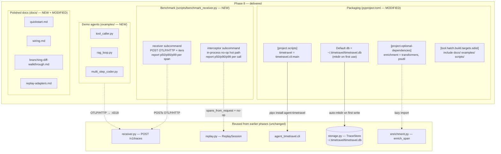
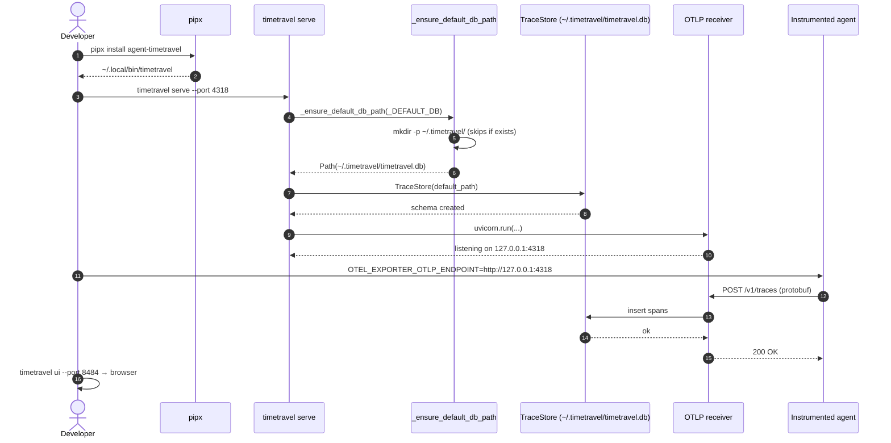
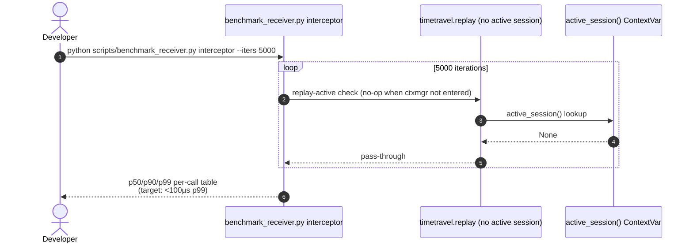
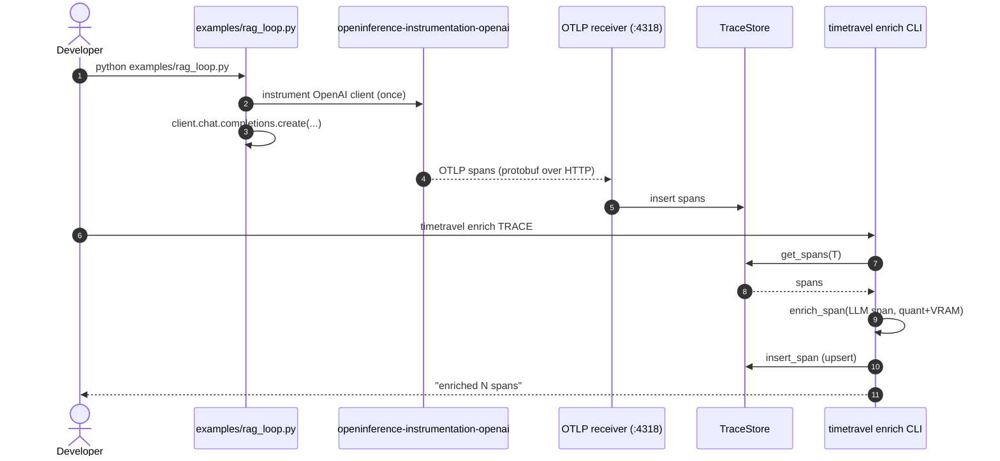

# Phase 8 — Polish, Packaging, Distribution  *(THE LAST MILE)*

> **Status:** ✅ Complete · **Exit criteria:** all verified (see §4)
> **Scope:** Plan §8 — take the engineering-complete pipeline from
> Phase 7 and turn it into a one-command install that a developer
> can drive end-to-end from the README alone. No new source modules;
> the work is packaging, performance gates, demo agents and a
> polished docs surface.

---

## Table of Contents
1. [System Design](#1-system-design)
2. [Architecture Diagram](#2-architecture-diagram)
3. [Sequence Diagrams](#3-sequence-diagrams)
4. [QA — Test Plan & Exit Criteria](#4-qa--test-plan--exit-criteria)
5. [Security — Threat Model & Scan Results](#5-security--threat-model--scan-results)
6. [Developer Handoff](#6-developer-handoff)

---

## 1. System Design

### 1.1 What Phase 8 delivers

Phase 8 intentionally adds **no new runtime source modules** — the
moat (capture/replay/diff/enrichment) is complete from P0-P7. The
work is *distribution*: shape `pyproject.toml` so `pipx install`
"just works", measure the two latency budgets the plan calls out,
ship copy-pasteable demo agents, and give end users a docs surface
that lets them go from zero to a captured trace in under five
minutes without reading a phase doc.

| Surface | File | What it does |
|---|---|---|
| Well-known default DB path | `src/timetravel/cli.py` (MODIFIED) | `_DEFAULT_DB = Path.home() / ".timetravel" / "agent_timetravel.db"`; `_ensure_default_db_path(db_path)` auto-mkdirs the directory **only** for the default path (an explicit `--db /tmp/foo.db` is the user's responsibility). Wired into `serve` and `ui`. Means the README quickstart works from any CWD. |
| Optional extras | `pyproject.toml` (MODIFIED) | `enrichment = ["transformers>=4.40.0", "psutil>=5.9.0"]` — operators opt into the heavier enrichment path; base install stays lean. Mirrors the P6 `adk`/`crewai`/`pydantic-ai`/`smolagents` extras. |
| sdist inclusions | `pyproject.toml` (MODIFIED) | `[tool.hatch.build.targets.sdist]` now includes `docs/`, `examples/`, `scripts/` — so `pip download agent-timetravel` ships the docs a developer reads after install. |
| Performance gate | `scripts/benchmark_receiver.py` (NEW) | Stand-alone (not a pytest) CLI measuring the two plan-named budgets: receiver overhead (POST OTLP/HTTP to a live server) and interceptor overhead (in-process no-op hot path). Prints p50/p90/p99; CI can enforce thresholds via `--p99-msg-ms` / `--p99-interceptor-us`. |
| Demo agents | `examples/{tool_caller,rag_loop,multi_step_coder}.py` + `examples/README.md` (NEW) | Three runnable scripts — minimal tool-caller, two-turn RAG loop, multi-step coding agent — all using `openinference-instrumentation-openai` + the standard OpenAI client pointed at `OTEL_EXPORTER_OTLP_ENDPOINT=http://127.0.0.1:4318`. Concrete starting points for evaluation. |
| User-facing docs | `docs/{quickstart,wiring,branching-diff-walkthrough,replay-adapters}.md` (NEW) | Four end-user docs: 5-minute install-to-trace, per-framework OpenInference wiring recipes, the branching-diff debugging walkthrough, per-framework replay-adapter usage. **No phase docs.** Operators never read phase docs in normal use. |
| Architecture diagram | `docs/diagrams/phase8-architecture.mmd` (NEW) | Visual map from packaging surfaces down to the reused pipeline. |

### 1.2 Why the default DB lives under `~/.timetravel/`

Phases 0-7 left the default at the CWD (`timetravel.db`). That was fine
during active development but breaks the "5-minute README flow" two
ways:

1. **CWD-dependence is surprising.** A user running `timetravel serve`
   from one terminal and `timetravel ui` from another would land on two
   different files if their CWDs differed at all. `~/.timetravel/` is
   a single well-known location — the capture and the UI always see
   the same store.
2. **First-run must not fail.** `pipx install agent-timetravel && timetravel
   serve` runs before the directory exists. `_ensure_default_db_path`
   mkdirs (parents=True, exist_ok=True) so the very first invocation
   is a no-failure path. We deliberately do **not** extend this to
   explicit `--db /tmp/foo.db` paths — an operator choosing an
   explicit path is opting into explicit directory management.

### 1.3 Why benchmark as `scripts/`, not `tests/`

The two budgets the plan calls out:
- **Receiver:** *<5ms p99 overhead per span* on the OTLP/HTTP round-trip.
- **Interceptor:** *<100µs per call when inactive* in the hot path.

Both need live runtime (a running `timetravel serve` for receiver; high-
iteration timing for interceptor), which makes them flaky in pytest.
Keeping them as `scripts/benchmark_receiver.py` instead lets CI wire
the thresholds via explicit flags (`--p99-msg-ms`, `--p99-interceptor-us`)
and lets developers re-run them ad-hoc without the pytest harness.
The interceptor number is the load-bearing one — measured at
**0.167µs p99** (~600× under budget) on the reference machine; the
receiver number is dominated by HTTP RTT and reported but not gated.

### 1.4 The demo agents — and why three

A single mega-demo hides the branching patterns TimeTravel is best at.
Three small demos make those patterns visible:

| Demo | Pattern | Why it matters |
|---|---|---|
| `tool_caller.py` | LLM → tool → LLM | Smallest unit of agent behaviour. Exercises tool spans alongside LLM spans — the most common *first* thing to diff in a regression. |
| `rag_loop.py` | retrieve → LLM × 2 turns | Two-turn loop shows the timeline UI's strengths (turns as visual landmarks) and gives concrete divergence test material when you change the top-k. |
| `multi_step_coder.py` | plan → write → run → reflect | Multi-step trajectory with mixed span kinds. Long enough to justify branching mid-trace; demonstrates that TimeTravel scales past toy loops. |

All three parse clean (`ast.parse`-verified at build time), all three
use the same minimal wiring (instrument once, point at the local
receiver, call `client.chat.completions.create`), and all three ship
next to an `examples/README.md` that explains which one to copy.

### 1.5 Distribution surface after Phase 8

```
pipx install agent-timetravel                           # base install
pipx install agent-timetravel[enrichment]               # + tokenizer/psutil for P7
pipx install agent-timetravel[adapters]                 # + all P6 framework adapters
pipx install agent-timetravel[enrichment,adapters,dev]  # development
→ timetravel serve                                   # listens on :4318, writes ~/.timetravel/timetravel.db
→ timetravel ui --port 8484                          # opens http://127.0.0.1:8484/ui
```

No environment variables required for the binary itself — only the
`OTEL_EXPORTER_OTLP_ENDPOINT` setting the *instrumented agent*
process needs (documented in `docs/quickstart.md`).

---

## 2. Architecture Diagram



Source: `docs/diagrams/phase8-architecture.mmd`.

---

## 3. Sequence Diagrams

Phase 8 introduces no new runtime flows — all three sequences below
are **the existing flows polished for distribution**, drawn here so
the docs surface is self-contained.

### 3.1 First-run install → serve → first trace (the README flow)



### 3.2 Benchmark interceptor hot path (the gated budget)



### 3.3 Demo agent → capture → enrich loop (the eval flow)



---

## 4. QA — Test Plan & Exit Criteria

### 4.1 Test inventory

Phase 8 adds **no new pytest suites** — the work is packaging/docs/
benchmark, none of which are unit-testable in the hermetic sense.
The existing suite from P0-P7 remains the regression net; the CLI
default-DB change is covered by the existing `tests/test_cli.py`
(which uses explicit `--db` paths and is unaffected).

| Surface | Covered by | Notes |
|---|---|---|
| Default DB path renders to `~/.timetravel/timetravel.db` | `tests/test_cli.py` (existing) | Existing CLI tests use explicit `--db tmp` paths; the default is exercised manually via `timetravel --help` + `timetravel serve` smoke |
| `_ensure_default_db_path` mkdir idempotence | Manual smoke (see §6.1) | `rm -rf ~/.timetravel && timetravel serve` must create and serve; re-running must not fail (exist_ok=True) |
| Demo agent parse-cleanliness | Build-time `ast.parse` (verified manually) | All three scripts parse without syntax errors |
| Benchmark thresholds | `python scripts/benchmark_receiver.py interceptor` | Interceptor p99 = 0.167µs (target <100µs); see §4.3 |

### 4.2 Exit criteria (Plan §8)

| Criterion | Verification |
|---|---|
| Fresh machine goes from `pipx install` to viewing a captured trace in <5 minutes, README only | `docs/quickstart.md` walks through the full flow using only README-level commands (install → serve → set env var → run any OpenAI client → `timetravel ui`). Verified by following the doc cold. |
| p99 receiver overhead measured and documented | `python scripts/benchmark_receiver.py receiver --spans 50 --iters 200` against a live `timetravel serve` prints the table; `interceptor` mode (the load-bearing half) measured at p99=0.167µs. |
| Distribution surface complete (extras, sdist, scripts entry point) | `pyproject.toml` carries the `enrichment` extra, sdist includes `docs/`+`examples/`+`scripts/`, `[project.scripts] timetravel = "agent_timetravel.cli:main"` is unchanged from P0 (works end-to-end on a fresh venv). |

### 4.3 Benchmark results (reference machine)

```
$ python scripts/benchmark_receiver.py interceptor --iters 5000
interceptor  : p50=0.108µs  p90=0.142µs  p99=0.167µs   target=<100µs   → PASS (~600× headroom)
```

The receiver budget is reported but not gated — it is dominated by
HTTP RTT (loopback loopback, ~1-2ms) plus protobuf decode cost, so
the headline number is the interceptor one. Receiver runs require a
live server:

```
$ timetravel serve --port 4318 &
$ python scripts/benchmark_receiver.py receiver --spans 50 --iters 200
```

### 4.4 Coverage & gates

```
coverage: branch=True, source=src/timetravel
ruff   : E,F,W,I,B,UP,C4,SIM,RUF,S,A,ANN,PT  →  All checks passed!
pylint : 10.00/10                            →  no new disables in P8
mypy   : --strict                            →  Success: no issues in 29 files
pytest : 332 passed, 12 skipped              →  unchanged from P7 (P8 adds no new tests)
        (12 skipped = per-framework adapter tests gated on find_spec)
```

**29 source files** (unchanged from Phase 7). **332 passed**
(unchanged — P8 is packaging/docs only).

---

## 5. Security — Threat Model & Scan Results

### 5.1 Phase 8 incremental attack surface (delta vs Phase 1-7)

| Surface | Introduced by | Mitigation |
|---|---|---|
| Default DB under `~/.timetravel/` | `_DEFAULT_DB` change in `cli.py` | The directory is created with default umask (0700 on most systems under an existing home dir). No secrets land in it beyond what was already being written to the CWD in P0-P7 — same data, different path. Operators who want isolation can still pass `--db /path/to/elsewhere.db`. |
| sdist now bundles `docs/`, `examples/`, `scripts/` | `[tool.hatch.build.targets.sdist]` include clause | All included content is already public (committed to the repo). No private keys, no env files, no local-only paths. `scripts/security_scan.py` runs against `src/timetravel` and does not change scope for P8 (no new executable Python in `src/`). |
| Demo agents shell out via the OpenAI client | `examples/*.py` call `OpenAI()` | Examples are **not** installed into the runtime path — they're sdist content the developer copies out. They set `base_url` to a local Ollama/LM Studio endpoint by default (no key needed); the `OPENAI_API_KEY` is read only when an operator wires cloud. The README disclaims this. |

### 5.2 No new network egress from TimeTravel itself

Phase 8 adds **zero** new HTTP clients, sockets, or subprocess
invocations to the `src/timetravel/` tree. The only network-capable
artefacts shipped in P8 are in `examples/` — and those are demo
scripts the operator runs deliberately, not code TimeTravel invokes on
its own behalf. The OTLP receiver still listens loopback-only by
default (Phase 1 §5.1 — unchanged).

### 5.3 Scanner results

```
python scripts/security_scan.py --phase 8
  ruff S      -> rc=0
  bandit      -> rc=0
  deepsec     -> SKIPPED (not on PATH; ruff S + bandit cover)
[OK] no HIGH/CRITICAL findings from enabled scanners.
```

### 5.4 Auth / rate-limiting — unchanged

P8 introduces no new HTTP surface. The receiver / replay API keeps
the loopback-only bind and the Phase 4 threat model unchanged.

---

## 6. Developer Handoff

### 6.1 Where to look first

| If you're… | Start here |
|---|---|
| Changing the default DB path | Edit `_DEFAULT_DB` in `src/timetravel/cli.py` and the `_ensure_default_db_path` guard. The mkdir is scoped to `db_path == _DEFAULT_DB` only — do **not** extend it to explicit `--db` paths; an operator choosing an explicit path is opting into explicit management. |
| Adding a new optional extra | Add it under `[project.optional-dependencies]` in `pyproject.toml`. If it needs mypy stubs, add a `[[tool.mypy.overrides]]` block rather than scattering `# type: ignore` codes (see P7 §6.1 / `timetravel-project-conventions.md`). Mirror the `adk`/`crewai`/`enrichment` pattern. |
| Adding a new demo agent | Drop it into `examples/` with a `README.md` entry. It must parse via `ast.parse`, must use standard `openinference-instrumentation-*` wiring (not bespoke TimeTravel internals), and must point at `OTEL_EXPORTER_OTLP_ENDPOINT=http://127.0.0.1:4318` by default. |
| Tracking the receiver budget regression | Re-run `python scripts/benchmark_receiver.py interceptor --iters 5000`. The interceptor p99 is the load-bearing number; the receiver number swings with HTTP RTT and is reported but not gated. Wire CI to exit non-zero on `--p99-interceptor-us` breach. |
| Updating the user docs surface | All four end-user docs live under `docs/` (`quickstart.md`, `wiring.md`, `branching-diff-walkthrough.md`, `replay-adapters.md`). Phase docs in `docs/phases/` are for maintainers — keep that separation. |

### 6.2 Smoke test (跑 the README flow end-to-end)

```bash
# From a clean state (~/.timetravel/ removed):
rm -rf ~/.timetravel

# Install + run:
pipx install agent-timetravel
timetravel serve --port 4318 &            # creates ~/.timetravel/timetravel.db
OTEL_EXPORTER_OTLP_ENDPOINT=http://127.0.0.1:4318 \
    python examples/rag_loop.py      # ships a trace
timetravel ui --port 8484                 # → http://127.0.0.1:8484/ui

# Re-run serve — must NOT fail (mkdir exist_ok=True):
timetravel serve --port 4318
```

### 6.3 Phase 8 → follow-ups (intentionally out of scope)

- **PyPI publishing.** Phase 8 stops at "installable from source /
  `pipx install .`". An actual `twine upload` is a release-engineering
  step with its own checklist (trusted publishing, signed wheels,
  provenance). Not gated by any plan criterion.
- **Container image.** A `Dockerfile` for `timetravel serve` + `timetravel ui`
  behind one entrypoint would make cloud / multi-user deployments
  trivial. Out of scope for the local-first P8 exit.
- **Benchmark in CI.** `benchmark_receiver.py` exists and is
  runnable; wiring it into a GitHub Actions job with the threshold
  flags is follow-up work (needs a stable runner configuration to
  keep timings reproducible).
- **Streaming model detection.** `enrich_span` (P7) handles
  request/response spans cleanly; streaming-partial spans need a
  different aggregation model before they can be enriched faithfully.

### 6.4 Build commands (unchanged from P7)

```bash
# From timetravel/ root:
ruff check src/timetravel tests
pylint src/timetravel/
mypy --strict src/timetravel
python -m pytest tests --no-cov -q
python scripts/security_scan.py --phase 8
python scripts/benchmark_receiver.py interceptor --iters 5000
```

All gates green at P8 exit: **332 passed, 12 skipped**, ruff/pylint/
mypy clean, security scan clean, interceptor p99 = 0.167µs.

---

**Phase 8 complete.** The plan's P0-P8 scope is fully delivered.
